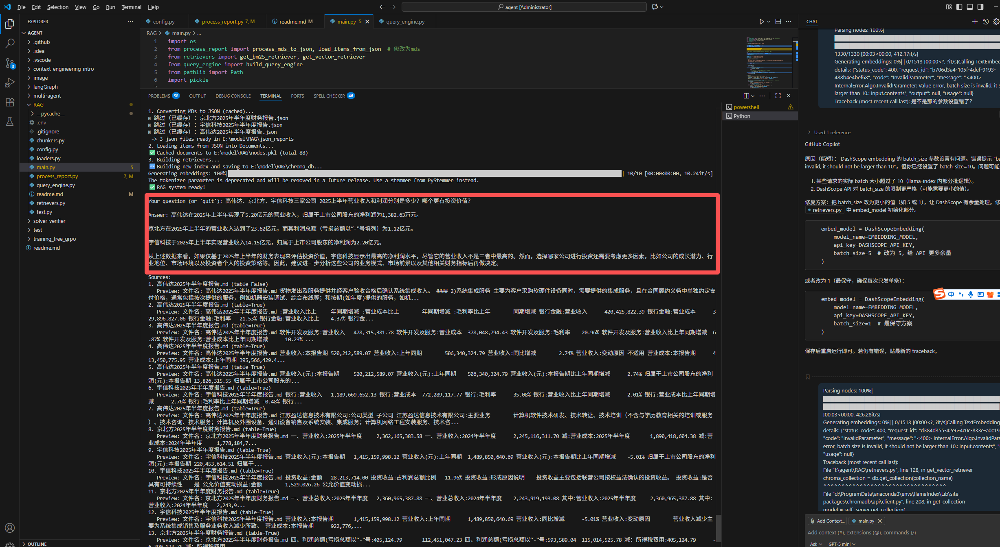

财报pdf转成md格式，然后再转成json，部分效果不好的案例：

用BeautifulSoup强行把md转成json会少表头，可能误导LLM做最后的输出

```
"宇信科技2025年半年度报告_table_7_part2": {
      ":筹资活动现金净流出减少主要为支付股票回购款减少、": "收员工持股计划款增加所致。",
      "现金及现金等价物净增加额:-60,495,783.05": "-701,391,583.04",
      "现金及现金等价物净增加额:-258,225,504.00": "-634,191,345.45",
      "现金及现金等价物净增加额:76.57%": "-10.60%",
      "现金及现金等价物净增加额:筹资活动现金净流出减少主要为支付股票回购款减少、": "本期现金及现金等价物减少主要为投资活动、经营活动净现金流出增加所致。",
      "其他收益:-60,495,783.05": "8,296,401.34",
      "其他收益:-258,225,504.00": "25,894,597.09",
      "其他收益:76.57%": "-67.96%",
      "其他收益:筹资活动现金净流出减少主要为支付股票回购款减少、": "其他收益减少主要为政府补助减少所致。",
      "投资收益:-60,495,783.05": "28,213,714.00",
      "投资收益:-258,225,504.00": "21,232,610.02",
      "投资收益:76.57%": "32.88%",
      "投资收益:筹资活动现金净流出减少主要为支付股票回购款减少、": "投资收益增加主要为联营公司按权益法确认投资收益增加所致。",
      "公允价值变动收益:-60,495,783.05": "1,529,026.26",
      "公允价值变动收益:-258,225,504.00": "-2,276,474.80",
      "公允价值变动收益:76.57%": "167.17%",
      "公允价值变动收益:筹资活动现金净流出减少主要为支付股票回购款减少、": "公允价值变动收益增加为交易性金融资产、其他非流动金融资产公允价值收益同比增加所致。",
      "信用减值损失:-60,495,783.05": "8,175,930.06",
      "信用减值损失:-258,225,504.00": "-18,923,702.99",
      "信用减值损失:76.57%": "143.20%",
      "信用减值损失:筹资活动现金净流出减少主要为支付股票回购款减少、": "信用减值损失减少主要为应收账款坏账损失减少所致。",
      "资产减值损失:-60,495,783.05": "-4,898,755.07",
      "资产减值损失:-258,225,504.00": "-1,856,347.74",
      "资产减值损失:76.57%": "-163.89%",
      "资产减值损失:筹资活动现金净流出减少主要为支付股票回购款减少、": "资产减值损失增加主要为存货跌价损失增加所致。",
      "资产处置收益:-60,495,783.05": "2,110.77",
      "资产处置收益:-258,225,504.00": "-44,435.87",
      "资产处置收益:76.57%": "104.75%",
      "资产处置收益:筹资活动现金净流出减少主要为支付股票回购款减少、": "资产处置收益增加主要为处置固定资产损失减少所致。",
      "营业外支出:-60,495,783.05": "894,395.80",
      "营业外支出:-258,225,504.00": "101,095.83",
      "营业外支出:76.57%": "784.70%",
      "营业外支出:筹资活动现金净流出减少主要为支付股票回购款减少、": "营业外支出增加主要为本期补缴滞纳金所致。"
    },
```

md处理方案：

1、table不要chunk切分，保持整体

2、其他按照章节chunk

3、效果：全部正确回答


