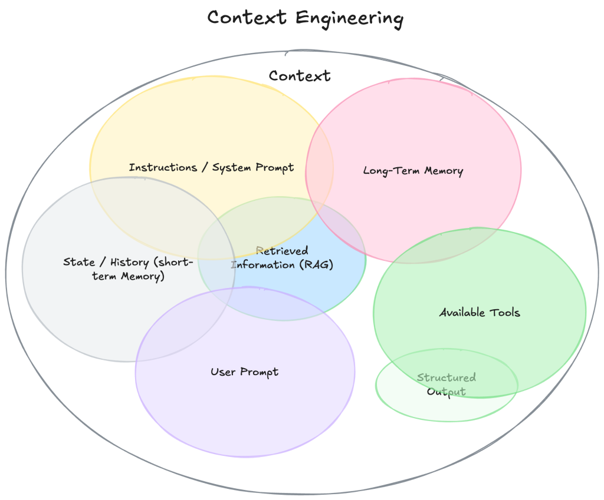

context-engineering practice for agent development!

1、作为码农，每天都要和产品经理打交道。码农最希望的就是产品经理把需求描述清楚，所以**非常反感产品经理的“一句话需求”：这种需求描述地模棱两可，码农完全无从下手**！好的产品经理会**提供详细的说明文档，把需求的细节描述地非常清晰，不会让开发人员看的云里雾里**！其实对于LLM也一样：prompt写的过于简单，需求描述不清晰，LLM的response也只能是“概率事件”了！为了解决这个问题，Andrej Karpathy 大佬近期提出了context engineering的概念，本质就是升级prompt：**对需求进行方方面面的详尽描述，避免“一句话”这种模糊不清的需求，让LLM在response之前充分了解user想要啥！**具体到落地实现，context的组成大概如下：

举个例子，比如用户提问：我的订单有啥进展？什么时候送达？  在回答这个问题前，肯定要做如下步骤的：

* 检索查询用户所有的未送达订单
* 查询这些订单在的状态：原料采购中？工厂生产中？快递运输中？
  * 如果是原料采购中，采购的进展是啥？预计什么时候采购完成？
  * 如果是生成中，生产到那个步骤了？预计什么时候完成生产并打包？
  * 如果是快递运输中，继续提供快递员的联系方式，实时的位置跟踪.......

只有先得到了这些信息，作为prompt输入LLM中，才有可能让LLM提供让用户满意的回复！

2、这个可以和以前传统的机器学习做个对比：传统的机器学习算法有多个，诸如logistic regression、svm、bayes、decision tree......   这些分类或回归算法本身已经非常成熟了，**要想模型的效果好，最核心的只有一点：构造好的特征数据，行业俗称 feather engineering**！其实做**传统的机器学习，只有20%的时间用在了算法选择、模型调参等，80%+的时间都耗费在了数据构造、清洗、feather engineering上了**！这里的feather engineering和context engineering没有本质区别，都是构造好的特征数据！
