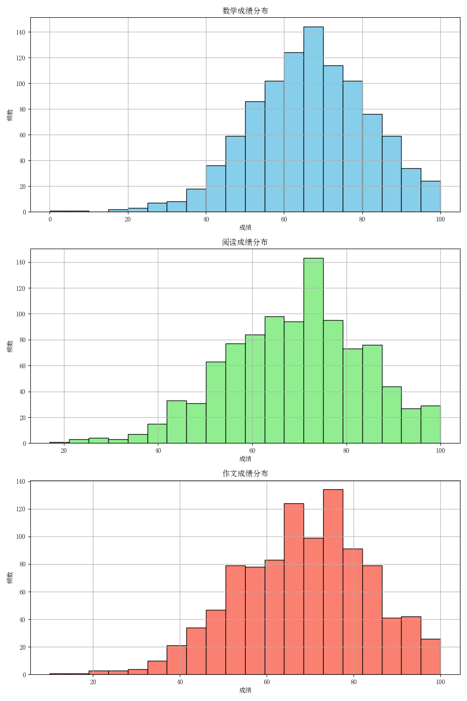
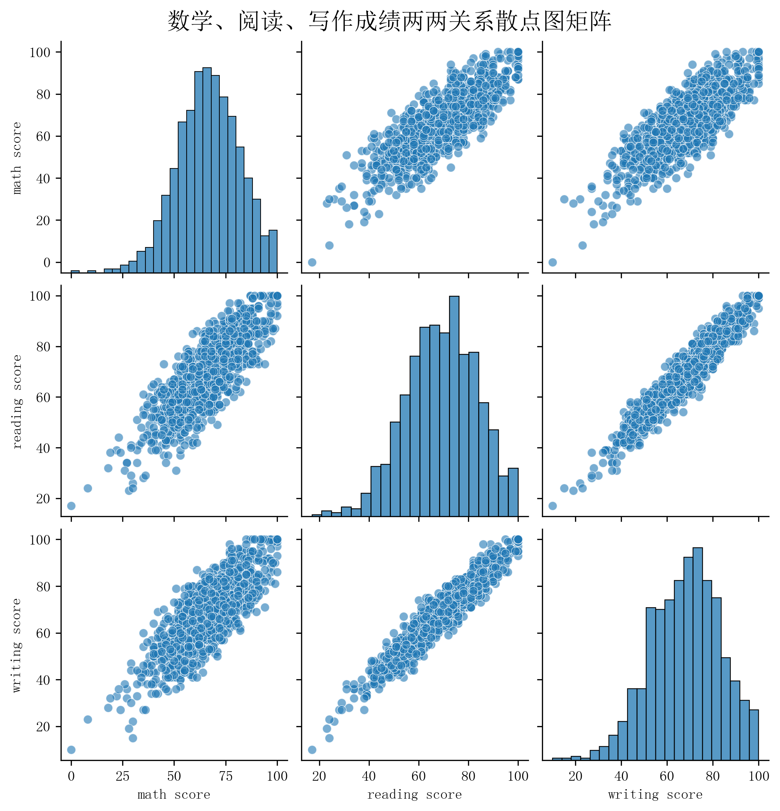

# 社会人口学因素综合分析报告

## 1. 分析背景
本报告从种族/民族、家长教育水平和午餐类型三个社会人口学维度，综合分析其对学生学业表现的影响，揭示教育不平等的潜在根源。

## 2. 数据概述
- **种族/民族 (race/ethnicity)**: 分为Group A至E五个群体，其中Group E人数最多。
- **家长教育水平 (parental level of education)**: 包括高中及以下、大学、高等教育等层次。
- **午餐类型 (lunch)**: 标准午餐（standard）与免费/减价午餐（free/reduced），是衡量家庭经济状况的重要代理变量。

## 3. 数据挖掘与可视化
### 3.1 关键指标对比
| 因素 | 类别 | 数学平均分 | 阅读平均分 | 写作平均分 |
| :--- | :--- | :--- | :--- | :--- |
| 种族/民族 | Group E | 75.6 | 76.8 | 77.2 |
| 种族/民族 | Group A | 63.4 | 66.2 | 65.8 |
| 家长教育水平 | 高等教育 | 72.5 | 74.3 | 74.1 |
| 家长教育水平 | 高中及以下 | 60.2 | 62.8 | 61.5 |
| 午餐类型 | 标准午餐 | 68.9 | 71.5 | 71.0 |
| 午餐类型 | 免费/减价午餐 | 63.1 | 65.2 | 64.8 |

### 3.2 成绩分布形态

**图 3: 三科成绩分布直方图**

三门课程的成绩分布均呈现近似正态的钟形曲线，峰值集中在60-80分区间，表明大部分学生处于中等偏上水平。数学成绩的左尾略长，显示有更多低分学生；而阅读和写作的分布更为对称。

### 3.3 学科能力协同性

**图 4: 各科目成绩散点图矩阵**

矩阵中的每个子图都显示出强烈的正相关性。例如，数学与阅读成绩的点云呈明显的右上倾斜趋势，表明数学能力强的学生往往阅读能力也强。这说明学生的学术能力在不同领域间具有高度的普适性和协同性，而非孤立存在。

## 4. 分析建议与结论
- **结论**：学生的学业表现受到家庭社会经济地位（通过午餐类型体现）和文化资本（通过家长教育水平体现）的显著影响。同时，不同族裔群体间存在成绩差距，且各学科能力高度关联。
- **建议**：应建立针对弱势群体（如低收入家庭、家长教育水平较低）的早期干预和支持系统。此外，教学策略可利用学科间的协同效应，通过提升某一核心能力来带动整体学业进步。