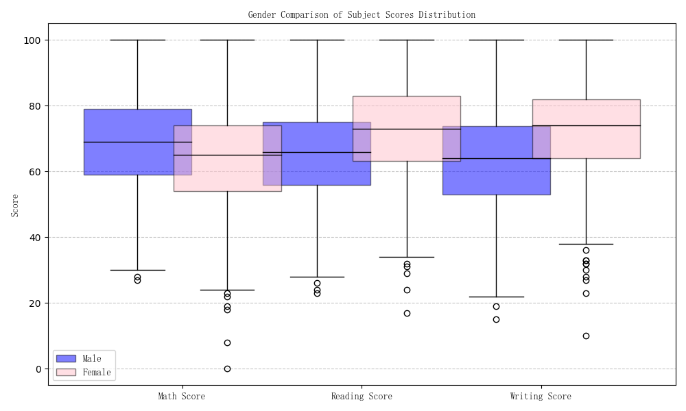

# 性别维度学业表现分析报告

## 1. 分析背景
本报告旨在探究性别因素对学生数学、阅读与写作三门核心课程成绩的影响，识别不同性别在各学科上的优势与差异，为实施差异化教学提供数据支持。

## 2. 数据概述
基于`student_habits_performance.csv`数据集，共包含1000名学生样本，按性别分为男性（518人）与女性（482人）。关键字段包括：
- **gender**: 学生性别（male/female）
- **math score**: 数学成绩（0-100）
- **reading score**: 阅读成绩（0-100）
- **writing score**: 写作成绩（0-100）

## 3. 数据挖掘与可视化
### 3.1 平均成绩对比
下表展示了男女学生在各科目上的平均成绩：

| 性别 | 数学平均分 | 阅读平均分 | 写作平均分 |
| :--- | :--- | :--- | :--- |
| 男 | 68.73 | 65.47 | 63.31 |
| 女 | 63.63 | 72.61 | 72.47 |

### 3.2 成绩分布分析

**图 1: 不同性别学生各科目成绩箱形图**

如图所示，男生在数学成绩的中位数和上四分位数上明显高于女生，表现出更强的数学能力集中趋势。相反，在阅读和写作科目上，女生的成绩中位数、上下四分位距均显著优于男生，且分布更为集中，表明女生在语言类学科上不仅平均分高，且个体间差异更小，表现更稳定。

## 4. 分析建议与结论
- **结论**：存在明显的学科性别差异，即“男生擅长数学，女生擅长语言”。
- **建议**：教师应关注这种差异，在数学教学中加强对女生的信心引导和兴趣培养；在语文教学中，可为男生设计更具吸引力的阅读与写作任务，以缩小性别差距。