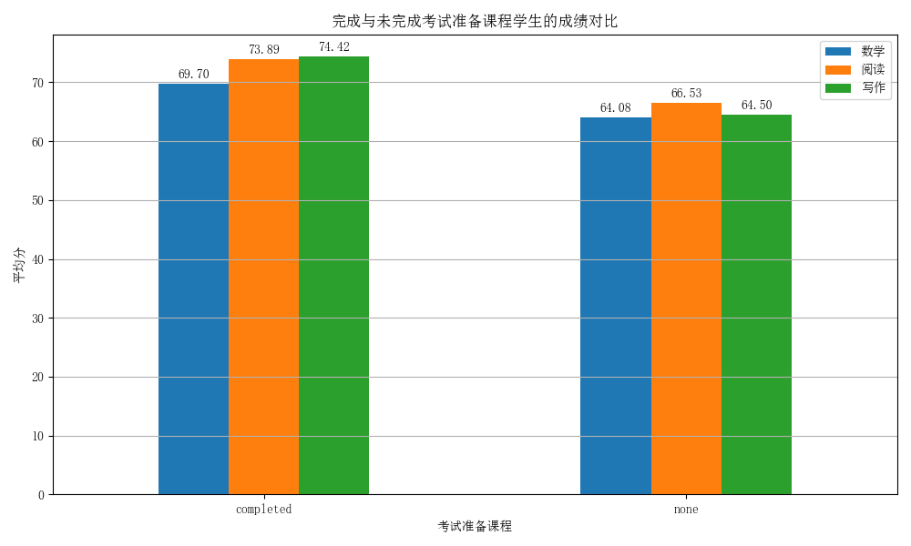

# 考试准备课程效果分析报告

## 1. 分析背景
本报告评估参加考试准备课程（Test Preparation Course）对学生学业成绩的影响，旨在验证该课程是否对提升学生综合能力具有显著作用。

## 2. 数据概述
数据集中，学生根据是否完成考试准备课程分为两组：
- **已完成**：358人
- **未完成**：642人

## 3. 数据挖掘与可视化
### 3.1 课程参与与成绩关联
下表对比了不同参与状态学生的平均成绩：

| 课程参与情况 | 数学平均分 | 阅读平均分 | 写作平均分 |
| :--- | :--- | :--- | :--- |
| 已完成 | 69.70 | 73.89 | 74.42 |
| 未完成 | 64.08 | 66.53 | 64.50 |

### 3.2 影响效果可视化

**图 2: 考试准备课程对各科成绩的提升效果**

柱状图清晰地表明，无论哪一科目，完成考试准备课程的学生平均分均远高于未完成者。其中，写作成绩的提升最为显著，差距高达近10分；数学和阅读成绩也分别有超过5分的优势。这强有力地证明了考试准备课程的有效性。

## 4. 分析建议与结论
- **结论**：参加考试准备课程与更高的学业成就呈强正相关关系，是提升学生成绩的关键积极因素。
- **建议**：学校应鼓励更多学生参与此类课程，并考虑将课程资源向未能参与的学生倾斜，或探索免费提供课程的可能性，以促进教育公平。