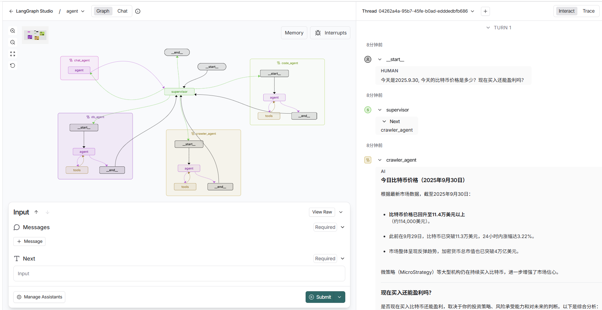
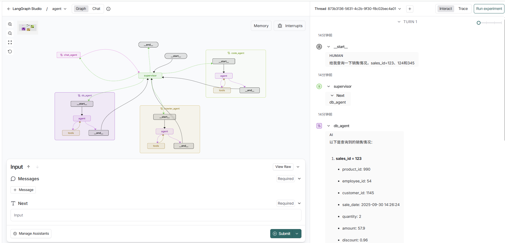
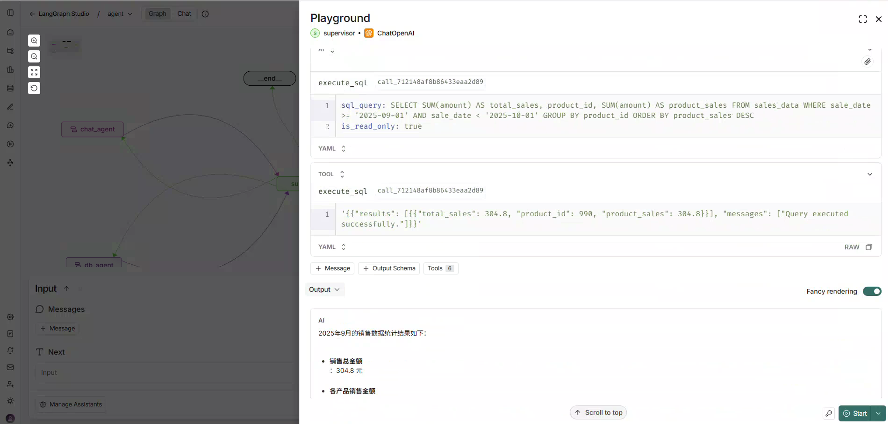
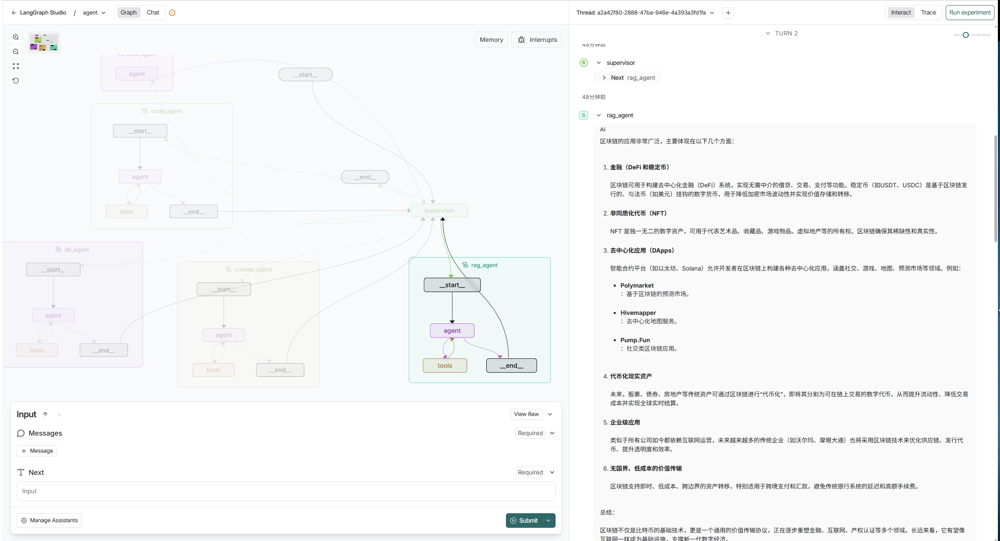

multi agent开发！ 经典的supervised + other agent结构！

生成研究报告：

数据库读写：

text2sql：根据用户的prompt自动生成sql查询并返回结果

agentic RAG：plan + self evaluation

langgraph优势： https://mp.weixin.qq.com/s/LHIfNCovj9eknufCiEEcUA

* 显式的流程建模能力: 有向图（Directed Graph）描述agent行为
  * 流程逻辑清晰，可快速理解系统架构；
  * 支持条件跳转、循环、并行等复杂控制流；
  * 易于做流程变更与功能扩展。
* 状态管理机制
  * **状态持久化** ：通过 Checkpointer（如 PostgreSQL、Redis）保存执行快照，支持断点续跑。
  * **会话隔离** ：每个会话（thread）独立存储，避免状态污染。
  * **状态合并策略** ：通过 Annotated 定义字段更新规则 这使得系统具备了处理长时间运行任务的能力，例如跨天的任务审批、多轮调研报告生成等。
* 内建的生产级能力
  * 全链路追踪（Trace）；
  * 节点级耗时、Token 消耗统计；
  * 错误堆栈与输入输出快照；
  * A/B 测试与评估指标管理。
  * 故障排查、性能优化、合规审计有优势
* 架构开放，易于集成
  * 多模型供应商（OpenAI、Anthropic、本地部署模型）；
  * 自定义工具调用（Tool Calling）；
  * 外部系统集成（数据库、API、消息队列）；
  * MCP（Model Context Protocol）扩展。
