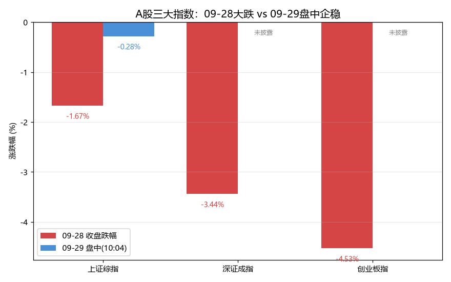
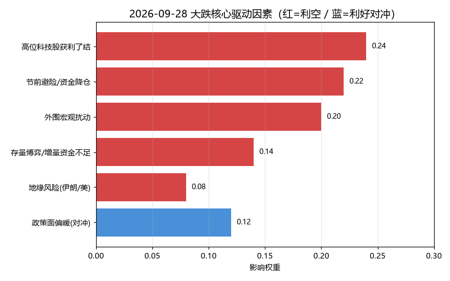
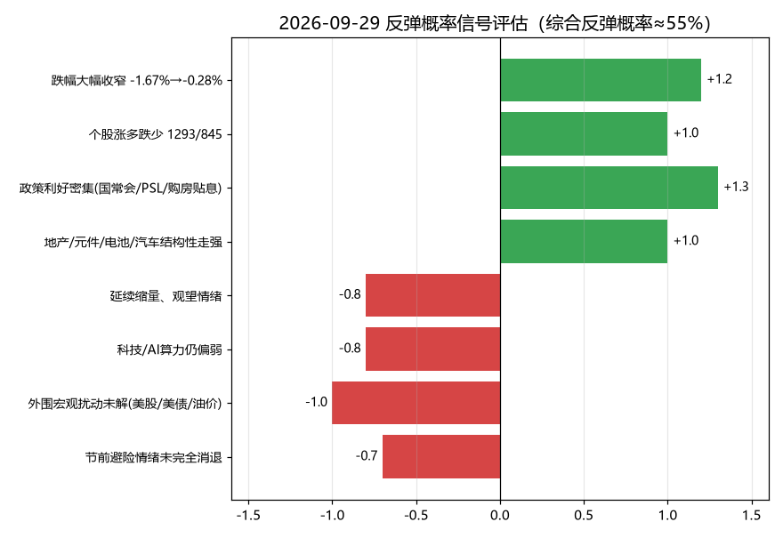
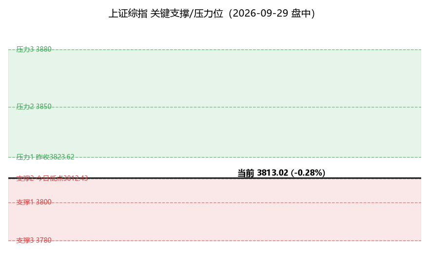

# A股大跌复盘与仓位管理建议
## ——2026-09-28 大跌原因 · 2026-09-29 走势研判 · 是否割肉

> **报告日期：2026-09-29（周二）**
> 数据基准：09-28 收盘 + 09-29 盘中（截至 10:04，非收盘）。
> 本报告为投资研究参考，不构成投资建议；市场有风险，决策需独立判断。

---

## 一、分析背景

2026-09-28（周一）A股三大指数集体大跌，市场情绪一度受挫。本报告回答三个问题：

1. **昨天（09-28）为什么大跌？** ——拆解驱动因素，判断性质；
2. **今天（09-29）会怎么走？** ——研判反弹概率与关键点位；
3. **现在该不该割肉？** ——给出分场景的仓位管理建议。

核心结论先行：**这是一次"高位成长股回调 + 节前流动性收缩"的技术性/流动性调整，而非基本面恶化或趋势反转。** 因此，对多数持仓而言，**盲目割肉并非最优解**——更合理的做法是"持有核心仓位、降低高贝塔科技敞口、用关键位做纪律"。

---

## 二、数据概览

| 指数 | 09-28 收盘 | 09-28 跌幅 | 09-29 盘中(10:04) | 09-29 涨跌 |
|---|---|---|---|---|
| 上证综指 | 3823.62 | **-1.67%** | 3813.02 | -0.28% |
| 深证成指 | 12858.75 | **-3.44%** | 未披露 | — |
| 创业板指 | 3139.82 | **-4.53%** | 未披露 | — |

- **量能**：09-28 两市成交约 1.65 万亿元，为年内次低，**缩量下跌**；09-29 延续缩量，观望情绪仍存。
- **个股广度**：09-28 超 4800 只个股下挫；09-29 截至 10:04 涨 1293 / 跌 845 / 平 92，**涨多跌少，情绪修复**。
- **估值背景**：科创50 PE 百分位 77.23%（偏高）、中证银行 92.53%（偏高）、创业板指 20.47%（偏低）、证券龙头 1.82%（极低）——**高位成长股估值压力是本次回调的结构性背景**。

> 图1：三大指数 09-28 大跌 vs 09-29 盘中企稳。跌幅从 -1.67% 收窄至 -0.28%，是企稳的第一信号。

---

## 三、09-28 大跌核心驱动因素（量化权重）

对大跌驱动因素做权重打分（权重归一，红=利空、蓝=利好对冲）：

| 驱动因素 | 权重 | 方向 | 证据 |
|---|---|---|---|
| 高位科技股获利了结 | 0.24 | 利空 | AI算力/光模块/半导体/PCB 前期涨幅大，集中止盈，领跌 |
| 节前避险/资金降仓 | 0.22 | 利空 | 国庆长假临近，资金降仓规避跨假期风险；缩量 1.65 万亿 |
| 外围宏观扰动 | 0.20 | 利空 | 美股三连跌、布油破百元、美债收益率走高、美联储9月加息概率抬升 |
| 存量博弈/增量资金不足 | 0.14 | 利空 | 增量资金入场谨慎，放量下跌后缩量 |
| 政策面偏暖（对冲） | 0.12 | 利好 | 央行例会加大逆周期调节、下调 PSL 利率 0.25pct |
| 地缘风险（伊朗/美） | 0.08 | 利空 | 伊朗称已为与美战事重开做好准备 |

**量化结论：** 利空权重合计 0.88，利好对冲仅 0.12，**净利空强度 ≈ 0.76**，属"利空主导、政策托底"格局。

- **主因（技术面+资金面，合计 0.46）**：高位科技股获利了结（0.24）+ 节前避险降仓（0.22）——本质是"高位成长股回调 + 节前流动性收缩"，**第一驱动力**。
- **次因（外围/情绪面，合计 0.42）**：外围宏观扰动（0.20）+ 存量博弈（0.14）+ 地缘（0.08），放大跌幅。
- **对冲（政策面 0.12）**：央行逆周期调节 + PSL 降息提供底部支撑，但权重不足以扭转当日方向。

> 图2：驱动因素权重。**性质判断：技术性/流动性调整，非基本面恶化。** 这一判断是后续"是否割肉"建议的根基。

---

## 四、2026-09-29 走势研判：结构性反弹

### 4.1 反弹概率信号评估

| 信号 | 方向 | 权重 |
|---|---|---|
| 跌幅大幅收窄（-1.67%→-0.28%） | 利好 | 1.2 |
| 个股涨多跌少（1293/845） | 利好 | 1.0 |
| 政策利好密集（国常会/PSL/购房贴息） | 利好 | 1.3 |
| 地产/元件/电池/汽车结构性走强 | 利好 | 1.0 |
| 延续缩量、观望情绪 | 利空 | 0.8 |
| 科技/AI算力仍偏弱 | 利空 | 0.8 |
| 外围宏观扰动未解（美股/美债/油价） | 利空 | 1.0 |
| 节前避险情绪未完全消退 | 利空 | 0.7 |

加权净信号 +0.154，**综合反弹概率 ≈ 55%（中性偏多）**。

> 图3：反弹概率信号。利好与利空大致均衡，故为"中性偏多"而非"强烈看多"。

### 4.2 "结构性反弹"逻辑（核心论点）

**今日大概率"企稳 + 结构性反弹"，但难言全面反转。** 逻辑链条：

1. **止跌有支撑**：跌幅大幅收窄、个股涨多跌少、政策利好密集——尤其 **10月1日起居民购房贷款贴息**直接刺激地产链，地产/地产ETF 多只涨超 3%，元件（依顿电子涨停）、电池、汽车（广汽集团涨停）接力，**低位方向领涨**。
2. **反弹有天花板**：缩量（增量资金不足）+ 科技主线未修复（中际旭创 -0.06%、AI算力仍偏弱）+ 外围宏观扰动未解，**制约反弹高度**。
3. **结论**：更可能是"**地产/金融等低位方向领涨、科技高位股继续消化**"的**结构性修复**，而非 V 型反转。

**两个关键观察点（决定反弹成色）：**
- ① **量能能否放大**：缩量则反弹持续性弱，仅是超跌反抽；
- ② **科技/AI算力能否止跌企稳**：决定市场主线是否切换、反弹能否扩散。

### 4.3 上证综指关键支撑/压力位

| 类型 | 点位 | 依据 |
|---|---|---|
| 压力3 | 3880 | 前期密集区 |
| 压力2 | 3850 | 整数关口 |
| 压力1 | **3823.62** | 09-28 收盘/缺口压力（收复则企稳确认） |
| 当前 | 3813.02 | 盘中 -0.28% |
| 支撑2 | **3812.43** | 今日低点（短线多空分界） |
| 支撑1 | 3800 | 整数关口 |
| 支撑3 | 3780 | 强支撑 |
| 52周区间 | 3741.11 – 4258.86 | 当前处于区间中下沿 |

> 图4：关键位。收复 3823.62（昨收）= 企稳确认；跌破 3812.43（今日低点）= 回踩 3800，破 3800 看 3780；3780 为强支撑，跌破需警惕二次探底。

---

## 五、是否割肉：仓位管理建议

### 5.1 核心判断：技术调整 ≠ 趋势反转，盲目割肉非最优

- 大跌主因是**高位科技股获利了结 + 节前避险降仓**（合计权重 0.46），属**技术性/流动性调整**，**非基本面恶化**；
- 政策面持续托底（逆周期调节、PSL 降息、购房贴息），底部有支撑；
- 09-29 已现企稳信号（跌幅收窄、个股涨多跌少）。

**因此：对多数持仓，"恐慌性割肉"往往卖在情绪低点，性价比低。** 但"不割肉"不等于"满仓不动"——**关键是结构优化 + 纪律化**，而非一刀切。

### 5.2 分持仓类型的操作建议

| 持仓类型 | 建议 | 理由 |
|---|---|---|
| **核心仓位（低估值/政策受益：银行、地产、金融、高股息）** | **持有，不割** | 银行 PE 百分位虽高但逆势走强、地产受购房贴息直接利好，是本轮反弹主线，割肉易踏空 |
| **高贝塔科技（AI算力/光模块/半导体/PCB 高位股）** | **降低敞口（部分止盈/减仓）** | 前期涨幅大、估值偏高（科创50 PE 百分位 77%），是本轮领跌与波动源；若**量能不放量**，反弹持续性弱，宜逢反弹降低仓位、锁定利润 |
| **贵金属/农业等领跌方向** | **观察，破位再减** | 跟随外围（金价/油价）波动，未破关键支撑前不急于割，破位则纪律离场 |
| **深套且无基本面支撑的个股** | **借反弹降低仓位** | 利用结构性反弹的流动性窗口优化结构，而非在恐慌低点割 |

### 5.3 仓位纪律（用关键位做决策，而非情绪）

- **总仓位**：节前 + 外围未解，建议维持**中性仓位（约 5–7 成）**，不追高、不满仓，保留应对二次探底的弹药。
- **加仓触发**：上证**放量收复 3823.62（昨收）** → 企稳确认，可适度回补核心仓位，上看 3850/3880。
- **减仓/防守触发**：跌破 **3812.43（今日低点）** → 回踩 3800；破 3800 进一步降仓；**3780 为强支撑，跌破则显著降低仓位、警惕二次探底**。
- **科技敞口**：无论指数如何，**高贝塔科技仓位建议控制在总仓位的较低比例**，逢反弹分批降低，避免单一主线回撤拖累整体。
- **节前因素**：国庆长假临近，跨假期持仓需评估外围（美股/美债/油价）不确定性，**风险偏好低者可适度降仓过节**，机构主流"持股过节"更适合核心低估值仓位。

### 5.4 一句话总结

> **不恐慌割肉，但优化结构**：持有核心低估值/政策受益仓位，逢反弹降低高贝塔科技敞口，用 3823.62（上）/ 3812.43、3780（下）做加减仓纪律，维持中性仓位应对节前与外围不确定性。

---

## 六、风险提示

1. **数据时效**：09-29 数据为盘中（10:04）快照，非收盘；北向资金盘中实时值未披露，需日终数据补充。收盘后走势可能变化。
2. **外围风险**：美股三连跌、布油破百元、美债收益率走高、美联储9月加息概率抬升、地缘（伊朗/美）尚未解除，是反弹的最大外部变量。
3. **量能风险**：若反弹持续缩量，则仅为超跌反抽，结构性修复难扩散为全面行情。
4. **本报告为投资研究参考，不构成投资建议**；市场有风险，决策需独立判断并自担风险。

---

### 附：图表清单
- 图1 `chart1_指数对比.png`：三大指数 09-28 vs 09-29
- 图2 `chart2_驱动因素.png`：大跌驱动因素权重
- 图3 `chart4_反弹概率.png`：反弹概率信号评估
- 图4 `chart3_支撑压力.png`：上证关键支撑/压力位
