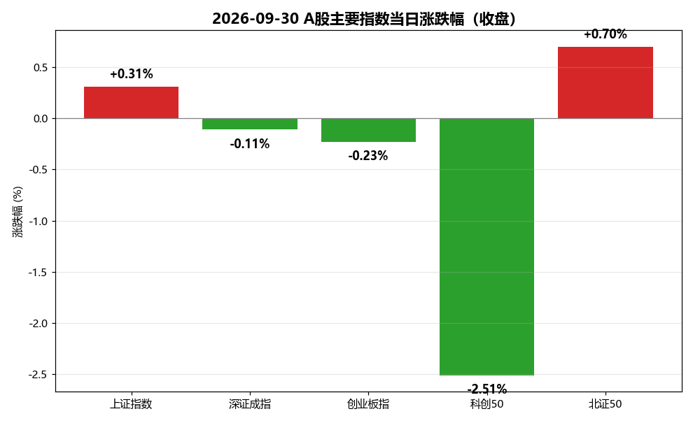
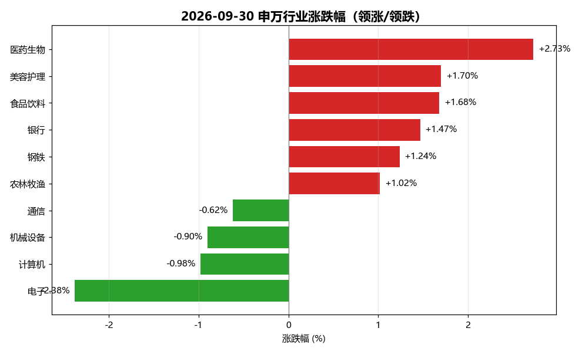
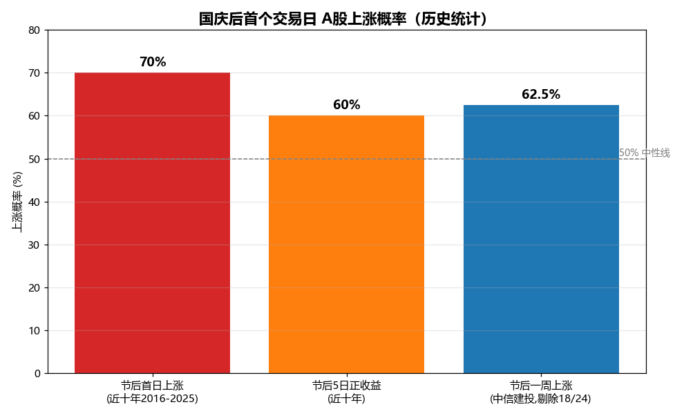

# A股收盘与国庆后上涨概率综合分析报告

**AS_OF: 2026-09-30 15:00**（当日收盘/收评口径，非盘中快照）
**报告生成时间：2026-09-30 19:38**

> 本报告基于 2026-09-30（国庆长假前最后一个交易日）A股收盘数据、当日重大新闻与政策动态，结合历史日历效应统计，分析 2026-10-09（国庆后首个交易日，周五）大盘上涨概率。历史统计不代表未来表现，本报告仅供研究参考，不构成投资建议。

---

## 一、分析背景

2026-09-30 是国庆长假前最后一个交易日，A股已收盘。当日三大指数走势分化、涨跌互现，沪指红盘收官。节前市场缩量调整（9月29日曾创14个月地量），叠加 9月29日晚间密集出台房贷贴息、央行下调PSL利率、国常会逆周期调节等重磅政策，市场普遍关注节后首个交易日（10-09）的走向。本报告从**收盘数据 → 新闻政策 → 历史概率 → 综合研判**四个维度展开。

---

## 二、2026-09-30 收盘数据总览

### 2.1 主要指数表现

| 指数 | 收盘点位 | 当日涨跌幅 | 9月全月涨跌幅 |
|------|---------:|-----------:|-------------:|
| **上证指数** | **3842.19** | **+0.31%**（红盘收官） | -3.62% |
| 深证成指 | 12887.62 | -0.11% | -8.04% |
| 创业板指 | 3135.28 | -0.23% | -8.82% |
| 科创50 | 1530.01 | -2.51%（半导体拖累） | — |
| 北证50 | — | +0.70% | — |

**核心要点：**
- **上证指数收报 3842.19 点，上涨 0.31%，红盘收官**，是当日唯一收涨的主要宽基指数。
- 三大指数走势分化：沪指红盘，深成指、创业板指小幅收跌，**科创50大跌2.51%**（半导体/电子板块拖累）。
- **9月全月三大指数月线集体收阴**，上证全月 -3.62%，深成指 -8.04%，创业板指 -8.82%，9月下旬缩量调整。

### 2.2 成交与市场广度

| 指标 | 数值 |
|------|------|
| 沪深北三市成交额 | 约 **1.45 万亿元**（较29日小幅放大约280亿元） |
| 上涨家数 | 约 2500–2600 只 |
| 下跌家数 | 超过 2800 只 |
| 涨停家数 | 56 只 |
| 申万31行业 | 21 个收涨、10 个下跌 |

> 成交额仍处年内较低水平（9月29日曾创14个月地量），但较前一日小幅放量，显示节前观望情绪略有缓和。

### 2.3 行业板块表现

| 领涨板块 | 涨跌幅 | 领跌板块 | 涨跌幅 |
|---------|-------:|---------|-------:|
| 医药生物 | +2.73% | 电子 | -2.38% |
| 美容护理 | +1.70% | 计算机 | -0.98% |
| 食品饮料 | +1.68% | 机械设备 | -0.90% |
| 银行 | +1.47% | 通信 | -0.62% |
| 钢铁 | +1.24% | | |
| 农林牧渔 | +1.02% | | |

**结构特征：** 医药生物（创新药/CRO，康希诺、贝瑞基因、南华生物等多股涨停）、白酒、银行、钢铁、农业等**防御+政策受益板块领涨**；电子（半导体）、计算机、机械设备等**成长/科技板块领跌**，拖累科创50。市场呈现"高低切换、防御占优"的节前特征。

---

## 三、当日重大新闻与政策动态

### 3.1 宏观政策（重磅利好）

| 政策 | 内容 | 影响 |
|------|------|------|
| **房贷贴息新政** | 10月1日起对居民购房实施年化 **1个百分点** 贷款贴息（财政部、央行首次推出房贷贴息工具） | 直接降低购房成本，**房地产板块盘中大逆转**（深物业A跌停拉至涨停，万科A、金地集团回升） |
| **央行下调PSL利率** | 下调抵押补充贷款（PSL）利率 **0.25个百分点** | 结构性宽松信号，利好地产、基建、银行 |
| **国常会逆周期调节** | 加大逆周期调节力度，推出一批增量政策（盘活地方债、稳楼市、促增收） | 提振信心，利好大消费、基建、地方平台，四季度增量政策可期 |

### 3.2 市场要闻
- **9月A股平稳收官**：三大指数月线集体收阴，9月全月成交额略超38万亿元，9月下旬缩量调整。
- **节前最后交易日红盘收官**：三大指数分化、涨跌互现，沪指 +0.31% 红盘收官，房地产盘中大逆转，医药、白酒、大消费活跃。

### 3.3 行业热点
- **领涨**：医药生物（创新药/CRO）、美容护理、食品饮料（白酒）、银行、钢铁、农林牧渔（农业）。
- **领跌**：电子（半导体）、计算机、机械设备、通信。

---

## 四、国庆后首个交易日（2026-10-09）上涨概率分析

### 4.1 历史日历效应统计

| 统计口径 | 来源 | 节后首日/一周上涨概率 |
|---------|------|---------------------:|
| 近十年（2016-2025）节后**首个交易日** | 21财经/Wind | **70%**（10年中7年上涨） |
| 近十年节后**5个交易日**正收益 | 21财经/Wind | **60%** |
| 2016年以来节后**一周**（剔除2018/2024） | 中信建投 | **约62.5%**，平均涨 **1.3%** |

**关键规律（东吴证券近20年 2006-2025 复盘）：**
- **走势**：指数节前震荡整理、国庆前2日企稳，节后快速上行，行情多持续到 **T+5 日**附近。
- **量能**：节前缩量、节后放量——节前量能自 T-8 日起回落，缩量持续到节后首个交易日，**T+2 日起量能中枢显著抬升**。
- **风格**：节前大盘/消费占优；**节后指数普涨、小盘弹性更佳、金融风格明显更强**。
- **杠杆资金**：节前融资客倾向减仓（2025节前两融 -226.3亿），**节后首日资金回补**（除2022年外均增长）。

### 4.2 节后高胜率板块
- **金融风格**：银行、非银金融（表现突出）。
- **地产链**：建筑材料、建筑装饰（胜率较高，叠加房贷贴息新政催化）。
- 节前主力净流入居前：食品饮料、银行、医药生物、美容护理、电力设备。

### 4.3 利好与风险因素

**利好（支撑节后上涨）：**
1. **政策催化密集**：房贷贴息新政（10/1生效）+央行下调PSL+国常会逆周期增量政策，构成节后明确利好。
2. **资金回流预期**：节前缩量属交易性/季节性因素，节后资金回流、修复性反弹预期较强。
3. **券商主流意见"持股过节"**：多家机构看好节后修复行情。
4. **历史日历效应偏多**：节后首日上涨概率约70%、节后一周约62.5%。

**风险（可能压制节后涨幅）：**
1. **节前已部分反弹**：节前最后两日已反弹，部分资金或提前博弈，节后首日涨幅或被部分透支。
2. **长假外部扰动**：长假期间海外股市、汇率、地缘局势等可能在节后开盘形成冲击。
3. **成长风格走弱**：半导体/电子节前走弱（科创50 -2.51%），需观察成长风格能否修复。
4. **基本面与流动性**：宏观经济复苏不及预期、流动性变化、行业基本面波动可能引发调整。

### 4.4 综合研判

| 维度 | 评估 |
|------|------|
| 历史概率基准 | 节后首日上涨概率约 **62.5%–70%** |
| 政策面 | 偏多（房贷贴息+PSL+逆周期三重催化） |
| 资金面 | 偏多（节后资金回流+杠杆回补） |
| 情绪面 | 中性偏多（节前缩量观望，节后修复预期） |
| 风险面 | 中性（外部扰动+成长走弱+节前反弹透支） |

**结论：2026-10-09（国庆后首个交易日）大盘上涨概率偏高，综合研判约 65%–70%。**

- **基准情形（概率最高）**：节后首日小幅高开或平开后震荡上行，金融、地产链、大消费领涨，沪指有望延续红盘，节后一周延续修复（对应历史"节后快速上行至T+5"规律）。
- **乐观情形**：政策催化+资金回流共振，节后放量上攻，小盘/金融弹性更大。
- **谨慎情形**：若长假海外扰动较大或节前反弹被透支，节后首日可能高开低走或震荡，但中期修复趋势不变。

**操作提示（仅供参考）：** 关注节后首日金融（银行/非银）、地产链（建材/装饰）、大消费（食品饮料/医药）的高胜率方向；留意 T+2 日起量能是否显著抬升以确认修复行情；警惕长假外部扰动对开盘的冲击。

---

## 五、结论

1. **今日收盘**：上证指数 **3842.19 点，上涨 0.31%，红盘收官**；三大指数分化，科创50大跌2.51%；9月全月三大指数月线集体收阴（上证 -3.62%）。
2. **今日要闻**：房贷贴息新政（10/1生效）、央行下调PSL利率0.25pct、国常会逆周期增量政策三大重磅利好；医药、白酒、银行、地产领涨，电子/半导体领跌。
3. **节后概率**：基于历史日历效应（节后首日上涨概率约70%、节后一周约62.5%）+政策催化+资金回流预期，**2026-10-09 大盘上涨概率综合研判约 65%–70%**，基准情形为节后震荡上行、金融/地产/消费领涨，需警惕长假外部扰动与节前反弹透支风险。

---

### 数据来源
- 东方财富网/证券日报、新华财经/中国金融信息网、金融投资报、新浪财经（2026-09-30 收评）
- 21世纪经济报道/Wind（近十年国庆日历效应）、中信建投、东吴证券（近20年复盘）
- 上游数据文件：`2026-09-30_A股收盘数据.json`、`2026-09-30_A股重大新闻.json`、`2026-10-09_国庆后首日历史统计.json`

> **免责声明**：本报告基于公开信息与历史统计，历史表现不代表未来收益，不构成任何投资建议。市场有风险，投资需谨慎。
