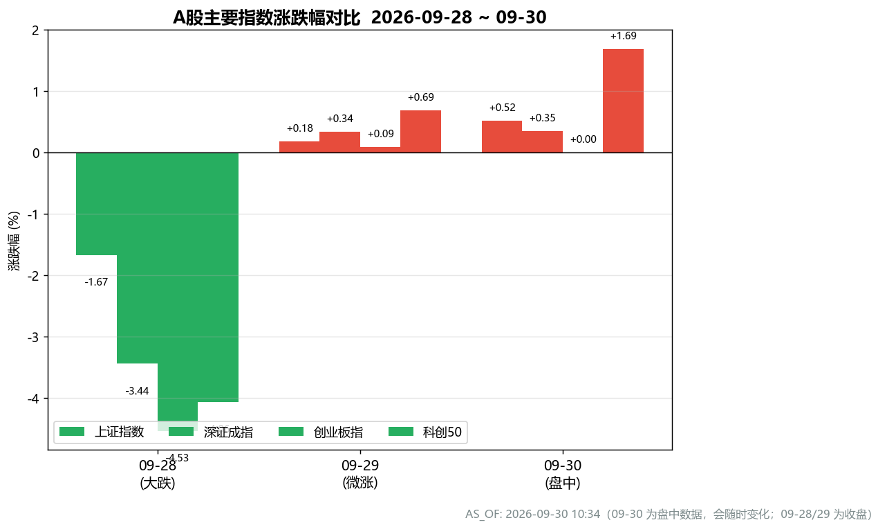
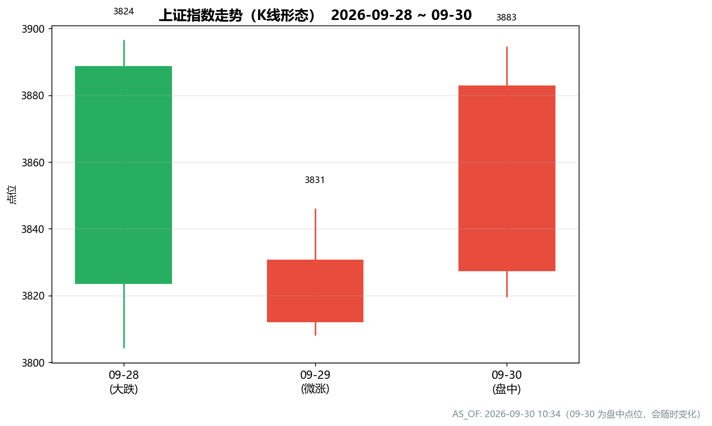
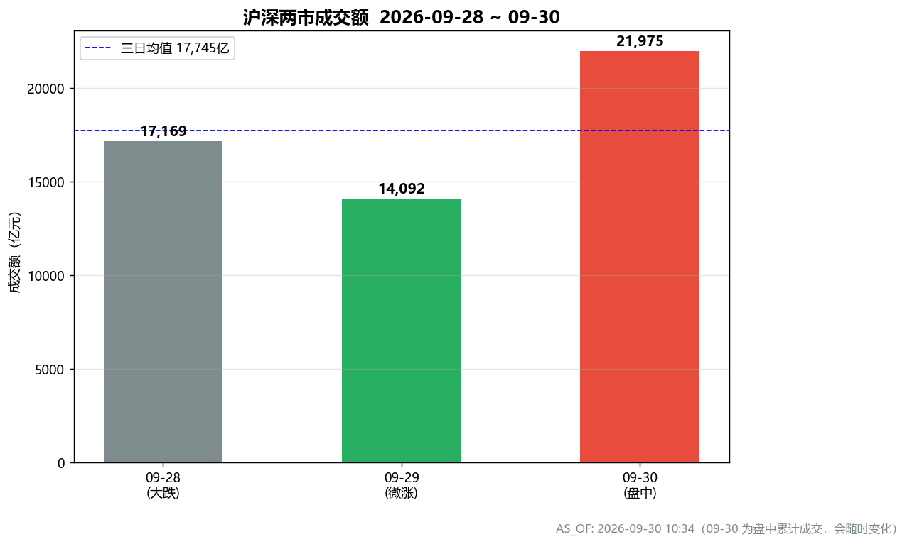
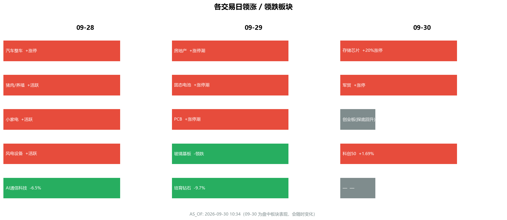

# A股买卖建议分析报告

**报告日期：** 2026-09-30（周三）
**数据基准：** AS_OF: 2026-09-30 10:34（09-30 为盘中数据，会随时变化；09-28/09-29 为收盘数据）
**分析窗口：** 2026-09-28（大跌）→ 09-29（微涨）→ 09-30（盘中放量回升）

> ⚠️ 本报告基于截至 2026-09-30 10:34 的盘中数据，盘中行情随时变化，收盘前结论可能调整。本报告仅为数据分析参考，不构成投资建议，据此操作风险自负。

---

## 一、分析背景

2026年9月，A股主要指数录得**连续第5个月上涨**，创业板指月涨12%（3年新高）、科创50月涨11%（4年新高），市场处于强势月度上行趋势中。

进入9月末，行情出现"急跌—企稳—放量修复"的三日节奏：

- **09-28（中秋后首个交易日）全线大跌**：上证 -1.67%、深成指 -3.44%、创业板指 -4.53%，超4500只个股下跌，AI通信科技股领跌（寒武纪 -6.55%）。
- **09-29 缩量微涨**：上证 +0.18%、深成指 +0.34%，成交缩至1.41万亿（14个月新低），房地产/固态电池/PCB 结构性走强。
- **09-30 盘中放量回升**（as-of 10:34）：上证 +0.52% 至 3882.78、科创50 +1.69%，成交放大至约2.2万亿，存储芯片/军贸领涨。

本报告基于上述行情、消息面与资金面，给出有据的买卖倾向、风险提示与仓位建议。

---

## 二、数据概览

### 2.1 主要指数三日表现

| 指数 | 09-28（大跌） | 09-29（微涨） | 09-30（盘中） |
|------|:---:|:---:|:---:|
| 上证指数 | 3823.62（-1.67%） | +0.18% | 3882.78（+0.52%） |
| 深证成指 | 12858.75（-3.44%） | +0.34% | +0.35% |
| 创业板指 | 3139.82（-4.53%） | +0.09% | 收平（探底回升） |
| 科创50 | -4.06% | +0.69% | **+1.69%** |
| 成交额 | ~1.72万亿（放量） | 1.41万亿（缩量，14月新低） | ~2.20万亿（放量） |
| 市场宽度 | 下跌超4500只 | 上涨超3400只 | 科技主线回暖 |

### 2.2 上证指数 K线形态

09-28 长阴 → 09-29 十字星（缩量企稳）→ 09-30 放量阳线，09-30 盘中点位 3882.78 已收复 09-28 全部跌幅，K线呈"V型修复"。

### 2.3 成交量节奏

呈"**放量跌 → 缩量企稳 → 放量涨**"的健康节奏。09-30 成交 2.2 万亿显著高于 09-29 的 1.41 万亿，承接意愿强，是修复行情成立的关键确认信号。

### 2.4 板块轮动

领涨主线三日切换清晰：

| 日期 | 领涨 | 领跌 |
|------|------|------|
| 09-28 | 汽车整车、猪肉/养殖、小家电、风电（防御） | AI通信科技（寒武纪 -6.55%） |
| 09-29 | 房地产（万科A涨停）、固态电池、PCB（政策驱动） | 玻璃基板、培育钻石、石化 |
| 09-30 | **存储芯片**（江波龙涨停、华虹 +16%）、**军贸**（中航沈飞涨停） | — |

---

## 三、消息面与资金面支撑

### 3.1 政策面（偏暖，09-28 集中释放）
- **国常会**：加大宏观政策**逆周期调节**力度（稳增长利好）。
- **工信部等七部门**印发《新型电池产业"十五五"规划》→ 直接催化 09-29 固态电池涨停潮。
- **上海**商品住房**现房销售**改革 → 催化 09-29 房地产领涨。
- **中美**"300亿对300亿"对等降税框架 + 11月底前再开中美AI对话。
- **统计局**：1-8月规上工业利润 **+15.7%**（基本面韧性）。
- 央行定调2026"适度宽松"，降准降息"灵活高效"，市场普遍预期仍有降准降息空间。

### 3.2 外部扰动（09-28 大跌主因，非基本面）
- 美债利率升至 **5.5%**，大摩称市场或高估美联储加息幅度、短期缺转鸽催化。
- 布油**破98美元**、现货黄金 -3.96%/白银 -5.65%、美股低开 → 压制风险偏好。
- 英伟达追加1500亿美元回购（利好科技情绪）。

### 3.3 资金面（增量环境偏暖）
- **北向**：2026年内累计净流入**超2800亿元**，外资在美联储降息+美元走弱背景下加速回流。
- **两融**：余额处历史高位（约2.63万亿，5月曾达2.8万亿新高），杠杆资金活跃。
- **国家队**：7月起协同进场超600亿（国新+诚通+五大险企+ETF+回购增持再贷款），科技ETF首次纳入，"政策底"清晰。

> **核心判断**：09-28 大跌是"节后获利了结 + 外围扰动 + 高估值科技回调"叠加，**属技术性/外部性，而非基本面恶化**；国内政策面实际偏暖，09-30 放量回升确认资金回流科技主线。

---

## 四、买卖倾向建议

### 4.1 总体倾向：**中性偏多（逢低布局，不追高）**

市场处于强势月度趋势中的"回调—修复"阶段，09-30 放量阳线 + 政策暖风 + 增量资金偏暖，中期趋势未破坏。但 09-29 缩量、09-30 为盘中数据，短期动能仍需收盘确认，**不宜追高，宜逢回调分批布局**。

### 4.2 分板块建议

| 板块 | 倾向 | 依据 | 操作建议 |
|------|:---:|------|----------|
| **存储芯片/半导体** | 买入（核心主线） | 09-30 放量领涨（江波龙涨停、华虹+16%），资金回流科技主线，基本面+资金共振 | 回调至5日线附近分批买入，不追涨停板 |
| **固态电池/新型电池** | 买入（政策驱动） | 工信部"十五五"规划直接催化，09-29 涨停潮，政策确定性高 | 政策落地后回调低吸，关注龙头 |
| **房地产** | 谨慎买入 | 上海现房销售改革催化，09-29 万科A涨停，但属政策脉冲、持续性待验证 | 轻仓参与，破位止损 |
| **军贸/军工** | 买入 | 09-30 中航沈飞涨停，地缘+订单逻辑 | 回调布局，关注量能持续性 |
| **AI通信科技（光模块/算力）** | 持有/逢低吸纳 | 09-28 领跌但属高估值回调，非基本面恶化，月线趋势仍强 | 已持有者不割肉，回调至支撑位分批补 |
| **防御板块（养殖/风电/汽车）** | 持有 | 09-28 抗跌，提供组合稳定器 | 作为底仓持有，不追 |
| **玻璃基板/培育钻石/石化** | 卖出/回避 | 09-29 领跌，资金流出，无政策催化 | 反弹减仓，回避 |

### 4.3 仓位建议

- **总仓位**：建议维持 **6~7 成**（中性偏多，留足现金应对盘中波动与外围不确定性）。
- **结构**：科技成长（存储/半导体/电池/军工）约 4~5 成 + 防御底仓（养殖/风电/红利）约 2 成 + 现金 3~4 成。
- **节奏**：09-30 为盘中数据，**若收盘能站稳 3880 上方且成交维持 2 万亿以上**，可加仓至 7 成；若尾盘回落缩量，则维持 6 成、等待确认。
- **杠杆**：两融已处历史高位，**不建议加杠杆**，避免放大波动风险。

---

## 五、风险提示

1. **盘中数据风险**：09-30 数据为 as-of 10:34 盘中值，收盘可能变化，本报告结论以收盘为准。
2. **外围不确定性**：美债利率 5.5%、油价破98美元、美联储加息预期、美伊谈判变数，若外围再度恶化可能引发二次回调。
3. **缩量隐忧**：09-29 成交 1.41 万亿为14个月新低，若 09-30 放量无法延续，修复行情可能夭折。
4. **高估值回调风险**：创业板指/科创50 月涨12%/11% 处3~4年高位，高估值科技股波动加大，追高易被套。
5. **杠杆风险**：两融余额历史高位，市场情绪敏感，警惕杠杆资金踩踏。
6. **政策脉冲衰减**：房地产/固态电池等政策驱动板块，若后续政策不及预期，脉冲行情可能快速退潮。

---

## 六、结论

- **趋势判断**：A股处于强势月度上行趋势中的"回调—修复"阶段，09-28 大跌为技术性/外部性，09-30 放量阳线确认资金回流科技主线，**中期趋势未破坏**。
- **操作基调**：**中性偏多，逢低布局、不追高**。核心主线为存储芯片/半导体、固态电池、军工；防御板块作底仓；回避玻璃基板/培育钻石/石化等资金流出板块。
- **仓位**：维持 6~7 成，科技成长 4~5 成 + 防御 2 成 + 现金 3~4 成，不加杠杆。
- **关键确认信号**：09-30 收盘能否站稳 3880 上方且成交维持 2 万亿以上——是决定加仓还是观望的核心变量。

---

*数据来源：上游 CrawlerAgent（行情/消息面）与 CodeAgent（可视化）；图表文件见 `E:\agent_dev\multi-agent\tmp\chart1~4_*.png`。本报告不构成投资建议。*
