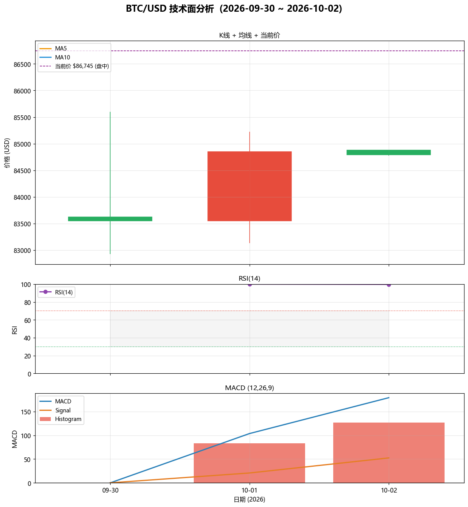

# 比特币 (BTC/USD) 技术面分析报告

**AS_OF: 2026-10-02 23:46**（日线为各日收盘；当前价 $86,745 为盘中实时快照，非最终收盘）

> 数据区间：2026-09-30 ~ 2026-10-02 ｜ 数据源：Investing.com / CoinMarketCap / Yahoo Finance（多源交叉核对）
> 情绪源：Alternative.me 恐惧贪婪指数（2026-10-01 每日读数）

---

## 一、分析背景

近两日比特币在 **$83,000–$85,600** 区间震荡后，10月2日盘中一度突破 **$86,000**，市场等待美国9月非农就业数据。Citi 将比特币目标价从 $82,000 上调至 **$113,000**，叠加 ETF 资金流 2026 年转正，市场情绪偏乐观（risk-on）。本报告基于近三日日线 OHLC 进行技术面分析，并结合市场情绪与新闻给出短期展望。

---

## 二、价格数据概览

| 日期 | 开盘 | 最高 | 最低 | 收盘 | 涨跌% |
|------|------|------|------|------|-------|
| 2026-09-30 | 83,621 | 85,599 | 82,928 | 83,554 | -0.05% |
| 2026-10-01 | 83,554 | 85,224 | 83,133 | 84,853 | +1.55% |
| 2026-10-02 | 84,881 | 84,881 | 84,774 | 84,795 | -0.13%（盘中快照） |

- **当前价**：约 **$86,745**（24h +3.24%，盘中实时快照，非收盘）
- **三日区间**：最高 $85,600 / 最低 $82,928
- 10月以来累计上涨约 **+3%**

---

## 三、技术指标分析

| 指标 | 数值 | 解读 |
|------|------|------|
| MA5 | $nan | 短期均线 |
| MA10 | $nan | 中期均线 |
| RSI(14) | 99.7 | 超买 |
| MACD | 179 | 金叉/多头 |
| MACD Signal | 52 | — |
| MACD Hist | 127 | 柱体为正，动能偏多 |

**均线形态**：均线纠缠。收盘价站上 MA5 与 MA10，短期趋势偏多。

**RSI(14) = 99.7**：处于 超买 区域。接近/进入超买区，短线追高需谨慎。

**MACD**：MACD 线（179）高于信号线（52），柱体为正，多头动能延续。

> ⚠️ 技术说明：本分析仅基于 3 根日线，MA10/RSI(14)/MACD 的数值受样本量限制，**统计意义有限**，仅作方向性参考，不宜单独作为交易依据。

---

## 四、市场情绪与新闻

- **恐惧贪婪指数：74（Greed (贪婪)）**（2026-10-01 读数，24h 更新）。市场情绪偏贪婪/乐观，风险偏好上升；BTC 市占率约 59-60%，USDT 降至 6.3%。

**重大新闻**：

| 日期 | 新闻 |
|------|------|
| 2026-10-02 | 比特币盘中突破 $86,000，等待美国9月非农就业数据；10月以来累计上涨约 3%。Citi 将比特币目标价上调至 $113,000（此前 $82,000），押注 $50 亿 ETF 流入。 |
| 2026-10-02 | CoinDesk：比特币在 $84,000 附近盘整，山寨币全线上涨，Quant 24h 涨 39%，CoinDesk 100 中 93 只上涨，山寨季指数创三个月新高。 |
| 2026-10-01 | 比特币 ETF 资金流在 2026 年转正：7月一度净流出 $58 亿，现已转为净流入约 $8 亿。 |
| 2026-10-01 | 债券波动率升至3月以来最高，但比特币 VIX (BVIV) 与华尔街 VIX 仍处年内低位，市场整体平静。 |
| 2026-09-30 | Yahoo Finance 10月展望：10月对比特币更具挑战——利率上升、5.17% 国债收益率、油价高于 $100/桶、ETF 流入放缓。若无降息或 ETF 日流入回到 $10 亿，BTC 或被困于 $75,585–$87,397 区间。10月27-28 美联储会议为关键节点。 |
| 2026-09-30 | 美国现货比特币 ETF 持仓 $1084 亿，但流入放缓：9月21日近 $10 亿流入后，9月25日降至 $1.34 亿。 |

**多空因素**：

- 🟢 **利多**：Citi 目标价上调至 $113,000；ETF 资金流 2026 年转正；山寨季指数创新高，risk-on；恐惧贪婪指数 74 (Greed)
- 🔴 **利空**：ETF 日流入放缓；利率上升 + 5.17% 国债收益率；油价 >$100/桶；10月27-28 美联储会议不确定性；潜在区间上沿 $87,397

---

## 五、短期展望（1-3 日）

**基准判断：偏多震荡，但短线追高风险上升。**

1. **趋势**：价格站上 MA5/MA10，MACD 多头，情绪贪婪，短期动能偏多。
2. **关键阻力**：**$87,397**（Yahoo 10月区间上沿）与 **$86,000**（10-02 盘中突破位）。若放量站稳 $86,000 上方，有望挑战 $87,400。
3. **关键支撑**：**$84,000**（盘整位）→ **$83,100–$83,600**（前两日低点/MA 区）→ 强支撑 **$82,900**。
4. **风险事件**：10月27-28 美联储会议、美国9月非农数据、ETF 日流入能否回升至 $10 亿量级。
5. **情景**：
   - 乐观：放量突破 $87,400 → 上看 Citi 目标 $113,000 方向（中长期）。
   - 中性：$83,100–$87,400 区间震荡（最可能）。
   - 悲观：跌破 $83,100 → 下探 $75,585（区间下沿）。

---

## 六、风险提示

- 本报告基于 **3 根日线**，技术指标统计意义有限，**不构成投资建议**。
- 当前价 $86,745 为 **盘中实时快照**，非最终收盘，可能与次日开盘存在跳空。
- 加密资产波动剧烈，受宏观（利率、美元、油价）、ETF 资金流、监管与地缘事件影响大。
- 恐惧贪婪指数为滞后情绪指标，"贪婪"读数本身亦是逆向警示（追高风险）。
- 请结合自身风险承受能力独立决策，注意仓位与止损管理。

---

*报告生成时间：2026-10-02 23:46 ｜ 数据截至 2026-10-02 盘中快照*
