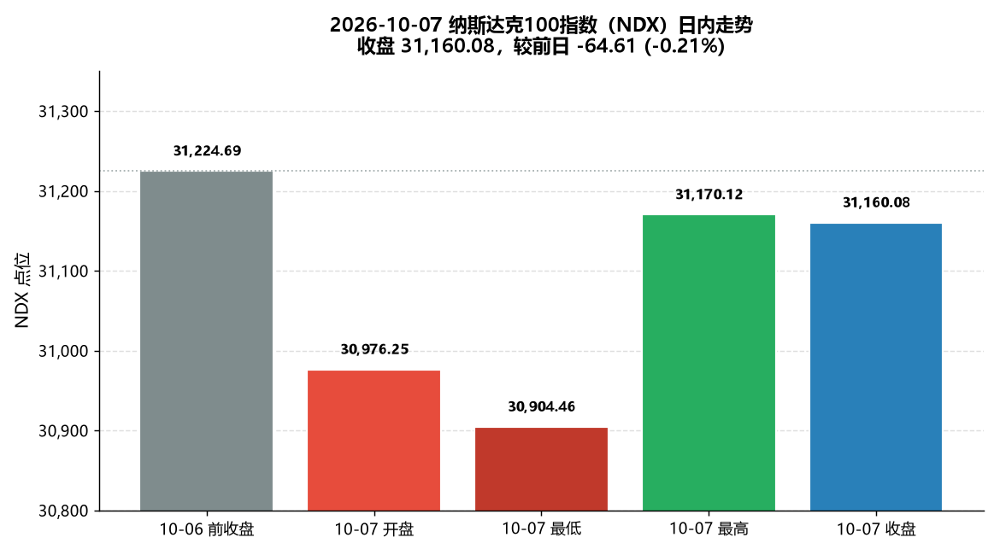
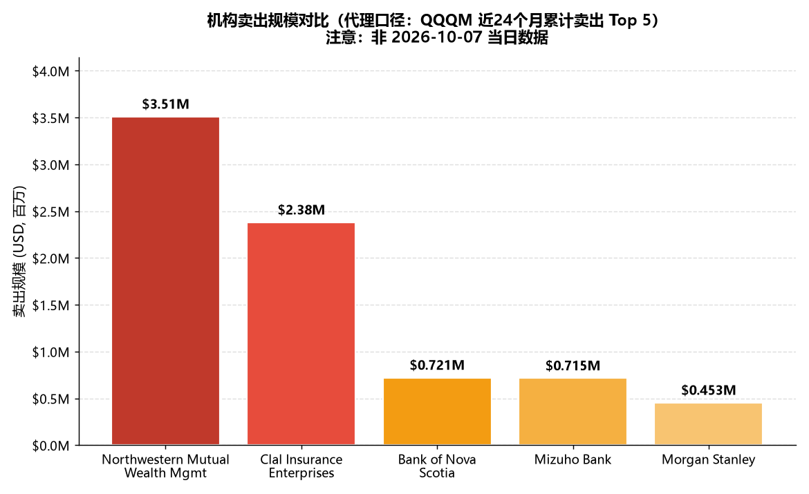

# 2026-10-07 纳斯达克100指数下跌分析与机构卖出 Top 5 报告

**AS_OF: 报告生成 2026-10-08 09:26（本地）；NDX 数据为 2026-10-07 收盘（17:15 EDT，对应北京时间 2026-10-08 05:15）**

---

## 一、分析背景

本报告分析 **2026-10-07（周三）** 纳斯达克100指数（NDX）的下跌情况，并尝试识别当日机构（共同基金/对冲基金/养老金等）卖出 Top 5。

> ⚠️ **核心数据口径声明（务必先读）**
> 用户原始需求为"识别 **2026-10-07 当日** 机构卖出 Top 5"。经检索确认：**"某一具体交易日的机构卖出 Top 5" 无公开权威数据**。机构持仓/买卖的权威披露渠道是 **SEC Form 13F**，属**季度**报告（季末后 45 天内提交），**只披露季末持仓快照，不披露逐日交易、不披露卖出明细**。
> 因此，本报告中的"机构卖出 Top 5"采用**代理口径**：MarketBeat 披露的 **QQQM（Invesco NASDAQ 100 ETF）近 24 个月累计卖出金额最大的 5 家机构**。该口径为 **24 个月累计、ETF 层面、非 10-07 单日**，**不可解读为 10-07 当日机构抛售**，仅作近似参考。

---

## 二、2026-10-07 纳指100（NDX）收盘概况

| 指标 | 数值 |
| --- | --- |
| 收盘价 | **31,160.08** |
| 涨跌 | -64.61 点 |
| 涨跌幅 | **-0.21%** |
| 前收盘 (10-06) | 31,224.69 |
| 开盘 (10-07) | 30,976.25 |
| 当日最低 | 30,904.46 |
| 当日最高 | 31,170.12 |
| 成交量 | 978,915,741 |

**结论：确认"跌了一点"。** 10-07 NDX 较前一日（10-06 收盘 31,224.69）下跌 64.61 点，跌幅 -0.21%，属**小幅回调而非大跌**。当日低开（30,976.25，低于前收盘约 0.79%）后日内持续收复失地，尾盘收于 31,160.08，呈"低开高走"形态。

### 可视化：NDX 2026-10-07 日内走势

**图表解读**：开盘 30,976.25 明显低于前收盘，盘中探底 30,904.46（日内最低）后逐步回升，最高触及 31,170.12，最终收于 31,160.08，几乎收复全部日内跌幅，仅较前收盘微跌 0.21%。

---

## 三、机构卖出 Top 5 详细列表（⚠️ 代理口径：QQQM 近24个月累计，非 10-07 当日数据）

| 排名 | 机构名称 | 卖出标的 | 卖出规模 (USD) | 机构类型 | 可能原因（公开披露） |
| --- | --- | --- | --- | --- | --- |
| 1 | Northwestern Mutual Wealth Management Co. | QQQM (Invesco NASDAQ 100 ETF) | $3.51M | 保险/财富管理 | 未披露具体原因（13F 仅披露持仓变动，不披露动机） |
| 2 | Clal Insurance Enterprises Holdings Ltd | QQQM | $2.38M | 保险（以色列） | 未披露 |
| 3 | Bank of Nova Scotia (Scotiabank) | QQQM | $721.32K | 银行（加拿大） | 未披露 |
| 4 | Mizuho Bank Ltd. | QQQM | $715K | 银行（日本） | 未披露 |
| 5 | Morgan Stanley | QQQM | $453.55K | 投行（美国） | 未披露 |

> **数据来源**：MarketBeat — Invesco NASDAQ 100 ETF (QQQM) Institutional Ownership。
> **口径**：近 24 个月累计卖出（基于 13F 汇总），**非 2026-10-07 单日**。
> **卖出标的说明**：13F 披露的是机构对 **QQQM（纳指100 ETF）** 的持仓变动，而非对某只 NDX 成分股的直接卖出；故"卖出标的"统一为 QQQM。
> **可能原因说明**：SEC 13F **不披露卖出动机**，公开渠道无具体原因披露，故标注"未披露"，不臆测。

### 可视化：机构卖出规模对比（柱状图）

**图表解读**：卖出规模呈明显**头部集中**——第 1 名（Northwestern Mutual，$3.51M）约为第 5 名（Morgan Stanley，$453K）的 **7.7 倍**；**前 2 家合计占 5 家总额的约 81%**。

---

## 四、市场解读

1. **指数层面：小幅回调，非趋势性下跌。** 10-07 NDX 仅跌 0.21%，且日内"低开高走"收复失地，显示抛压有限、买盘承接有力，市场情绪偏稳。
2. **机构层面（代理口径）：无法确认 10-07 当日机构集中抛售。** 由于 13F 为季度披露，公开数据无法证实 10-07 当日存在机构集中卖出行为。代理口径（QQQM 近24个月累计）显示机构对纳指100 ETF 的卖出以**保险/银行类机构**为主，且高度集中于头部（前 2 家占 81%），但这是**长期累计**行为，与 10-07 单日走势无直接因果。
3. **数据可得性提示**：若需真正的"10-07 当日机构卖出 Top 5"，需**付费实时 institutional flow 数据源**（如 Bloomberg、Refinitiv、Nasdaq Data Link 的机构实时资金流），公开免费渠道无法获取。

---

## 五、结论

- **2026-10-07 纳指100 小幅回调**：收盘 31,160.08，-0.21%，低开高走，非大跌。
- **"当日机构卖出 Top 5" 无公开权威数据**；本报告以 **QQQM 近24个月累计卖出 Top 5** 作为代理口径展示（Northwestern Mutual $3.51M 居首），**已明确标注非当日数据**。
- 机构卖出规模头部集中（前 2 家占 81%），以保险/银行类机构为主；13F 不披露卖出动机，故"可能原因"均标注"未披露"。

---

## 附：数据来源与文件清单

| 项 | 说明 |
| --- | --- |
| NDX 收盘数据 | Yahoo Finance（^NDX，"At close: October 7 at 5:15:59 PM EDT"），交叉参考 Investing.com |
| 机构卖出代理数据 | MarketBeat — QQQM Institutional Ownership |
| 13F 背景 | SEC 13F FAQ；HedgeTrace（Q3 2026 13F） |
| 图表文件 | `chart_ndx_2026-10-07.png`、`chart_institutional_selling_top5.png` |
| 上游数据文件 | `step1_ndx_2026-10-07_close.md`、`step2_institutional_selling_top5.md`、`step3_data_table_and_charts.md` |

*本报告由多智能体流水线生成（Step 1 数据检索 → Step 2 机构数据检索 → Step 3 数据整理与可视化 → Step 4 报告撰写）。*
