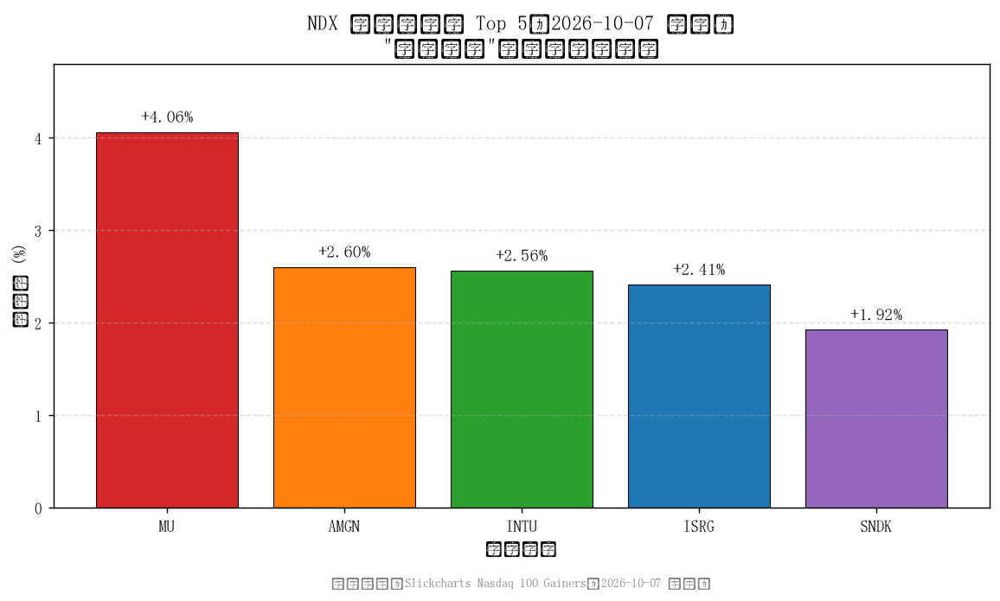
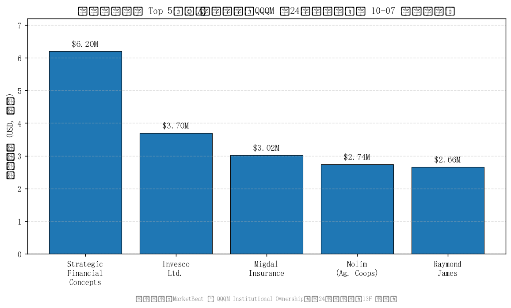

# 2026-10-07 纳斯达克100指数"低开高走"驱动分析与机构买入 Top 5 报告

**AS_OF: 报告生成 2026-10-08 09:44（本地）；NDX 个股数据为 2026-10-07 收盘（17:15 EDT，对应北京时间 2026-10-08 05:15）**

---

## 一、分析背景

用户问题：**2026-10-07（周三）纳斯达克100指数（NDX）呈"低开高走"形态，为什么会"高走"？都是哪些机构看好在大幅买入？**

本报告分两部分回答：
1. **"高走"的标的层面驱动**——当日 NDX 成分股中领涨、放量的个股与板块；
2. **机构买入 Top 5**——识别当日机构（共同基金/对冲基金/养老金等）买入 Top 5。

> ⚠️ **核心数据口径声明（务必先读）**
> 用户原始需求为"识别 **2026-10-07 当日** 机构买入 Top 5"。经检索确认：**"某一具体交易日的机构买入 Top 5" 无公开权威数据**。机构持仓/买卖的权威披露渠道是 **SEC Form 13F**，属**季度**报告（季末后 45 天内提交），**只披露季末持仓快照，不披露逐日交易、不披露买入明细与动机**。
> 因此，本报告中的"机构买入 Top 5"采用**代理口径**：MarketBeat 披露的 **QQQM（Invesco NASDAQ 100 ETF）近 24 个月累计买入金额最大的 5 家机构**。该口径为 **24 个月累计、ETF 层面、非 10-07 单日**，**不可解读为 10-07 当日机构买入**，仅作近似参考。

---

## 二、"高走"的标的层面驱动：NDX 成分股领涨 Top 5（2026-10-07 收盘）

| 排名 | 公司 | 代码 | 收盘价 | 涨跌 | 涨跌幅 | 板块 |
| --- | --- | --- | --- | --- | --- | --- |
| 1 | Micron Technology | MU | 1,088.00 | +42.44 | **+4.06%** | 半导体/存储 |
| 2 | Amgen | AMGN | 413.08 | +10.48 | +2.60% | 医疗 |
| 3 | Intuit | INTU | 297.24 | +7.43 | +2.56% | 软件 |
| 4 | Intuitive Surgical | ISRG | 414.52 | +9.76 | +2.41% | 医疗/器械 |
| 5 | Sandisk | SNDK | 1,692.42 | +31.96 | +1.92% | 存储 |

> **数据来源**：Slickcharts Nasdaq 100 Gainers（2026-10-07 收盘）。
> **解读**：领涨以**半导体/存储（MU +4.06%、SNDK +1.92%）**与**医疗（AMGN、ISRG）**为主，叠加软件（INTU）。多数成分股收涨，是指数"低开高走"收复失地的标的层面支撑。

### 当日市场领涨板块（含非 NDX 成分，供板块背景）

| 公司 | 代码 | 涨跌幅 | 板块 |
| --- | --- | --- | --- |
| Ciena | CIEN | +11.46% | 光通信/网络设备 |
| Vistra Corp. | VST | +10.27% | 电力 |
| Constellation Energy | CEG | +7.00% | 电力/核电 |
| Marvell Technology | MRVL | +5.46% | 半导体 |
| Corning | GLW | +5.43% | 光通信/玻璃 |

> **解读**：当日**电力/核电（CEG、VST）与光通信/网络设备（CIEN、GLW、MRVL）**领涨，反映 **AI 数据中心电力与网络基础设施**主题活跃，为纳指科技板块提供买盘。

**"高走"驱动小结**：10-07 NDX 低开（30,976.25，低于前收盘约 0.79%）后日内持续收复失地，尾盘收于 31,160.08（-0.21%）。其"高走"并非单一因素，而是**半导体/存储（MU、SNDK）+ 医疗（AMGN、ISRG）领涨**，叠加**电力/核电与光通信（AI 数据中心主题）**的板块买盘共同推动，多数成分股收涨，使指数几乎收复全部日内跌幅。

---

## 三、机构买入 Top 5（⚠️ 代理口径：QQQM 近24个月累计，非 10-07 当日数据）

> **核心结论**：**"2026-10-07 当日机构买入 Top 5" 无公开权威数据**（SEC 13F 为季度报告，不披露逐日买入明细）。
> 采用**代理口径**：MarketBeat 披露的 **QQQM（Invesco NASDAQ 100 ETF）近 24 个月累计买入金额最大的 5 家机构**（近 24 个月共 **1,223 家机构**买入 QQQM）。
> **口径说明**：① 近 24 个月累计买入（13F 汇总），**非 10-07 单日**；② 买入标的统一为 **QQQM（ETF）**，非对某只 NDX 成分股的直接买入；③ 13F **不披露买入动机**，故"可能原因"均标注"未披露"。

| 排名 | 机构名称 | 买入标的 | 买入规模 (USD) | 机构类型 | 可能原因 |
| --- | --- | --- | --- | --- | --- |
| 1 | Strategic Financial Concepts LLC | QQQM | $6.20M | 财富管理/资管 | 未披露 |
| 2 | Invesco Ltd. | QQQM | $3.70M | 基金管理人（ETF发行方） | 未披露 |
| 3 | Migdal Insurance & Financial Holdings | QQQM | $3.02M | 保险（以色列） | 未披露 |
| 4 | Nolim (National Mutual Insurance Fed. of Ag. Coops) | QQQM | $2.74M | 保险（以色列） | 未披露 |
| 5 | Raymond James Financial Inc. | QQQM | $2.66M | 财富管理/券商 | 未披露 |

> **数据来源**：MarketBeat — Invesco NASDAQ 100 ETF (QQQM) Institutional Ownership。
> **集中度**：Top 1（Strategic Financial Concepts，$6.20M）占 Top 5 合计（$18.32M）的 **33.8%**；Top 2 合计占 **58.4%**，头部集中度较高。
> **机构类型分布**：财富管理/资管 2 家、保险 2 家、基金管理人 1 家——以**保险与财富管理**类机构为主。

---

## 四、市场解读

1. **"高走"是标的层面多板块共振，而非单一驱动。** 10-07 NDX 低开高走收复失地，背后是**半导体/存储（MU、SNDK）与医疗（AMGN、ISRG）领涨**，叠加**电力/核电与光通信（AI 数据中心主题）**的板块买盘，多数成分股收涨，使指数几乎收复全部日内跌幅。
2. **机构层面（代理口径）：无法确认 10-07 当日机构集中买入。** 由于 13F 为季度披露，公开数据无法证实 10-07 当日存在机构集中买入行为。代理口径（QQQM 近24个月累计）显示机构对纳指100 ETF 的买入以**保险/财富管理/券商**类机构为主，且头部集中（Top 2 占 58.4%），但这是**长期累计**行为，与 10-07 单日走势无直接因果。
3. **数据可得性提示**：若需真正的"10-07 当日机构买入 Top 5"，需**付费实时 institutional flow 数据源**（如 Bloomberg、Refinitiv、Nasdaq Data Link 的机构实时资金流），公开免费渠道无法获取。

---

## 五、结论

- **"高走"驱动**：10-07 NDX 低开高走，由**半导体/存储（MU +4.06%、SNDK +1.92%）+ 医疗（AMGN、ISRG）领涨**，叠加**电力/核电与光通信（AI 数据中心主题）**板块买盘共同推动，多数成分股收涨。
- **"当日机构买入 Top 5" 无公开权威数据**；本报告以 **QQQM 近24个月累计买入 Top 5** 作为代理口径展示（Strategic Financial Concepts $6.20M 居首，Top 2 占 58.4%），**已明确标注非当日数据**。
- 机构买入以**保险/财富管理/券商**类机构为主，头部集中；13F 不披露买入动机，故"可能原因"均标注"未披露"。

---

## 附：数据来源与文件清单

| 项 | 说明 |
| --- | --- |
| NDX 个股领涨数据 | Slickcharts Nasdaq 100 Gainers（2026-10-07 收盘） |
| 当日市场领涨板块 | CNBC 2026-10-07 市场领涨股（含非 NDX 成分） |
| 机构买入代理数据 | MarketBeat — QQQM Institutional Ownership |
| 13F 背景 | SEC 13F FAQ（季度披露，不披露逐日买入与动机） |
| 图表文件 | `chart_ndx_top_gainers_2026-10-07.png`、`chart_institutional_buying_top5.png` |
| 上游数据文件 | `step1_ndx_gainers_and_institutional_buying.md`、`step2_data_table_and_charts.md` |

*本报告由多智能体流水线生成（Step 1 数据检索 → Step 2 数据整理与可视化 → Step 3 报告撰写）。*
