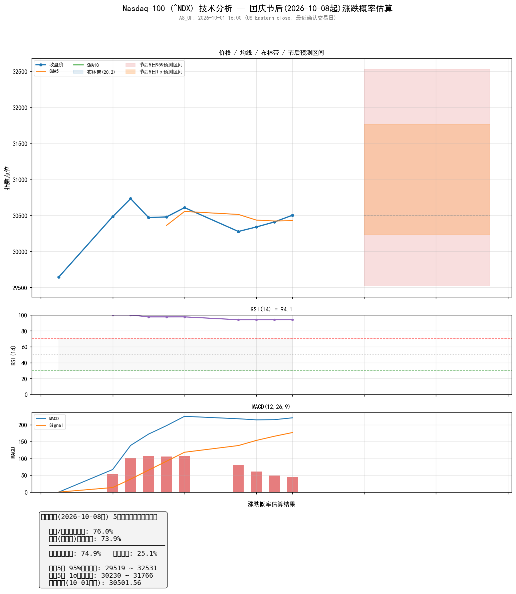

# 纳斯达克100指数（^NDX）国庆节后涨跌概率分析报告

**AS_OF: 2026-10-01 16:00 (US Eastern close，最近确认交易日)**
**报告生成时间: 2026-10-03 20:24 (周六，A股休市)**

> 数据说明：本报告基于最近确认交易日 2026-10-01（周四）的收盘数据。2026-10-02（周五）数据在数据源中尚未确认，故以 10-01 为基准。新闻/情绪数据截至 2026-10-02。

---

## 一、分析背景

本报告旨在分析纳斯达克100指数（^NDX）在国庆节后（A股休市期间美股持续交易）的涨跌概率。分析维度包括：

1. **技术面**：基于最近10个交易日的收盘价、涨跌幅、均线、RSI、MACD等指标
2. **市场情绪**：美联储政策动向、科技股财报、宏观数据
3. **概率模型**：综合技术面与情绪面，给出节后5个交易日的涨跌概率及价格区间

---

## 二、数据概览

### 2.1 最近10个交易日收盘价

| 日期 | 收盘价 | 涨跌幅 |
|------|--------|--------|
| 2026-10-01 | 30,501.56 | +0.31% |
| 2026-09-30 | 30,408.50 | +0.23% |
| 2026-09-29 | 30,339.33 | +0.21% |
| 2026-09-28 | 30,276.81 | -1.08% |
| 2026-09-25 | 30,608.13 | +0.42% |
| 2026-09-24 | 30,478.86 | +0.03% |
| 2026-09-23 | 30,470.29 | -0.85% |
| 2026-09-22 | 30,732.40 | +0.82% |
| 2026-09-21 | 30,482.35 | +2.83% |
| 2026-09-18 | 29,644.17 | +0.67% |

**趋势观察**：指数从 9月18日的 ~29,644 上涨至 10月1日的 ~30,502，两周累计涨幅约 **+2.9%**，呈明显上升趋势。9月21日出现 +2.83% 的显著跳涨。

### 2.2 技术指标

| 指标 | 数值 | 解读 |
|------|------|------|
| SMA5 | 30,426.87 | 短期均线 |
| SMA10 | 30,394.24 | 中期均线 |
| RSI14 | 94.1 | **严重超买**（>70为超买区） |
| MACD | 220.2 | 多头信号 |
| MACD Signal | 176.49 | 信号线 |
| MACD Hist | 43.72 | 柱状图为正，多头动能 |
| 5日动量 | +0.07% | 短期动量趋缓 |
| 年化波动率 | 17.6% | 中等波动水平 |

**技术面解读**：
- **均线**：收盘价（30,501.56）> SMA5（30,426.87）> SMA10（30,394.24），呈多头排列，趋势向上。
- **RSI**：94.1 处于严重超买区，短期存在回调压力，但强势市场中超买可延续。
- **MACD**：MACD（220.2）> Signal（176.49），柱状图（43.72）为正，多头动能仍在，但需关注是否出现顶背离。

---

## 三、市场情绪与新闻

### 3.1 美联储/宏观

| 日期 | 事件 | 影响 |
|------|------|------|
| 2026-09 (FOMC) | 美联储降息25bp至4.00%-4.25%（12月以来首次） | **偏鸽**，利好成长股 |
| 2026-09-17 | 10年期美债收益率4.94%（近24年高位） | **利空**，压制科技股估值 |
| 2026-10-01 | 美元指数DXY创2026新高（~102） | **利空**，强美元压制风险资产 |
| 2026 (全年) | PCE通胀预期上调至2.6% | **利空**，限制进一步降息空间 |

### 3.2 科技股/财报

| 日期 | 事件 | 影响 |
|------|------|------|
| 2026-10-01 | 科技股连续2日走强，Micron财报受关注 | **利好** |
| 2026-10-01 | Vicor +12%（上调Q3展望）；Jabil -10%（AI需求强劲但股价回调） | 分化 |
| 2026-10-02 | 大型科技股普涨：Nvidia +2.1%, Microsoft +1.1%, Amazon +1.8%, Tesla +3.9% | **利好** |

### 3.3 市场背景

- S&P 500 当周下跌1.2%（8月以来最差单周表现），Dow -1.8%
- 油价下跌缓解通胀压力，支撑债券和股市
- 企业利润率接近历史高位，AI/科技驱动盈利增长

### 3.4 情绪综合判断

**偏多但谨慎（Mixed-to-cautiously-bullish）**

| 利多因素 | 利空因素 |
|----------|----------|
| 美联储降息25bp（偏鸽） | 10年期美债收益率近24年高位（~4.94%） |
| 科技/AI财报强劲，大型科技股普涨 | 美元指数创2026新高（~102） |
| 企业利润率接近历史高位 | PCE通胀预期上调至2.6%，限制降息 |
| 油价下跌缓解通胀压力 | S&P 500当周表现8月以来最差 |

---

## 四、概率分析

### 4.1 涨跌概率

| 维度 | 上涨概率 | 说明 |
|------|----------|------|
| 技术面+情绪面综合 | **74.9%** | 多头排列+偏鸽Fed+AI财报强劲 |
| 纯统计波动模型 | 73.9% | 基于历史波动率的随机游走 |
| 技术+情绪因子 | 76.0% | 因子加权 |

**最终判断：节后5个交易日内，NDX上涨概率约 75%，下跌概率约 25%。**

### 4.2 价格区间预测

| 区间 | 下限 | 上限 | 说明 |
|------|------|------|------|
| 95%置信区间 | 29,519 | 32,531 | 极端情况 |
| 1σ区间（68%） | 30,230 | 31,766 | 大概率范围 |
| 基准价 | 30,501.56 | — | 10-01收盘价 |

### 4.3 因子得分

| 因子 | 得分 | 解读 |
|------|------|------|
| 趋势 | 1.10 | 强多头趋势 |
| RSI | 0.35 | 超买，短期回调风险 |
| MACD | 0.80 | 多头动能 |
| 情绪 | 0.58 | 偏多但谨慎 |

---

## 五、可视化

*图表包含：价格走势、技术指标（RSI/MACD）、涨跌概率分布、价格区间预测*

---

## 六、结论与建议

### 核心结论

1. **短期偏多**：NDX处于明显上升趋势，技术面多头排列，美联储偏鸽+AI财报强劲支撑上行。
2. **超买风险**：RSI 94.1 严重超买，短期存在技术性回调压力。
3. **宏观逆风**：高企的美债收益率（~4.94%）和强美元（DXY ~102）是主要压制因素。
4. **概率判断**：节后5个交易日内上涨概率约 **75%**，大概率运行区间 **30,230 - 31,766**。

### 风险提示

- 若10年期美债收益率继续上行，可能压制科技股估值
- RSI严重超买，若出现放量下跌可能触发短期回调
- 周五非农就业数据（10-03）可能影响市场情绪
- 本报告基于历史数据和当前信息，不构成投资建议

---

*报告生成: 2026-10-03 20:24 | 数据截至: 2026-10-01 16:00 (US Eastern close)*
