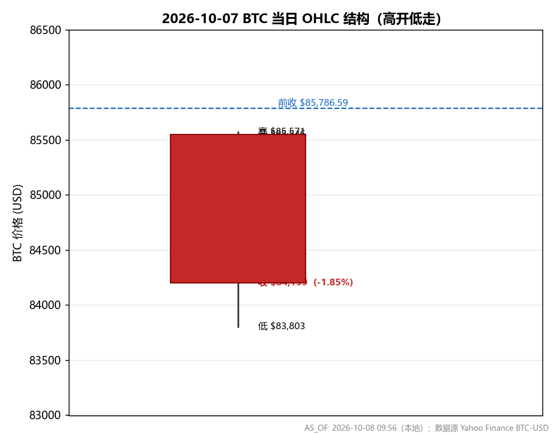
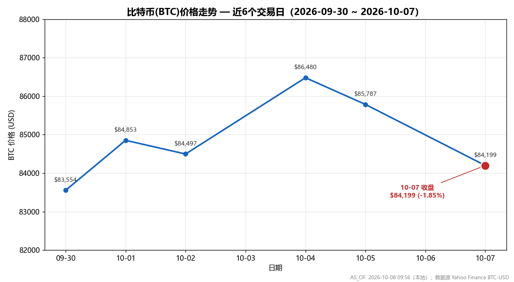
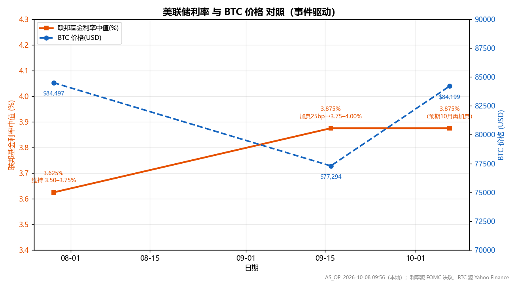

# 2026-10-07 比特币价格与美联储加息利空影响分析报告

**AS_OF: 报告撰写 2026-10-08 09:58（本地）；BTC 价格数据为 2026-10-07 收盘（UTC 24:00 / 美东 20:00）；美联储数据为 2026-09-16 FOMC 决议（最新已公布）；BTC 利率敏感性数据为 2026-09-10~12 区间**

> **数据溯源声明**：本报告所有价格与利率数据均来自上游检索步骤已落盘文件（`step1_btc_2026-10-07_price.md`、`step2_fed_policy_btc_sensitivity.md`），未重新抓取。BTC 价格为 Yahoo Finance 历史收盘数据；美联储利率为 FOMC 官方决议与点阵图；利率敏感性为新闻/研报佐证（属**定性+部分量化**证据，非逐日高频相关性数据）。所有图表为上游已生成 PNG，本报告仅嵌入，未重绘。

---

## 一、分析背景

2026 年 10 月初，比特币（BTC）在 $84,000–$87,000 区间震荡，市场正在定价"10 月美联储加息"预期（CoinDesk，10-05）。与此同时，美联储已于 2026-09-16 完成 2023 年 7 月以来**首次加息**，政策立场明确转向**偏鹰/加息周期**。

本报告聚焦两个问题：
1. **2026-10-07（周三）BTC 当日价格与涨跌**；
2. **美联储加息对 BTC 的利空影响机制与严重程度**。

---

## 二、2026-10-07 BTC 价格与涨跌

### 2.1 当日 OHLC 数据（来源：Yahoo Finance BTC-USD）

| 指标 | 数值 |
| --- | --- |
| 开盘价 (Open) | $85,546.23 |
| 最高价 (High) | $85,570.70 |
| 最低价 (Low) | $83,802.94 |
| **收盘价 (Close)** | **$84,199.14** |
| 成交量 (Volume) | 32,083,177,472（约 320.8 亿 USD 成交额） |

### 2.2 涨跌判定

| 对比基准 | 前值 | 当日收盘 | 涨跌 | 涨跌幅 |
| --- | --- | --- | --- | --- |
| 较前一日收盘（10-05 收盘 $85,786.59） | $85,786.59 | $84,199.14 | **-$1,587.45** | **-1.85%** |
| 较当日开盘（$85,546.23） | $85,546.23 | $84,199.14 | -$1,347.09 | -1.57% |

> **结论：2026-10-07 比特币【下跌】，收盘 $84,199.14，较前一日收盘下跌约 1.85%（-$1,587.45）。**
> 当日呈"**高开低走**"：开盘 $85,546.23 后一路走低，最低探至 $83,802.94，尾盘收于 $84,199.14。

### 2.3 当日 OHLC 走势

*图 1：2026-10-07 BTC 当日 OHLC 走势（高开低走，收盘 $84,199.14，-1.85%）。AS_OF: 2026-10-07 收盘。*

### 2.4 近期价格趋势

*图 2：BTC 近期价格趋势（10 月初于 $84,000–$87,000 区间震荡，10-07 回落至 $84,000 附近）。AS_OF: 2026-10-07 收盘。*

| 日期 | 收盘价 | 备注 |
| --- | --- | --- |
| 2026-10-07 | $84,199.14 | 当日 -1.85% |
| 2026-10-05 | $85,786.59 | |
| 2026-10-04 | $86,480.30 | |
| 2026-10-02 | $84,497.21 | |
| 2026-10-01 | $84,853.10 | |
| 2026-09-30 | $83,553.85 | |

---

## 三、美联储利率政策立场（截至 2026-10-08）

### 3.1 最新决议：2026-09-16 FOMC —— 加息 25bp

| 项 | 内容 |
| --- | --- |
| 决议日期 | 2026-09-16（周三） |
| 动作 | **加息 25 个基点**（2023 年 7 月以来首次加息） |
| 联邦基金利率目标区间 | **3.75% – 4.00%** |
| 投票 | 一致通过（unanimous） |
| 背景 | 抗击通胀（油价飙升等因素推高通胀） |
| 前瞻指引 | 暗示**年内可能再加息一次** |

### 3.2 此前决议：2026-07-29 FOMC —— 维持不变
- **维持** 联邦基金利率目标区间 **3.50% – 3.75%** 不变（9-3 投票，3 名委员倾向加息 25bp）。

### 3.3 利率路径预期（点阵图，2026-09-16）
- 联邦基金利率**今年与明年**的"适当政策路径"中值均指向 **4.1%**。
- 今年末利率中值从 6 月的 3.8% **上调至 4.1%**；明年从 3.6% 上调至 4.1%。
- **8 名政策制定者**预计从现在到明年年底前**可能再加息两次**。
- 背景：2025 年曾连续三次降息，2026 年转为**加息周期**。

### 3.4 政策立场定性
- **当前立场：偏鹰（Hawkish）/ 加息周期**。
- 利率已从 2025 年降息后的低位回升，2026-09-16 加息至 3.75%–4.00%，且点阵图指向年内/明年进一步升至 ~4.1%。
- 驱动因素：通胀（油价飙升）仍高于 2% 目标。

---

## 四、美联储加息对 BTC 的利空影响机制

### 4.1 利率与 BTC 联动（前所未有紧密）

*图 3：美联储利率路径与 BTC 价格联动（10 年期美债收益率升至一年高位 4.95%，BTC 同步承压）。AS_OF: 2026-09-10~12 区间。*

- **核心证据**（Yahoo Finance / 24-7 Wall St，2026-09-12）：
  > "Bitcoin now moves with bonds and growth stocks more closely than at any point on record, so a Fed surprise reaches it faster than it did in earlier cycles."
  （比特币与债券、成长股的联动比历史上任何时候都更紧密，因此美联储的意外会更快传导到比特币。）
- 标题即点题：**"Bitcoin Has Never Tracked Interest Rates This Closely"**（比特币从未如此紧密地跟踪利率）。

### 4.2 量化背景（2026-09-10~12）

| 指标 | 数值 | 说明 |
| --- | --- | --- |
| 10 年期美债收益率 | **4.95%**（2026-09-10） | 一年最高；当日 +0.12pp，较一个月前 +0.25pp |
| BTC 价格 | $77,293.66（2026-09-12） | 周跌 3.26%，**年跌 33.48%** |
| 市场定价 | Polymarket 9-16 加息 25bp 概率 **83%** | 加息预期升温 |
| 金融条件 | 债券"抢跑"加息，金融条件已全面收紧 | 压制所有风险资产 |

### 4.3 传导机制（加息 → 利空 BTC）

| 传导路径 | 机制 | 对 BTC 的影响 |
| --- | --- | --- |
| **实际利率上行** | 加息提高无风险利率与实际利率 | 降低风险资产相对吸引力，资金回流债券/现金 |
| **流动性收紧** | 金融条件全面收紧 | 风险偏好下降，高贝塔资产（BTC）首当其冲 |
| **预期定价** | 点阵图指向年内/明年再加息 | 利空具有持续性，非一次性冲击 |
| **联动放大** | BTC 与利率联动"前所未有紧密" | 美联储意外**更快更强**传导到 BTC |

> **反向佐证（降息 → 利多）**：CoinLedger（2026）指出降息增加流动性、提升风险偏好，利好 BTC；2026-09 报道显示当"鸽派信号"压垮加息预期时，BTC 数小时内从低位反弹突破 $80,000。这从反面印证了利率对 BTC 的强传导。

---

## 五、利空影响严重程度评估

### 5.1 评估维度

| 维度 | 评估 | 依据 |
| --- | --- | --- |
| **方向** | **明确利空** | 实际利率上行 + 流动性收紧 + 风险偏好下降 |
| **传导速度** | **快** | BTC 与利率联动"前所未有紧密"，美联储意外更快传导 |
| **持续性** | **强（预期性）** | 点阵图指向年内/明年再加息（利率或升至 ~4.1%），非一次性 |
| **已定价程度** | **部分定价** | 10 年期美债收益率已处一年高位（4.95%），实际利率压力已部分反映 |
| **实际冲击** | **显著但非灾难性** | 加息后 BTC 仍守住 $76,000–$84,000 区间（未崩盘），市场已部分消化 |

### 5.2 严重程度综合判断

> **美联储加息对 BTC 的利空影响：方向明确（利空）、传导快、具持续性，但严重程度为"中等偏强"——显著压制上行空间，但非灾难性。**

**理由**：
1. **利空方向确定**：加息通过实际利率上行、流动性收紧、风险偏好下降三条路径压制 BTC，方向无争议。
2. **传导被放大**：BTC 与利率的联动处于历史高位，意味着每一次加息/鹰派信号都会**更快、更强**地反映在 BTC 价格上（10-07 的 -1.85% 下跌即为体现）。
3. **利空具持续性**：点阵图指向年内/明年再加息（利率或升至 ~4.1%），利空不是"一次性事件"，而是**持续的政策压力**，压制 BTC 估值中枢。
4. **但非灾难性**：BTC 在 9-16 加息后仍守住 $76,000–$84,000 区间，10-07 仅下跌 1.85%（未破位崩盘），说明市场已**部分消化**加息利空，实际利率压力已部分定价（10Y 美债 4.95%）。

### 5.3 风险情景（供参考）

| 情景 | 触发条件 | 对 BTC 的影响 |
| --- | --- | --- |
| **基准** | 年内再加息一次，利率升至 ~4.1% | 持续压制，BTC 在 $80,000–$87,000 区间震荡偏弱 |
| **偏空** | 通胀超预期，加息超预期（>1 次） | 实际利率进一步上行，BTC 或下探 $76,000 下方 |
| **偏多** | 通胀回落，鸽派信号压垮加息预期 | 流动性改善，BTC 反弹（如 9 月鸽派信号后破 $80,000） |

---

## 六、结论

1. **2026-10-07 BTC 下跌**：收盘 $84,199.14，较前一日收盘 **-1.85%**（-$1,587.45），当日"高开低走"。
2. **美联储处于偏鹰/加息周期**：2026-09-16 加息 25bp 至 3.75%–4.00%（2023 年 7 月以来首次），点阵图指向年内/明年利率升至 ~4.1%。
3. **加息对 BTC 明确利空**：通过实际利率上行、流动性收紧、风险偏好下降三条路径压制 BTC；且 BTC 与利率联动"前所未有紧密"，利空传导**更快更强**。
4. **严重程度：中等偏强（显著但非灾难性）**：利空具持续性（点阵图指向再加息），但市场已部分消化（10Y 美债 4.95% 已定价、BTC 守住 $76,000–$84,000 区间未崩盘）。
5. **展望**：在偏鹰政策下，BTC 上行空间受压，基准情景下于 $80,000–$87,000 区间震荡偏弱；若通胀超预期导致加息超预期，或下探 $76,000 下方；若出现鸽派信号，则可能反弹。

---

## 七、数据来源与溯源

| 数据项 | 来源 | AS_OF |
| --- | --- | --- |
| BTC 2026-10-07 OHLC | Yahoo Finance BTC-USD 历史行情 | 2026-10-07 收盘 |
| BTC 近期价格趋势 | Yahoo Finance BTC-USD | 2026-10-07 收盘 |
| 2026-09-16 加息决议 | CNBC / Forbes Advisor / Charles Schwab | 2026-09-16 |
| 2026-07-29 维持决议 | Federal Reserve 官网 FOMC 声明/纪要 | 2026-07-29 |
| 点阵图/利率路径 | Charles Schwab（FOMC 点阵图） | 2026-09-16 |
| BTC 利率敏感性 | Yahoo Finance / 24-7 Wall St | 2026-09-12 |
| 加息后 BTC 反应 | CryptoTicker | 2026-09-17 |
| 利率-加密传导机制 | CoinLedger | 2026 |
| 10 月加息预期背景 | CoinDesk / The Block | 2026-10-05 |

> **图表说明**：本报告嵌入的 3 张图表（图 1–3）均为上游步骤已生成的 PNG 文件，未在本步骤重绘。
> **免责声明**：本报告基于公开数据与新闻，利率敏感性部分为定性+部分量化证据（非逐日高频相关性数据）。本报告不构成投资建议。
