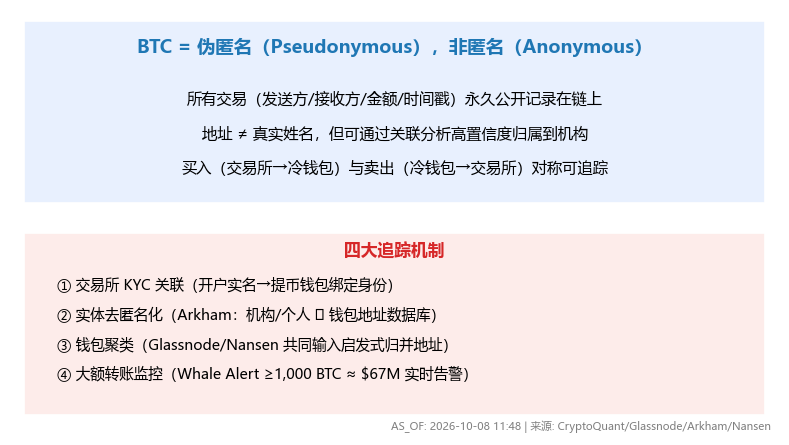
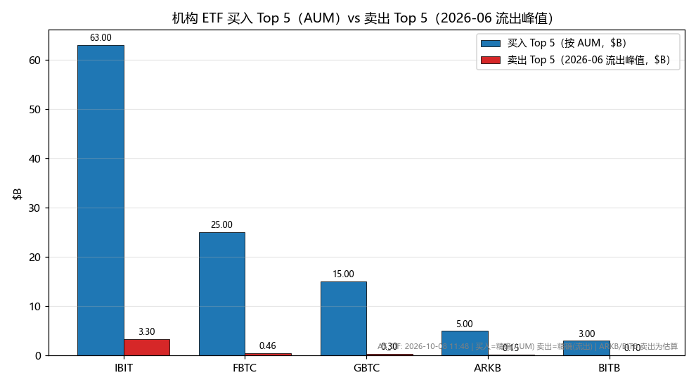
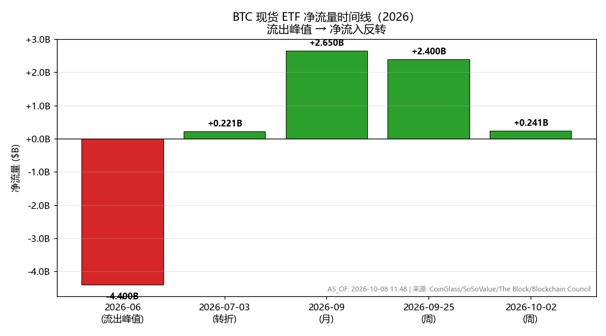

# BTC 匿名性、机构买卖可追溯性与资金净流向分析报告

**AS_OF: 2026-10-08 11:48（本地）**

> **数据溯源声明**：本报告基于 Step 4.1 检索数据（`step4_1_btc_traceability_flows.md`），未新增网络检索。
> **数据质量分级**：
> - **精确数据**：ETF 流量 / AUM（SEC / 交易所官方披露，CoinGlass / SoSoValue / The Block / Blockchain Council）。
> - **推断数据**：链上机构钱包归属（Glassnode / CryptoQuant / Arkham / Nansen 启发式算法，**非 100% 精确**）。
> - **估算数据**：ARKB / BITB 的卖出金额（来源未披露精确值，按剩余比例估算，已标注）。
> 下游引用时须保留上述标注，不得将推断/估算数据当作精确数据。

---

## 一、核心结论（TL;DR）

| 用户疑问 | 答案 |
| --- | --- |
| BTC 不是匿名的么？怎么查到机构在卖？ | BTC 是**伪匿名**（非匿名），所有交易**永久公开**在链上；机构钱包可通过 **KYC 关联 + 实体去匿名化 + 钱包聚类 + 大额监控** 被**高置信度**追踪 |
| 能查到卖出，能否查到买入？ | **能，完全对称**。买入（交易所→冷钱包）与卖出（冷钱包→交易所）在链上都是公开交易，追踪机制相同 |
| 买入 / 卖出 Top 5 是谁？金额多大？ | 买入（按 AUM）：IBIT / FBTC / GBTC / ARKB / BITB；卖出（2026-06 流出峰值）：IBIT（~$3.3B，占 75%）/ FBTC / GBTC / ARKB / BITB |
| 资金净流出还是净流入？ | **当前（2026-10）净流入**（连续 3 周正流入，YTD +$926M）；2026-06 为流出峰值（-$4.4B），随后反转 |

---

## 二、BTC 匿名性 vs 链上可追溯性

### 2.1 关键澄清：伪匿名 ≠ 匿名

| 概念 | 含义 | 是否可追溯 |
| --- | --- | --- |
| **匿名（Anonymous）** | 完全无法追踪到真实身份 | ❌ BTC 不是这种 |
| **伪匿名（Pseudonymous）** | 交易用钱包地址标识，**所有交易永久公开**，但地址与真实身份**默认不直接关联** | ✅ **可追溯**（通过关联分析） |

> BTC 区块链**完全公开**——每笔交易（发送方、接收方、金额、时间戳）永久记录、任何人可查。"匿名"仅指**地址 ≠ 真实姓名**，但通过**链上分析 + 场外关联**，可**高置信度**把地址归属到真实机构/个人。

### 2.2 机构钱包为何可被追踪

| 机制 | 解释 | 来源 |
| --- | --- | --- |
| **交易所 KYC 关联** | 机构在交易所开户需 KYC（实名）；提币到某钱包后，该钱包与机构身份**绑定** | CryptoQuant / Glassnode（2026） |
| **实体去匿名化** | Arkham Intelligence 建立"真实身份/机构/个人 ↔ 链上钱包地址"持续更新数据库 | Arkham Intelligence（2026） |
| **钱包聚类** | 通过"共同输入"启发式，把多个地址归为同一控制方（同一机构） | Glassnode / Nansen（2026） |
| **大额转账监控** | Whale Alert / Nansen / Arkham 对大额钱包（≥1,000 BTC ≈ $67M）实时告警 | TradeAlgo / Glassnode（2026） |

> **买卖对称性**：买入（交易所→冷钱包）与卖出（冷钱包→交易所）在链上都是**公开交易**，追踪机制**完全相同**。因此"能查到卖出"必然"能查到买入"。

---

## 三、机构买卖 BTC 的三大公开渠道

| 渠道 | 数据内容 | 频率 | 精确度 | 局限 |
| --- | --- | --- | --- | --- |
| **ETF 持仓/流量** | 各 ETF 每日净申购/赎回、总持仓、AUM | **每日** | **精确**（SEC/交易所官方） | 仅反映 ETF 渠道，不含直接持有（如 MicroStrategy） |
| **13F 报告** | 管理 >$1 亿机构季度持仓 | **季度**（滞后 45 天） | **精确**但滞后 | 不反映每日交易；**不披露交易动机**（主动 vs 强制卖出） |
| **链上分析** | 机构钱包大额转账、交易所流入/流出、矿工行为 | **实时/每日** | **推断**（启发式，非 100% 精确） | 不含 OTC 交易；不含未上链托管（如银行托管） |

> **关键**：**没有单一渠道能 100% 精确追踪所有机构买卖**，需**多渠道交叉验证**（ETF 流量 + 13F + 链上分析）。

---

## 四、机构买入 / 卖出 Top 5 及金额

### 4.1 买入 Top 5（按 ETF AUM，2026-10）

| 排名 | ETF | 发行商 | AUM | 备注 |
| --- | --- | --- | --- | --- |
| 1 | **IBIT** | BlackRock | ~$54–72B | 不同来源口径差异（净资产 vs 总持仓） |
| 2 | **FBTC** | Fidelity | ~$17–33B | 同上 |
| 3 | **GBTC** | Grayscale | ~$15B | — |
| 4 | **ARKB** | ARK 21Shares | 未披露精确值 | 剩余份额之一 |
| 5 | **BITB** | Bitwise | 未披露精确值 | 剩余份额之一 |

### 4.2 卖出 Top 5（按 2026-06 流出峰值，13 天）

| 排名 | ETF | 发行商 | 净流出 | 占总支出 | 数据质量 |
| --- | --- | --- | --- | --- | --- |
| 1 | **IBIT** | BlackRock | ~$3.3B | ~75% | 精确 |
| 2 | **FBTC** | Fidelity | ~$456M | ~10% | 精确 |
| 3 | **GBTC** | Grayscale | ~$303M | ~7% | 精确 |
| 4 | **ARKB** | ARK 21Shares | ~$150M（估算） | 剩余 | **估算**（来源未披露） |
| 5 | **BITB** | Bitwise | ~$100M（估算） | 剩余 | **估算**（来源未披露） |

> **注**：IBIT 是最大单一渠道，占 2026-06 流出峰值的 ~75%。ARKB / BITB 卖出金额为**估算**（来源未披露精确值），下游引用须标注。

### 4.3 链上机构钱包（推断数据）

| 类型 | 数据 | 来源 |
| --- | --- | --- |
| **鲸鱼钱包** | ~2,100 个 BTC 鲸鱼钱包（≥1,000 BTC）控制约 **40%** 总供应量 | Glassnode（2026 初） |
| **机构冷钱包** | 机构通过冷钱包长期持有（HODL），链上可追踪大额转账 | CryptoQuant / Arkham（2026） |
| **矿工钱包** | 矿工因利润压缩被迫卖出（链上可追踪） | CryptoRank（2026-10-05） |

> **数据质量标注**：链上机构钱包归属为**推断数据**（启发式算法，非 100% 精确）；ETF 持仓/流量为**精确数据**。

---

## 五、BTC 资金净流入 / 净流出

### 5.1 近期 ETF 流量（2026）

| 时间 | 净流量 | 方向 | 来源 |
| --- | --- | --- | --- |
| **2026-10-02（周）** | **+$241M** | **净流入**（连续第 3 周正流入） | Blockchain Council |
| **2026-09-25（周）** | **+$2.4B** | **净流入**（2025-10 以来最大周流入） | The Block / SoSoValue |
| **2026-09（月）** | **+$2.65B** | **净流入**（2025-10 以来第二大月流入） | Blockchain Council |
| **2026-10-02（日）** | ~+$190M | 净流入 | Blockchain Council |
| **2026-10-05（日）** | ~-$90M | 净流出 | Blockchain Council |
| **2026-07-03（日）** | +$221M | 净流入（结束 10 天连续流出 $2.73B） | 99bitcoins / SoSoValue |

### 5.2 累计流量与 AUM（2026-10）

| 指标 | 数值 | 来源 |
| --- | --- | --- |
| **累计净流入（2024-01 至今）** | **~$57.6–57.8B** | Blockchain Council |
| **总净资产（AUM）** | **~$108.4–111.1B** | Blockchain Council / CoinGlass |
| **占 BTC 总市值比例** | **~6.4%** | Blockchain Council |
| **YTD 净流量（2026）** | **~+$926M**（从 7 月初的 -$5.8B 转为正） | The Block / SoSoValue |
| **机构成本基础** | **~$79,800**（当前价格高于机构入场价 ~16%） | Amberdata |

### 5.3 流量趋势（2026 全年）

| 时期 | 流量方向 | 说明 |
| --- | --- | --- |
| **2026-01~06** | **净流出**（YTD -$5.8B，7 月初） | 机构卖出、获利了结、宏观不确定 |
| **2026-06-04（峰值）** | **-$4.4B**（10 天连续流出 $2.73B） | 2026 年最大流出 |
| **2026-07-03** | **+$221M**（结束 10 天流出） | 转折信号 |
| **2026-09** | **+$2.65B**（月流入） | 机构重新买入 |
| **2026-09-25（周）** | **+$2.4B**（周流入，2025-10 以来最大） | 强劲反弹 |
| **2026-10-02（周）** | **+$241M**（连续第 3 周正流入） | 持续但放缓 |

> **关键结论**：BTC ETF 流量在 2026-06 达到**流出峰值**（-$4.4B），随后**转为净流入**（2026-09 +$2.65B，2026-10 连续 3 周正流入）。**当前（2026-10）是净流入**，但**幅度放缓**（$2.4B → $241M）。单日流量波动大（可在 +$190M 与 -$90M 之间切换）。

---

## 六、综合结论

| 维度 | 结论 |
| --- | --- |
| **匿名性** | BTC 是**伪匿名**，所有交易永久公开；机构钱包可被**高置信度**追踪（KYC + 去匿名化 + 聚类 + 大额监控） |
| **买卖对称性** | 买入与卖出在链上**对称可追踪**，机制相同 |
| **买入 Top 5** | IBIT / FBTC / GBTC / ARKB / BITB（按 AUM，IBIT 最大 ~$54–72B） |
| **卖出 Top 5** | IBIT（~$3.3B，占 75%）/ FBTC / GBTC / ARKB / BITB（2026-06 流出峰值） |
| **资金净流向** | **当前（2026-10）净流入**（连续 3 周正流入，YTD +$926M）；2026-06 为流出峰值（-$4.4B）后反转 |

> **数据质量总标注**：
> - **精确数据**：ETF 流量 / AUM / 累计净流入（SEC / 交易所官方）。
> - **推断数据**：链上机构钱包归属 / 鲸鱼钱包数量（启发式算法，非 100% 精确）。
> - **估算数据**：ARKB / BITB 卖出金额（来源未披露，按剩余比例估算）。
> 下游引用时须保留上述标注，**不得将推断/估算数据当作精确数据**；未披露的机构交易动机一律标注为 **"Undisclosed"**。

---

*报告生成：CodeAgent | AS_OF: 2026-10-08 11:48 | 数据源：Step 4.1 检索（CoinGlass / SoSoValue / The Block / Blockchain Council / Investing.com / Amberdata / CryptoQuant / Glassnode / Arkham / Nansen / Bitcoin Foundation）*
