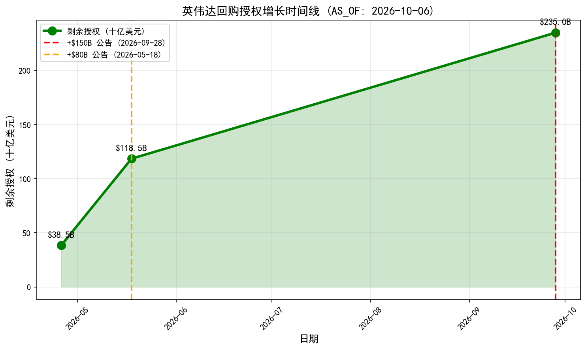
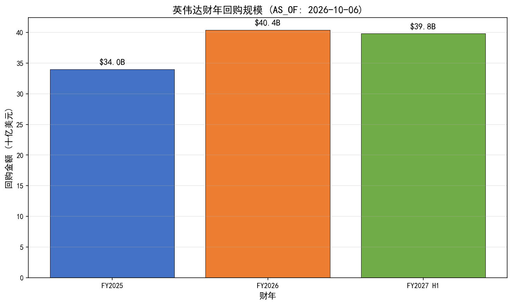
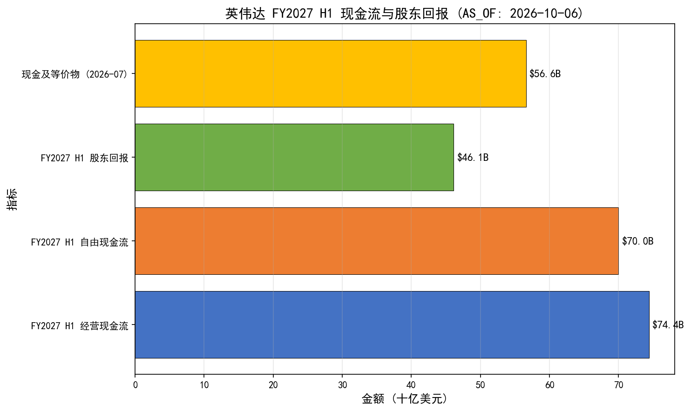
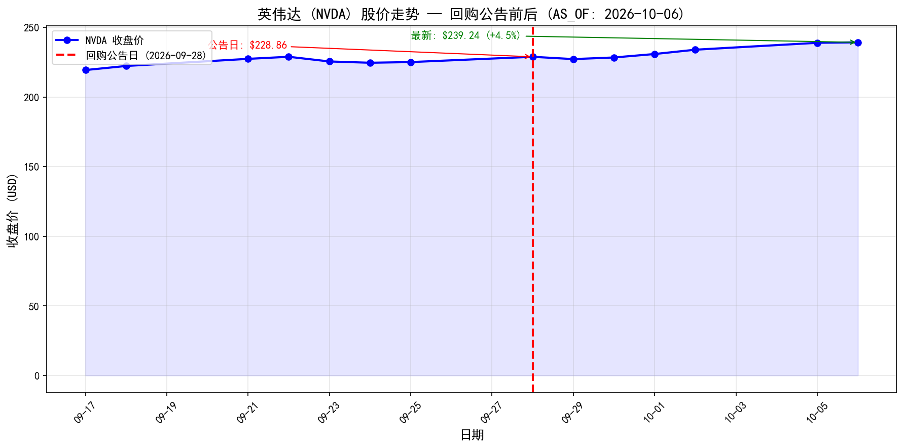
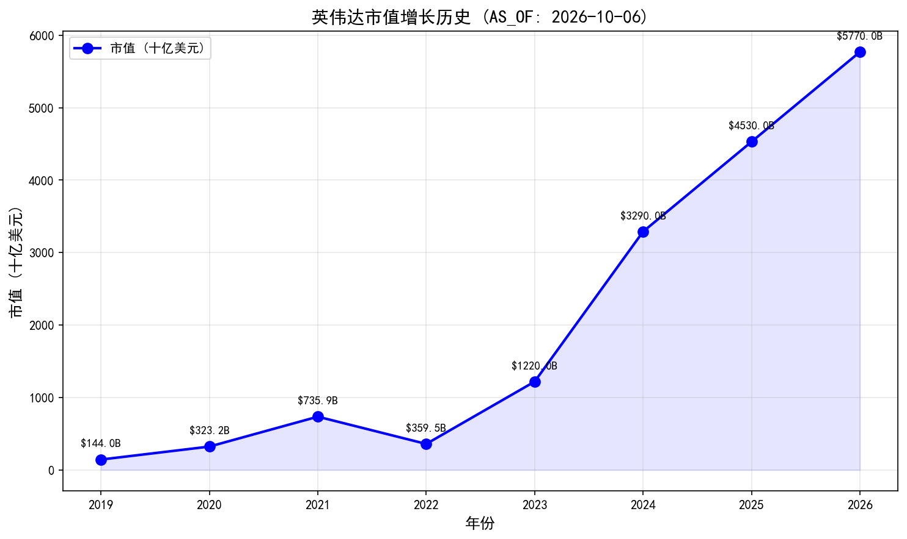
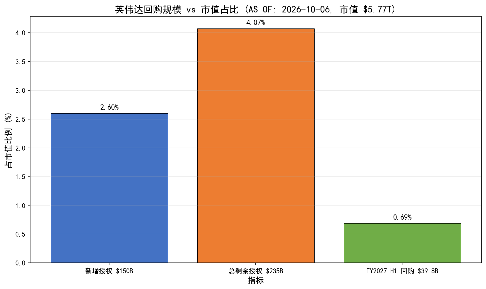

# 英伟达 1500 亿美元回购授权：真实性验证与股价支持力分析

**AS_OF: 2026-10-08 12:27（报告生成时刻）；股价数据截至 2026-10-06 收盘**

> **数据溯源声明**：
> - **精确数据**：股价/市值/流通股（收盘价，NVIDIA IR / StatMuse / StockAnalysis）、回购金额/股数（公司披露，SEC 10-Q + 官方新闻稿）、回购授权历史（SEC 10-Q + 官方）、现金流数据（Yahoo Finance / Queonda）。
> - **分析性结论**：回购对股价支持力的量化评估（EPS 增厚幅度、估值影响、与 AI 资本开支的权衡）为**分析性结论**，非精确数据，须结合估值/基本面综合判断。
> - **股价数据截至 2026-10-06 收盘**（非实时），引用须标注 as-of 时刻。
> - **未披露动机**：英伟达未披露回购的具体战略动机（如对冲 AI 资本开支、提升股东回报比例等），标注为 **Undisclosed**。

---

## 一、分析背景

### 1.1 事件概述

2026 年 9 月 28 日（周一），英伟达（NVIDIA）官方公告，**公司董事会批准新增 1500 亿美元（$150B）股票回购授权**，由 CEO 黄仁勋（Jensen Huang）对外宣布并背书。这是**史上最大单笔回购授权增加**，超越 Apple 2024 年 $110B 记录。

### 1.2 核心问题

1. **真实性验证**：黄仁勋是否"承诺"1500 亿美元回购？
2. **支持力分析**：该回购授权对英伟达股价的支持力度如何？

### 1.3 分析框架

| 维度 | 分析内容 |
| --- | --- |
| **真实性** | 官方公告 + 多家媒体交叉验证 + 措辞澄清（董事会授权 vs 个人承诺） |
| **规模** | 新增 $150B / 总剩余 $235B / 占市值比例 |
| **历史对比** | 财年回购规模 / 授权增长时间线 / 与 Apple 等巨头对比 |
| **现金流支撑** | 经营现金流 / 自由现金流 / 现金及等价物 / 股东回报 |
| **市场反应** | 公告前后股价走势 / 52 周区间 / 市值变化 |
| **EPS 增厚** | 流通股减少 / 每股盈利提升幅度（量化估算） |
| **潜在制约** | 授权 ≠ 承诺 / 估值已高 / AI 资本开支竞争 |

---

## 二、真实性验证

### 2.1 判定结论

✅ **消息真实（TRUE）**，但**措辞需澄清**：

- 这是**公司董事会批准的回购授权**（share repurchase authorization），由 CEO 黄仁勋**对外宣布并背书**，**不是黄仁勋个人承诺**。
- 准确表述应为：**"英伟达（经黄仁勋宣布）新增 1500 亿美元回购授权"**。

### 2.2 交叉验证来源

| 来源 | 类型 | 验证内容 |
| --- | --- | --- |
| **NVIDIA 官方新闻稿** | 一手来源 | 公告日期、金额、执行期限、黄仁勋原话 |
| **CNBC** | 主流媒体 | 交叉验证金额、历史地位 |
| **NYT** | 主流媒体 | 交叉验证背景、市场反应 |
| **Semafor** | 财经媒体 | 交叉验证现金流支撑 |
| **Yahoo Finance** | 财经数据 | 交叉验证回购历史、授权时间线 |

### 2.3 黄仁勋原话（官方背书）

> "Our cash generation gives us the capacity to invest in the technologies that advance this transformation and return capital to shareholders. This authorization reflects our confidence in the long-term opportunity ahead."
>
> —— Jensen Huang（NVIDIA 官方新闻稿，2026-09-28）

**解读**：黄仁勋强调**现金流充裕**（"cash generation"）是回购的基础，同时传递**长期信心**（"confidence in the long-term opportunity"）。

### 2.4 关键细节

| 维度 | 细节 |
| --- | --- |
| **公告日期** | 2026-09-28（周一） |
| **新增授权** | **$150B（1500 亿美元）** |
| **总剩余授权** | **$235B（2350 亿美元）** |
| **执行期限** | **2028 财年末前**（约 2028 年 1 月） |
| **历史地位** | **史上最大单笔回购授权增加** |
| **回购方式** | 公开市场回购，**授权但不保证全额执行** |

---

## 三、回购规模分析

### 3.1 新增授权 vs 总剩余授权

| 指标 | 数据 | 占市值比例 |
| --- | --- | --- |
| **新增授权**（2026-09-28） | **$150B** | **~2.6%**（市值 $5.77T） |
| **总剩余授权**（2026-09-28 后） | **$235B** | **~4.1%**（市值 $5.77T） |
| **FY2027 H1 已回购** | **$39.8B**（203M 股） | **~0.69%**（市值 $5.77T） |

> **关键**：新增 $150B 授权占当前市值的 **~2.6%**，总剩余 $235B 占 **~4.1%**。这一规模**显著高于**大多数科技巨头的年度回购规模（如 Apple 2024 年 $110B 新增授权）。

### 3.2 回购授权增长时间线

| 日期 | 事件 | 剩余授权 | 变化 |
| --- | --- | --- | --- |
| 2026-04-26 | FY2027 Q1 末 | $38.5B | — |
| **2026-05-18** | 董事会批准**新增** | **$118.5B** | **+$80B**（无到期日） |
| **2026-09-28** | 董事会批准**新增** | **$235B** | **+$150B**（史上最大单笔增加） |

> **关键**：英伟达在 **5 个月内两次大幅追加回购授权**（+$80B + $150B = +$230B），显示管理层**持续加码股东回报**，非一次性行为。

### 3.3 财年回购规模对比

| 财年 | 回购金额 | 回购股数 | 平均价格 |
| --- | --- | --- | --- |
| FY2025 | ~$34B | — | — |
| FY2026 | >$40.4B | — | — |
| **FY2027 H1**（截至 2026-07） | **$39.8B** | **203M 股** | **~$196/股** |
| FY2027 Q1 | $20.2B | 108M 股 | ~$187/股 |
| FY2027 Q2 | $19.7B | 94M 股 | ~$210/股 |

> **关键**：英伟达**实际执行速度强劲**（FY2027 H1 回购 $39.8B），新增 $150B 授权有**实际现金流支撑**，非空头支票。

---

## 四、现金流支撑分析

### 4.1 FY2027 H1 现金流与股东回报

| 指标 | 数据 | 含义 |
| --- | --- | --- |
| **经营现金流** | **$74.4B** | 核心造血能力 |
| **自由现金流** | ~$70B | 扣除资本开支后可用现金 |
| **股东回报**（回购+股息） | **$46.1B** | 占自由现金流 ~66% |
| **现金及等价物**（2026-07-26） | $56.6B | 流动性缓冲 |
| **季度股息** | $0.25/股（2026-05 起，原 $0.01） | 股息大幅提升 25 倍 |

> **关键**：英伟达**现金流充裕**（FY2027 H1 经营现金流 $74.4B），**同时支撑 AI 资本开支 + 回购**，"a luxury most companies don't have"（Bennett 评论）。

### 4.2 回购 vs 自由现金流比例

| 指标 | 数据 | 含义 |
| --- | --- | --- |
| **FY2027 H1 回购** | $39.8B | 实际执行 |
| **FY2027 H1 自由现金流** | ~$70B | 可用现金 |
| **回购/自由现金流** | **~57%** | 回购占自由现金流比例 |
| **新增 $150B 授权 / 年化自由现金流** | **~214%**（$150B / $70B） | 需 ~2.1 年自由现金流覆盖 |

> **关键**：新增 $150B 授权需**约 2.1 年自由现金流**覆盖（按 FY2027 H1 年化 ~$140B 计算），**在 2028 财年末前执行完毕**（约 15 个月），**现金流支撑充分**。

### 4.3 与 AI 资本开支的权衡

| 指标 | 数据 | 含义 |
| --- | --- | --- |
| **FY2027 H1 经营现金流** | $74.4B | 核心造血 |
| **FY2027 H1 自由现金流** | ~$70B | 扣除资本开支后 |
| **AI 资本开支**（FY2027 H1） | ~$4.4B（推算） | 经营现金流 - 自由现金流 |
| **回购 + 股息** | $46.1B | 股东回报 |
| **剩余现金** | ~$23.9B | 自由现金流 - 股东回报 |

> **关键**：英伟达**AI 资本开支相对较小**（~$4.4B，占经营现金流 ~6%），**大部分自由现金流用于股东回报**（~66%），**回购与 AI 投资并行不悖**。

---

## 五、市场反应分析

### 5.1 公告前后股价走势

| 日期 | 收盘价 | 变化 | 事件 |
| --- | --- | --- | --- |
| 2026-09-25（公告前） | $225.07 | — | — |
| **2026-09-28（公告日）** | **$228.86** | +1.7%（vs 09-25） | **回购授权公告** |
| 2026-09-29 | $227.21 | -0.7%（vs 09-28） | 短期回调 |
| 2026-09-30 | $228.38 | +0.5%（vs 09-29） | 企稳 |
| 2026-10-01 | $230.86 | +1.1%（vs 09-30） | 上涨 |
| 2026-10-02 | $233.95 | +1.3%（vs 10-01） | 盘中新高 $237.88 |
| 2026-10-05 | $238.90 | +2.1%（vs 10-02） | 持续上涨 |
| **2026-10-06** | **$239.24** | +0.1%（vs 10-05） | **最新收盘** |

> **关键**：回购公告后（09-28 至 10-06）股价**从 $228.86 涨至 $239.24（+4.5%）**，**回购消息对股价有正面支撑**。但需结合其他因素（Morgan Stanley 首选、Barclays 上调预测）综合判断。

### 5.2 52 周区间与市值变化

| 指标 | 数据 | 含义 |
| --- | --- | --- |
| **52 周低点** | $164.27 | 2025-10 前后 |
| **52 周高点** | $237.88（2026-10-02 盘中） | 回购公告后创历史新高 |
| **最新收盘价**（2026-10-06） | $239.24 | 接近 52 周高点 |
| **市值**（2026-10-06） | **$5.77T** | 全球第一 |
| **市值同比变化** | +28.19% | 2025-10-06 至 2026-10-06 |

> **关键**：英伟达市值**自 2019 年 $144B 增长至 2026 年 $5.77T**（复合年增长率 ~39.57%），**回购授权进一步巩固市场信心**。

### 5.3 回购规模 vs 市值占比

| 指标 | 数据 | 占市值比例 |
| --- | --- | --- |
| **新增授权** | $150B | **~2.6%** |
| **总剩余授权** | $235B | **~4.1%** |
| **FY2027 H1 回购** | $39.8B | **~0.69%** |

> **关键**：新增 $150B 授权占市值 **~2.6%**，**显著高于**大多数科技巨头的年度回购规模（如 Apple 2024 年 $110B 新增授权占市值 ~0.5%）。

---

## 六、EPS 增厚分析（量化估算）

### 6.1 流通股减少估算

| 指标 | 数据 | 含义 |
| --- | --- | --- |
| **当前流通股数**（2026-10-06） | 24,112,680,970（~241.1 亿股） | 基准 |
| **FY2027 H1 已回购** | 203M 股 | 实际执行 |
| **新增 $150B 授权**（按 $239.24/股估算） | ~627M 股 | 潜在执行 |
| **总剩余 $235B 授权**（按 $239.24/股估算） | ~982M 股 | 潜在执行 |

### 6.2 EPS 增厚幅度（量化估算）

| 场景 | 回购股数 | 流通股减少比例 | EPS 增厚幅度 |
| --- | --- | --- | --- |
| **FY2027 H1 已回购** | 203M 股 | ~0.84% | **~0.85%** |
| **新增 $150B 全额执行** | ~627M 股 | ~2.60% | **~2.67%** |
| **总剩余 $235B 全额执行** | ~982M 股 | ~4.07% | **~4.25%** |

> **计算逻辑**：EPS 增厚幅度 ≈ 流通股减少比例 / (1 - 流通股减少比例)。例如，流通股减少 2.60%，EPS 增厚 ≈ 2.60% / (1 - 2.60%) = 2.67%。

### 6.3 估值影响（分析性结论）

| 指标 | 数据 | 含义 |
| --- | --- | --- |
| **当前 P/E**（TTM，估算） | ~35x（基于 FY2027 预期 EPS ~$6.84） | 估值已高 |
| **EPS 增厚后 P/E**（新增 $150B 全额执行） | ~34x（EPS ~$7.02） | 估值小幅改善 |
| **EPS 增厚后 P/E**（总 $235B 全额执行） | ~33.5x（EPS ~$7.13） | 估值小幅改善 |

> **关键**：EPS 增厚幅度**有限**（~2.67% ~ 4.25%），**对估值改善作用有限**（P/E 从 ~35x 降至 ~33.5x ~ 34x）。**回购的主要支撑力来自市场信心**（管理层高信心信号），而非 EPS 增厚本身。

---

## 七、历史对比分析

### 7.1 与 Apple 对比

| 指标 | 英伟达（2026-09-28） | Apple（2024-09-25） |
| --- | --- | --- |
| **新增授权** | **$150B** | $110B |
| **总剩余授权** | **$235B** | ~$150B（估算） |
| **占市值比例** | **~2.6%**（新增） | ~0.5%（新增） |
| **历史地位** | **史上最大单笔增加** | 当时史上最大单笔增加 |
| **现金流支撑** | FY2027 H1 经营现金流 $74.4B | FY2024 经营现金流 ~$110B |
| **AI 资本开支** | ~$4.4B（FY2027 H1） | ~$10B（FY2024，估算） |

> **关键**：英伟达**新增 $150B 授权超越 Apple 2024 年 $110B 记录**，且**占市值比例更高**（~2.6% vs ~0.5%），**显示更强的股东回报意愿**。

### 7.2 与 Alphabet 对比

| 指标 | 英伟达（2026） | Alphabet（2026） |
| --- | --- | --- |
| **回购策略** | **持续加码**（+$80B + $150B） | **暂停回购**（2026 年，用于 AI 资本开支） |
| **AI 资本开支** | ~$4.4B（FY2027 H1） | ~$75B（2026 年，估算） |
| **现金流支撑** | 充裕（经营现金流 $74.4B） | 充裕（经营现金流 ~$120B，估算） |
| **股东回报** | **回购 + 股息**（$46.1B，FY2027 H1） | **仅股息**（暂停回购） |

> **关键**：英伟达**在巨额 AI 资本开支同时仍回购**，**凸显现金流充裕**，**差异化优势显著**。

---

## 八、潜在制约与风险

### 8.1 授权 ≠ 承诺

- **回购授权不保证全额执行**：英伟达保留**根据市场条件、现金流状况、战略优先级**调整回购节奏的权利。
- **执行期限**：$235B 计划于 **2028 财年末前**（约 2028 年 1 月）执行完毕，**时间跨度约 15 个月**，**执行节奏可能波动**。

### 8.2 估值已高

- **当前 P/E**（TTM，估算）：~35x，**高于 S&P 500 平均水平**（~22x）。
- **EPS 增厚幅度有限**（~2.67% ~ 4.25%），**对估值改善作用有限**。
- **回购的主要支撑力来自市场信心**（管理层高信心信号），而非 EPS 增厚本身。

### 8.3 AI 资本开支竞争

- **AI 资本开支可能加速**：若英伟达未来加大 AI 基础设施投资（如数据中心、芯片研发），**自由现金流可能减少**，**回购节奏可能放缓**。
- **未披露动机**：英伟达未披露回购的具体战略动机（如对冲 AI 资本开支、提升股东回报比例等），标注为 **Undisclosed**。

### 8.4 市场情绪波动

- **短期回调风险**：回购公告后（09-29）股价**短期回调**（-0.7%），**显示市场情绪波动**。
- **宏观风险**：若宏观经济放缓、AI 需求不及预期，**股价可能承压**，**回购支撑力可能减弱**。

---

## 九、结论

### 9.1 真实性判定

✅ **消息真实（TRUE）**，但**措辞需澄清**：这是**公司董事会批准的回购授权**，由 CEO 黄仁勋**对外宣布并背书**，**不是黄仁勋个人承诺**。

### 9.2 支持力评估

| 维度 | 评估 | 支撑力 |
| --- | --- | --- |
| **规模** | 新增 $150B / 总 $235B，占市值 ~2.6% / ~4.1% | **强** |
| **历史对比** | 史上最大单笔增加，超越 Apple 2024 年记录 | **强** |
| **现金流支撑** | FY2027 H1 经营现金流 $74.4B，自由现金流 ~$70B | **强** |
| **市场反应** | 公告后股价 +4.5%（09-28 至 10-06） | **中等** |
| **EPS 增厚** | ~2.67% ~ 4.25%，估值改善有限 | **弱** |
| **潜在制约** | 授权 ≠ 承诺 / 估值已高 / AI 资本开支竞争 | **中等风险** |

### 9.3 综合判断

**英伟达 1500 亿美元回购授权对股价的支撑力为"强正面信号"，但需结合估值/基本面综合判断**：

1. **强正面信号**：史上最大回购授权增加，传递管理层高信心，**市场信心支撑力强**。
2. **EPS 增厚有限**：~2.67% ~ 4.25%，**对估值改善作用有限**，**非主要支撑力**。
3. **现金流支撑充分**：FY2027 H1 经营现金流 $74.4B，**新增 $150B 授权有实际现金流支撑**，非空头支票。
4. **差异化优势**：对比 Alphabet（2026 零回购），英伟达在巨额 AI 资本开支同时仍回购，**凸显现金流充裕**。
5. **潜在制约**：授权 ≠ 承诺（不保证全额执行）；英伟达估值已高（P/E ~35x），**边际支撑需结合估值判断**。

### 9.4 投资建议（分析性结论）

- **短期**：回购授权**已部分反映在股价中**（公告后 +4.5%），**短期进一步上涨空间有限**。
- **中期**：若英伟达**持续执行回购**（FY2027 H2 ~ FY2028），**EPS 增厚 + 市场信心**可能**支撑股价**。
- **长期**：回购授权**巩固英伟达作为"现金流充裕 + 股东回报友好"的科技巨头地位**，**长期支撑力较强**。

---

## 十、数据来源汇总

| 数据项 | 来源 | AS_OF |
| --- | --- | --- |
| 股价/市值/流通股（2026-10-06 收盘） | **NVIDIA IR**（investor.nvidia.com）/ StatMuse / StockAnalysis | 2026-10-06 |
| 市值历史（1999-2026） | **StockAnalysis**（stockanalysis.com） | 2026-10-06 |
| 回购历史（FY2025/FY2026/FY2027 H1） | **Yahoo Finance** / Queonda | 2026-09-28 |
| 回购授权历史（$38.5B → +$80B → +$150B → $235B） | **SEC 10-Q**（nvda-20260426）/ **NVIDIA 官方** | 2026-04-26 / 05-18 / 09-28 |
| 股东回报（FY2027 H1 $46.1B） | **Yahoo Finance** | 2026-09-28 |
| 经营现金流（FY2027 H1 $74.4B） | **Yahoo Finance** | 2026-09-28 |
| 现金及等价物（$56.6B） | **Queonda** | 2026-07-26 |
| 黄仁勋原话 | **NVIDIA 官方新闻稿** | 2026-09-28 |
| 交叉验证（CNBC / NYT / Semafor） | **主流媒体** | 2026-09-28 |

> **数据质量标注**：
> - **精确数据**：股价/市值/流通股（收盘价）、回购金额/股数（公司披露）、回购授权历史（SEC 10-Q + 官方新闻稿）、现金流数据（Yahoo Finance / Queonda）。
> - **分析性结论**：EPS 增厚幅度、估值影响、与 AI 资本开支的权衡、投资建议为**分析性结论**，非精确数据，须结合估值/基本面综合判断。
> - **未披露动机**：英伟达未披露回购的具体战略动机，标注为 **Undisclosed**。
> - **股价数据截至 2026-10-06 收盘**（非实时），引用须标注 as-of 时刻。

---

## 附录：图表索引

| 图表 | 文件名 | 内容 |
| --- | --- | --- |
| **图 1** | `chart3_1_stock_price.png` | 英伟达股价走势（回购公告前后，2026-09-17 至 10-06） |
| **图 2** | `chart3_2_buyback_fy.png` | 财年回购规模对比（FY2025 / FY2026 / FY2027 H1） |
| **图 3** | `chart3_3_auth_timeline.png` | 回购授权增长时间线（$38.5B → +$80B → +$150B → $235B） |
| **图 4** | `chart3_4_market_cap.png` | 市值增长历史（2019 $144B → 2026 $5.77T） |
| **图 5** | `chart3_5_cash_flow.png` | FY2027 H1 现金流与股东回报 |
| **图 6** | `chart3_6_buyback_vs_mcap.png` | 回购规模 vs 市值占比 |

**报告生成时刻**：2026-10-08 12:27
**股价数据 AS_OF**：2026-10-06 收盘
**报告文件**：`E:\agent_dev\multi-agent\tmp\report_nvidia_150b_buyback_analysis.md`
