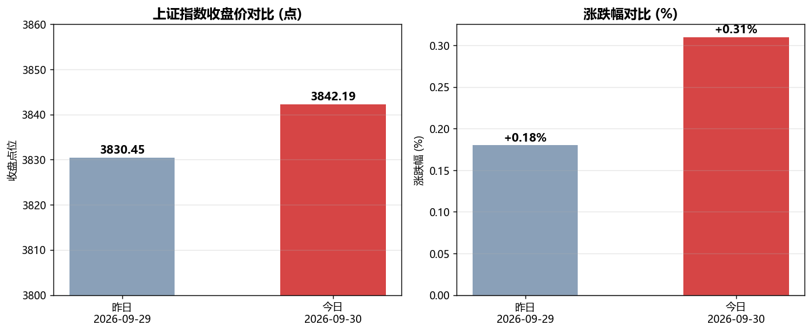
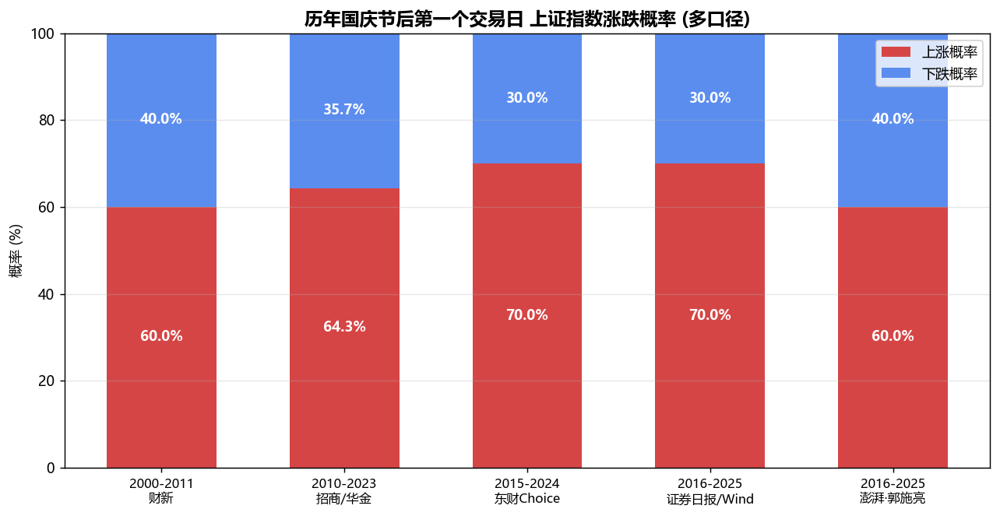
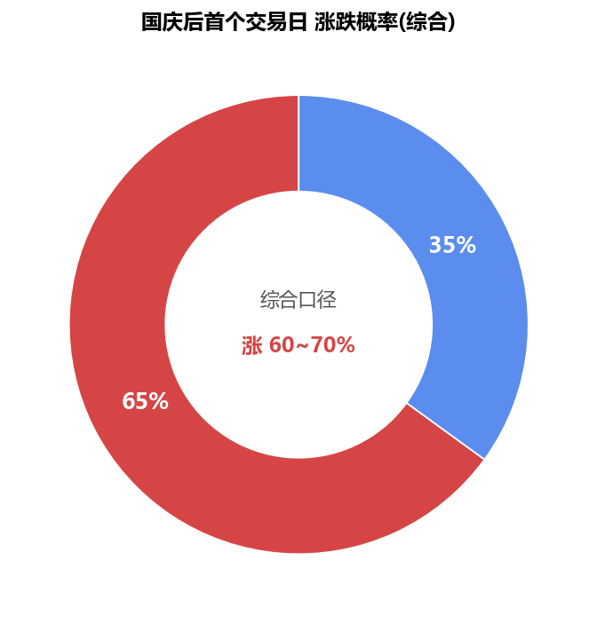

# A股上证指数收盘对比与国庆后首个交易日涨跌概率分析报告

**AS_OF: 2026-09-30 16:54**（A股已收盘，本报告采用 2026-09-30 15:00 收盘数据，非盘中快照）

---

## 一、分析背景

2026-09-30（周三）是 A 股 9 月的最后一个交易日，也是国庆长假前最后一个交易日。本报告基于已获取的收盘数据，完成两项任务：

1. **今日（2026-09-30）上证指数收盘表现**，并与昨日（2026-09-29）对比；
2. **国庆后第一个交易日（2026-10-08，周四）上证指数涨跌的历史概率统计**，为节后开盘提供历史参考。

> 数据来源：富途牛牛/格隆汇（今日收盘）、网易市场数据日报/中新经纬（昨日收盘）、证券日报/Wind、东方财富Choice、招商/华金证券、财新网、澎湃新闻（历史统计）。

---

## 二、今日收盘表现与昨日对比

### 2.1 核心数据

| 指标 | 今日 2026-09-30 (周三) | 昨日 2026-09-29 (周二) | 变化 |
|---|---|---|---|
| **收盘点位** | **3842.19** | 3830.45 | **+11.74 点** |
| **涨跌幅** | **+0.31%** | +0.18% | 涨幅扩大 |
| 今开 | 3839.25 | — | — |
| 最高 / 最低 | 3851.22 / 3833.09 | 3843.84 / 3810.81 | — |
| 振幅 | 0.47% | — | — |
| 成交额 | 3993.99 亿 | 14091.98 亿 | 显著缩量 |
| 上涨 / 下跌家数 | 1173 / 996 | — | 个股跌多涨少 |

**结论：今日上证指数收 3842.19 点，较昨日收盘 3830.45 点上涨 11.74 点，涨幅 +0.31%，连续第二个交易日收涨，但涨幅温和、量能明显萎缩。**

### 2.2 盘面解读

- **指数层面**：三大指数涨跌不一——上证 +0.31%、深成指 -0.11%、创业板指 -0.23%、北证50 +0.7%、科创50 -2.51%。权重蓝筹（银行、白酒、地产）护盘，成长板块（科创、创业板）走弱。
- **个股层面**：全市场超 2800 只个股下跌，呈现"指数红、个股绿"的结构性分化，赚钱效应偏弱。
- **量能层面**：今日成交额 3993.99 亿，较昨日 14091.98 亿大幅缩量，节前观望情绪浓厚，资金离场避险特征明显。
- **板块层面**：医药、白酒、农业、地产等防御/消费板块活跃，符合节前避险逻辑。

> 注：今日为 9 月收官日，主要指数本月集体收跌（上证全月 -3.62%），整体呈缩量调整态势；银行股本月逆势创历史新高。

---

## 三、国庆后第一个交易日历史涨跌概率统计

国庆后首个交易日为 **2026-10-08（周四）**。不同机构统计区间略有差异，故给出多口径对比。

### 3.1 多口径统计

| 统计区间 | 来源 | 上涨概率 | 下跌概率 |
|---|---|---|---|
| 2000–2011 | 财新网 | ~60% | ~40% |
| 2010–2023 (14年) | 招商/华金证券 | 64.3% (9/14) | 35.7% |
| 2015–2024 (近10年) | 东方财富Choice | 70% | 30% |
| 2016–2025 (近10年) | 证券日报/Wind | 70% (7/10) | 30% |
| 2016–2025 (近10年) | 澎湃·郭施亮 | 60% (6/10) | 40% |

### 3.2 综合结论

- **上涨概率：约 60% ~ 70%**
- **下跌概率：约 30% ~ 40%**
- 整体呈 **"涨多跌少"** 格局，节后首日平均涨幅通常温和（多数年份不超过 0.5%）。

### 3.3 关键驱动因素

1. **资金回补**：节前融资盘收敛、节后迸发，节后首日两融余额多数年份增长（仅 2022 年下降），是节后偏强的核心支撑。
2. **政策与外部事件**：政策利好或中美关系缓和年份（2010/2015/2019/2021）节后多上涨；海外利空或美国 PMI 下滑年份（2018/2022）节后走弱。
3. **假期海外数据**：假期海外市场大幅下跌或出现重大利空，会显著压低节后首日上涨概率。

### 3.4 极端案例

- **2018 年节后首日：-3.72%**（海外利空 + 美国 PMI 下滑）
- **2024 年节后首日：+4.59%**（政策利好 + 中美关系缓和）

---

## 四、分析洞察

1. **今日是"节前收官"而非"节后首日"**：2026-09-30 是国庆前最后一个交易日，缩量、避险、权重护盘是典型节前特征；真正的节后首个交易日是 **2026-10-08（周四）**。
2. **历史胜率偏向上涨但非确定性**：节后首日上涨概率 60%~70%，意味着仍有 30%~40% 的下跌可能，历史统计是概率参考而非预测。
3. **决定 2026 节后首日方向的关键变量**：国庆假期（10-01~10-07）期间海外市场走势、国内政策与消费数据、以及突发事件。若假期海外平稳 + 政策偏暖，则节后首日上涨概率偏向区间上沿（~70%）；反之若海外大跌或现重大利空，则可能落入下跌区间。
4. **量能是重要信号**：今日大幅缩量（3993.99 亿 vs 昨日 14091.98 亿）显示节前资金观望，节后首日能否放量回补，将直接影响反弹的持续性。

---

## 五、结论

| 问题 | 答案 |
|---|---|
| 今日上证收多少？ | **3842.19 点** |
| 和昨天比涨还是跌？ | **涨**（+11.74 点，+0.31%） |
| 国庆后首个交易日涨的概率？ | **约 60% ~ 70%** |
| 国庆后首个交易日跌的概率？ | **约 30% ~ 40%** |

**一句话总结**：今日（2026-09-30）上证指数收 3842.19 点，较昨日上涨 0.31%，呈缩量避险的节前收官格局；从历史统计看，国庆后首个交易日（2026-10-08）上证指数上涨概率约 60%~70%、下跌概率约 30%~40%，整体偏多，但实际表现取决于假期期间海外市场、政策及突发事件。

---

> **免责声明**：本报告基于公开历史数据的统计复盘，历史表现不代表未来，不构成任何投资建议。市场有风险，决策需谨慎。
