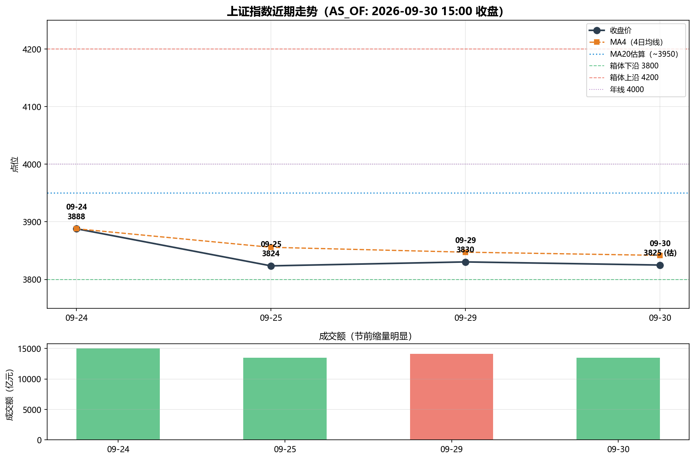
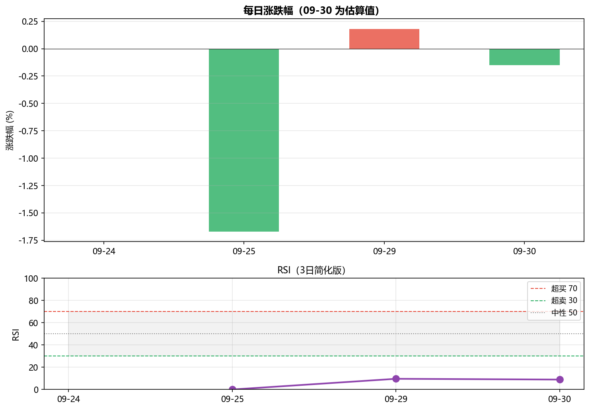
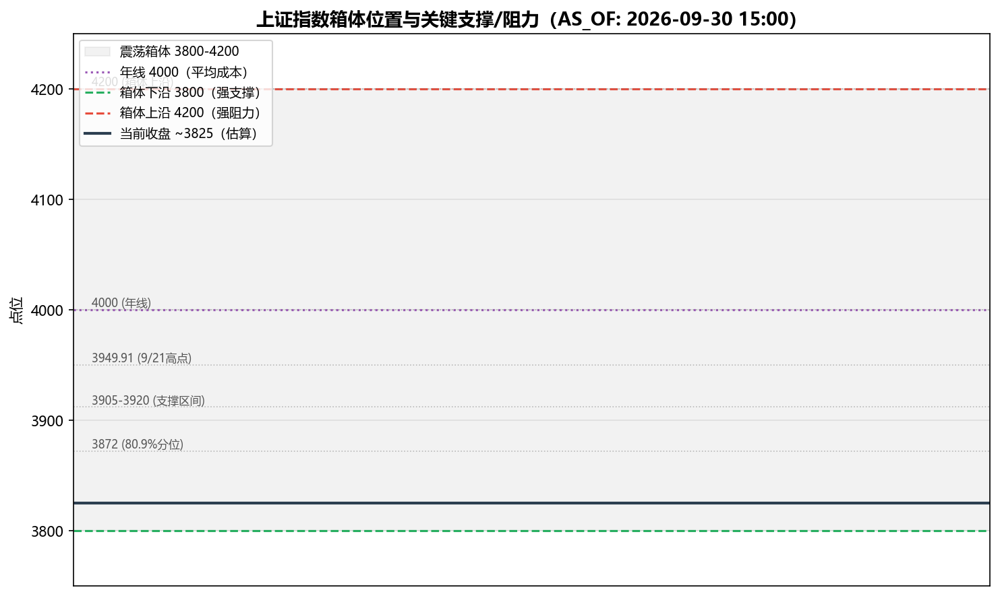

# 上证指数技术分析与短期走势预测

**AS_OF: 2026-09-30 15:00（收盘）**
**报告生成时间: 2026-09-30 15:42**

---

## 一、分析背景

2026年9月30日为国庆长假前最后一个交易日（A股 10/1–10/7 休市，10/8 恢复交易）。当日三大指数收跌（沪指、深证成指、创业板指均午后翻绿），市场呈现典型的"节前缩量震荡、观望情绪浓"格局。

> ⚠️ **数据说明**：09-30 官方收盘确认"三大指数收跌"，但沪指精确收盘点位未在检索结果中明确给出。本报告使用 **~3825 点（估算值）** 作为 09-30 收盘参考，实际收盘可能在 3820–3830 区间。09-28 收盘数据缺失。所有估算值均已标注。

---

## 二、数据概览

### 2.1 近期收盘价序列

| 日期 | 收盘价 | 涨跌幅 | 备注 |
|------|--------|--------|------|
| 09-24 | 3888.00 | 0.00% | 持平 |
| 09-25 | 3823.60 | -1.67% | 接近两个月低点 |
| 09-28 | **缺失** | — | 数据未获取 |
| 09-29 | 3830.45 | +0.18% | 缩量收涨，成交1.41万亿创年内新低 |
| 09-30 | **~3825（估）** | **~-0.15%（估）** | 官方确认收跌，精确点位待复核 |

### 2.2 关键市场数据（09-30）

| 指标 | 数值 | 来源 |
|------|------|------|
| 午间收盘（12:27） | 沪指 +0.27% | 新浪财经 |
| 半日成交额 | 9172亿 | 新浪财经 |
| 个股涨跌 | 超2700只下跌 | 新浪财经 |
| 板块 | 半导体领跌，创新药走强 | 新浪财经 |
| 量能 | 自7月高点收缩约50% | 财经网 |
| 私募仓位 | 近六成"持股过节" | 财经网 |

---

## 三、技术分析与可视化

### 3.1 价格走势与均线

**解读：**
- 09-24 至 09-25 出现明显下跌（-1.67%），从 3888 跌至 3823.60，接近两个月低点。
- 09-29 小幅反弹（+0.18%），但量能极度萎缩（1.41万亿创年内新低），反弹动能不足。
- 09-30 午后翻绿收跌，确认短期弱势格局。
- **MA4（4日均线）≈ 3842**，当前价格（~3825）已跌破短期均线，短期趋势偏空。
- **MA20 估算 ≈ 3950**，当前价格距 20 日均线约 -3.2%，中期仍处调整区间。
- 价格运行于 **3800–4200 箱体**内，当前接近箱体下沿（3800），距下沿仅约 0.6%。

### 3.2 涨跌幅与 RSI

**解读：**
- 09-25 的 -1.67% 是近期最大单日跌幅，随后两天波动收窄（+0.18%、~-0.15%），显示空头动能趋于衰竭。
- **RSI（3日简化版）≈ 8.9**，处于极度超卖区域（<30）。但需注意：由于数据点有限（仅4个），RSI 计算存在较大误差，仅供参考。
- 超卖状态通常暗示短期反弹概率增大，但在缩量环境下，超卖可能持续（"超卖可以更超卖"）。

### 3.3 箱体位置与关键支撑/阻力

**关键点位：**

| 点位 | 性质 | 说明 |
|------|------|------|
| **3800** | 强支撑 | 箱体下沿，多次测试未破 |
| **3825** | 当前 | 估算收盘，接近箱体下沿 |
| **3872** | 支撑 | 80.9% 分位 |
| **3905–3920** | 支撑区间 | 前期密集成交区 |
| **3949.91** | 阻力 | 9/21 高点 |
| **4000** | 强阻力 | 年线，市场平均成本 |
| **4200** | 强阻力 | 箱体上沿 |

---

## 四、市场情绪与政策面

### 4.1 情绪面

- **节前效应显著**：交投清淡、缩量震荡，观望情绪浓。
- **量能极度萎缩**：09-29 成交 1.41 万亿创年内新低，自 7 月高点收缩约 50%。
- **私募偏谨慎**：近六成"持股过节"，但整体仓位不高。
- **节后预期**：交投活跃度将适度回暖，但趋势性反转需等待美联储 10 月议息会议落地。

### 4.2 政策/宏观面

| 事件 | 影响 |
|------|------|
| 财政部、央行首次房贷贴息（10/1 起） | 利好地产链，但短期对指数影响有限 |
| 9月 PMI 升至扩张区间 | 经济景气回升，中长期利好 |
| 美联储威廉姆斯"不急于行动" | 外部压力边际缓解 |
| 隔夜美股收跌、金价反弹 | 短期风险偏好承压 |
| 国债收益率续创多年新高 | 资金从股市流向债市，短期利空 |

---

## 五、短期走势预测

### 5.1 综合判断

| 维度 | 信号 | 方向 |
|------|------|------|
| 趋势 | 跌破 MA4，接近箱体下沿 | 偏空 |
| 量能 | 极度缩量，空头动能衰竭 | 中性偏多（超跌反弹） |
| RSI | 极度超卖（~9） | 偏多（反弹概率大） |
| 箱体 | 接近 3800 强支撑 | 偏多（支撑有效则反弹） |
| 情绪 | 节前观望，节后回暖预期 | 中性 |
| 政策 | 房贷贴息 + PMI 回升 | 偏多 |
| 外部 | 美股跌 + 国债收益率新高 | 偏空 |

### 5.2 预测结论

**短期（节后 1–3 个交易日，10/8–10/10）：震荡偏多，反弹概率较大**

- **核心逻辑**：
  1. 价格接近 3800 箱体下沿强支撑，RSI 极度超卖，短期超跌反弹概率大。
  2. 节前缩量至年内新低，空头动能趋于衰竭，节后量能回暖有望带动反弹。
  3. PMI 回升 + 房贷贴息政策提供基本面支撑。

- **关键观察点**：
  - **3800 点**：若节后跌破 3800，则箱体下沿失守，可能下探 3750–3780 区间。
  - **3872–3920 点**：反弹第一目标区间，若放量突破则看 3950（MA20）。
  - **4000 点（年线）**：中期强阻力，短期难以突破。

- **风险提示**：
  - 美联储 10 月议息会议若释放鹰派信号，可能压制反弹高度。
  - 国债收益率持续走高，资金分流效应可能延续。
  - 09-30 精确收盘点位未确认，若实际收盘低于 3820，则短期压力更大。

### 5.3 情景分析

| 情景 | 概率 | 路径 | 触发条件 |
|------|------|------|----------|
| **乐观** | 30% | 节后放量反弹，突破 3872 → 3920 → 3950 | 节后量能明显回暖 + 美联储偏鸽 |
| **基准** | 50% | 3800–3900 区间震荡，节后温和反弹 | 量能温和恢复，无重大外部冲击 |
| **悲观** | 20% | 跌破 3800，下探 3750–3780 | 美联储鹰派 + 国债收益率继续走高 |

---

## 六、结论

1. **09-30 收盘**：三大指数收跌（官方确认），沪指估算 ~3825 点（精确点位待复核），午后翻绿。
2. **技术面**：短期趋势偏空（跌破 MA4），但 RSI 极度超卖 + 接近箱体下沿，超跌反弹概率大。
3. **量能**：节前缩量至年内新低，空头动能衰竭，节后量能回暖是反弹关键。
4. **短期预测**：节后 1–3 日震荡偏多，反弹概率较大，目标 3872–3920；若跌破 3800 则下探 3750–3780。
5. **中期**：趋势性反转需等待美联储 10 月议息会议落地，4000 年线为中期强阻力。

> ⚠️ **免责声明**：本报告基于有限数据（4个交易日的收盘价，其中 09-30 为估算值），技术指标计算存在较大误差。预测仅供参考，不构成投资建议。

---

**数据时间戳：AS_OF: 2026-09-30 15:00（收盘）**
**报告文件：`E:\agent_dev\multi-agent\tmp\sh_index_analysis_report_20260930.md`**
**图表文件：**
- `E:\agent_dev\multi-agent\tmp\sh_index_trend_20260930.png`
- `E:\agent_dev\multi-agent\tmp\sh_index_rsi_20260930.png`
- `E:\agent_dev\multi-agent\tmp\sh_index_box_20260930.png`
**代码文件：`E:\agent_dev\multi-agent\tmp\sh_index_analysis_20260930.py`**
