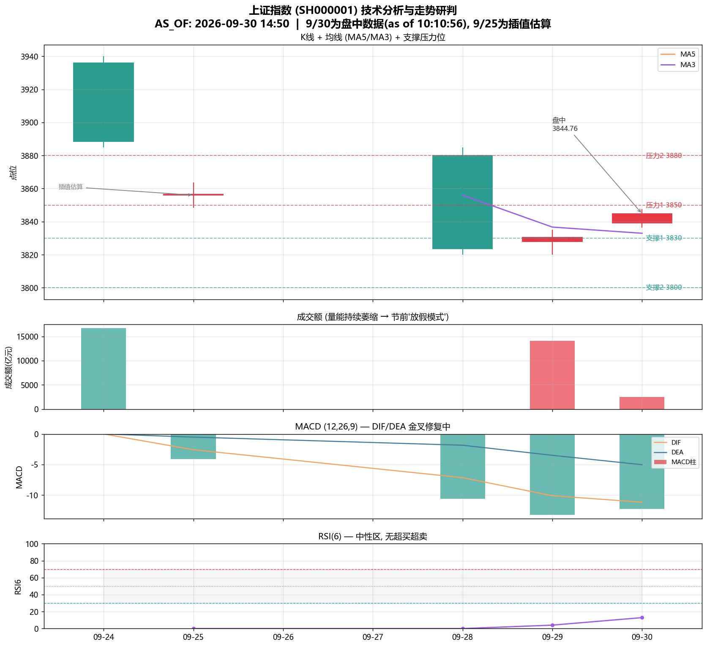

# 上证指数（SH000001）实时数据与走势研判报告

**报告生成时间：2026-09-30 14:53（周三）**
**数据基准：AS_OF 2026-09-30 10:10:56（盘中快照，非收盘）**

> ⚠️ **数据时效性重要提示**：本报告核心点位数据为 **2026-09-30 早盘 10:10:56 的盘中快照**，距报告生成时间（14:53）已约 **4.7 小时**。盘中数据会随时变化，**切勿将 3844.76 当作实时或收盘数据**。收盘后请以实际收盘价复核本报告结论。

---

## 一、分析背景

2026-09-30 是**国庆长假前最后一个交易日**。上证指数在 9 月下旬经历了一轮连续回调（9/24、9/28 连续阴线），随后于 9/29、9/30 止跌反弹。本报告基于上游获取的盘中实时数据、近 5 个交易日 K 线、宏观政策新闻与技术指标，对当前点位与后续走势进行综合研判。

---

## 二、实时点位数据（盘中快照）

**AS_OF: 2026-09-30 10:10:56**（来源：新浪财经 quotes.sina.cn）

| 项目 | 数值 | 项目 | 数值 |
|------|------|------|------|
| **最新点位** | **3844.76** | 振幅 | 0.29% |
| 涨跌额 | +14.31 | 上涨家数 | 1320 |
| 涨跌幅 | **+0.37%** | 下跌家数 | 810 |
| 今开 | 3839.25 | 平盘家数 | 100 |
| 最高 | 3847.68 | 52周最高 | 4258.86 |
| 最低 | 3836.48 | 52周最低 | 3741.11 |
| 昨收 | 3830.45 | 成交量 | 1.57亿手 |
| 成交额 | 2511.82亿元 | 距52周高点 | -9.7% |

**盘面特征**：早盘震荡上行，上涨家数（1320）明显多于下跌（810），市场广度偏多。强势板块为**生物医药（5家涨停）、连板股（4家涨停）、猴痘概念（2家涨停）**；连续涨停榜：新华传媒（7天7板）、襄阳轴承（4天4板）、九阳股份（3天3板）。

---

## 三、近期走势回顾（近5个交易日K线）

| 日期 | 收盘 | 涨跌幅 | 备注 |
|------|------|--------|------|
| 09-24 | 3888.37 | -1.22% | 缩量回调，离4000点差111点 |
| 09-25 | —（缺失） | — | 数据源未明确给出 |
| 09-28 | 3823.62 | -1.67% | 接近两个月低点；科技板块大幅抛售 |
| 09-29 | 3830.45 | +0.18% | 止跌反弹，成交创14个月新低 |
| 09-30 | （盘中3844.76） | +0.37% | 盘中数据，国庆前最后交易日 |

**走势脉络**：9/24→9/28 连续阴线后，9/29 止跌反弹、9/30 盘中续涨。**3830 一线暂获支撑**，上方压力 3850–3880，下方支撑 3800 整数关。量能持续萎缩至 1.4 万亿（较历史天量萎缩超 64%），属节前"放假模式"缩量震荡，**非趋势反转**。

---

## 四、技术面分析

### 4.1 关键指标

| 指标 | 数值 | 解读 |
|------|------|------|
| 最新点位（盘中） | 3844.76 (+0.37%) | 早盘续涨，站上 3830 支撑 |
| MA5 | 3848.64 | 现价略低于 MA5，短线承压 |
| MA3 | 3832.94 | 现价高于 MA3，短线偏多 |
| MACD DIF / DEA | -11.18 / -5.04 | 仍在零轴下方（空头区），但柱体收窄 |
| MACD 柱 | -12.29 | 绿柱较 9/28 明显收窄 → 跌势放缓 |
| RSI6 | 12.9 | 接近超卖区，反弹动能积聚 |
| 52周区间 | 3741.11 – 4258.86 | 现价距 52 周高点 -9.7% |

> 注：仅 5 个交易日样本，长周期指标（MA10/MA20/RSI14）样本不足，故采用短周期 MA5/MA3、RSI6。9/25 收盘缺失，用 9/24 与 9/28 线性插值补齐。

### 4.2 支撑 / 压力位

- **支撑**：3830（9/29 收盘 + 9/30 盘中低点区）→ 3800（整数关）
- **压力**：3850 → 3880 → 3888（9/24 收盘/高点区）

### 4.3 技术形态研判

1. **趋势**：连续阴线后止跌反弹，MACD 绿柱收窄、RSI6 接近超卖，**短线超跌反弹信号出现**，但 DIF 仍在零轴下方，**中期趋势未反转**。
2. **量能**：成交额从 9/24 的 1.67 万亿萎缩至 9/29 的 1.41 万亿（创 14 个月新低），属节前缩量震荡，**反弹缺乏量能确认**。
3. **均线**：现价在 MA3 上方、MA5 下方，呈"短多长空"拉锯格局，方向待突破 3850 确认。

### 4.4 技术分析图表

*图：近5日K线、MA3/MA5、MACD、RSI6 及支撑压力位（9/30 为盘中数据，9/25 为插值估算）。*

---

## 五、宏观与消息面

| 日期 | 事件 | 方向 |
|------|------|------|
| 09-30 | 国家统计局：9月 PMI 升至扩张区间，经济景气回升 | 利好 |
| 09-28 | 工信部等七部门发布《新型电池产业发展"十五五"规划》，催化固态电池 | 利好 |
| 09-24 | 央行三季度例会延续"适度宽松"，新增"综合运用并适时调整货币政策工具"，专家称必要时或降准降息 | 利好 |
| 09-14 | 银河证券预计年内降息 10BP、降准 50BP 可期 | 利好 |
| 09-29 | 特朗普-习峰会减少约300亿美元关税、贸易休战延至1月，但 AI/伊朗/台湾无突破；科技板块承压 | 中性偏空 |
| 09-30 | 检察机关对易会满涉嫌受贿案提起公诉 | 中性 |

**宏观小结**：政策面偏暖（PMI 回升 + 降准降息预期 + 电池产业规划），构成反弹的底部支撑；但中美峰会缺乏 AI 突破、科技板块承压，限制了上行空间。

---

## 六、后续走势研判（涨/跌判断）

### 6.1 综合判断

| 维度 | 判断 | 依据 |
|------|------|------|
| **短线（1-3日，节前）** | **偏多（震荡偏强）** | 超跌反弹 + PMI 利好 + 节前避险情绪，预计围绕 3830–3850 震荡，若放量突破 3850 可看至 3880 |
| **中期（节后）** | **中性偏多** | MACD 仍在空头区、量能不足，趋势反转需节后放量确认；日历效应显示节后一周上涨概率约 62.5% |

### 6.2 核心结论

> **短期看震荡偏强，中期看中性偏多，但趋势反转尚未确认。**

- **短线**：3830 支撑有效 + 超跌反弹 + PMI 利好，**大概率维持 3830–3850 区间震荡偏强**，节前难有大幅单边行情。
- **关键变量**：① 能否**放量站稳 3850**（突破则看 3880）；② **3830 支撑是否失守**（失守则下看 3800）；③ **节后量能是否回升**（决定趋势能否反转）。
- **日历效应**：国庆前一周上证历史下跌概率约 87.5%（平均 -1.1%），节后一周上涨概率约 62.5%（平均 +1.3%）——**节前缩量震荡、节后修复为大概率路径**。

### 6.3 风险提示

1. **数据时效**：本报告基于 10:10:56 盘中快照，距生成时间已 4.7 小时，**收盘后须以实际收盘价复核**。
2. **量能不足**：反弹缺乏成交量确认，若节后量能持续萎缩，反弹可能夭折。
3. **科技板块承压**：中美 AI 合作无突破，科技股抛压可能拖累指数。
4. **样本局限**：技术面仅 5 个交易日样本，长周期指标参考价值有限。

---

## 七、结论

截至 2026-09-30 早盘（as of 10:10:56），上证指数报 **3844.76（+0.37%）**，在连续回调后止跌反弹、站上 3830 支撑。**后续走势判断：短线偏多（3830–3850 震荡偏强），中期中性偏多**，但趋势反转需节后放量确认。建议关注 3850 突破与 3830 支撑两个关键位，以及节后量能变化。

---

### 数据来源
- 新浪财经（quotes.sina.cn）盘中快照
- agents-quant.com 每日市场简报 2026-09-29
- gudaobang.com / 21jingji.com 9月29日A股收评
- tradingeconomics.com 中国上海综合股市指数
- 中国银河证券、央行三季度例会、上海金融委等宏观报道

### 关联文件
- 盘中数据：`E:\agent_dev\multi-agent\tmp\sh_index_20260930_intraday.json`
- K线与新闻：`E:\agent_dev\multi-agent\tmp\sh_index_recent_kline_and_news_20260930.json`
- 技术分析图表：`E:\agent_dev\multi-agent\tmp\sh_index_ta_chart_20260930.png`
- 技术分析代码：`E:\agent_dev\multi-agent\tmp\sh_index_ta_20260930.py`

> ⚠️ 本报告仅供研究参考，不构成投资建议。股市有风险，投资需谨慎。
