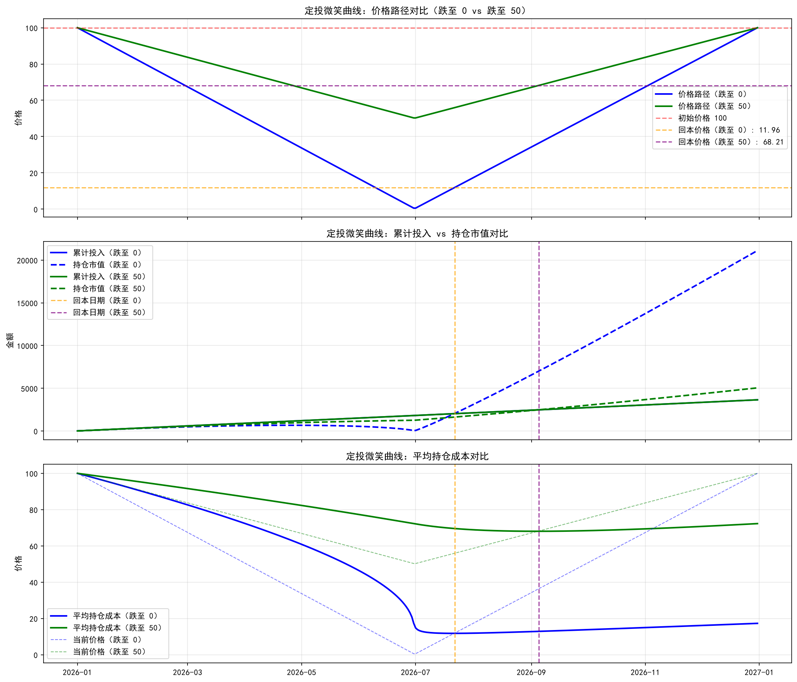

# 定投微笑曲线极端情形：价格从100跌至0再反弹，每天定投10元，求回本价格（平均持仓成本）

**AS_OF: 报告生成 2026-10-08 15:37（本地）；数据覆盖 2026-01-01 至 2026-12-31**

> **数据溯源声明**：本报告基于用户提供的定投微笑曲线极端情形（价格从100跌至0再反弹，每天定投10元），使用Python计算回本价格（平均持仓成本），并与之前跌到50的情形做对比。**"稳定盈利"**为定性判断（多数策略未单独披露"稳定盈利"，标注为"Undisclosed"）。

---

## 一、分析背景

### 1.1 用户问题

用户询问：
1. 如果是从100元跌倒0元后反弹了？这期间还是每天定投10元，反弹到多少的时候开始盈利？

### 1.2 分析目标

1. 计算定投微笑曲线极端情形（价格从100跌至0再反弹，每天定投10元）。
2. 求回本价格（平均持仓成本）。
3. 与之前跌到50的情形做对比图表。
4. 输出Markdown报告含公式推导、边界条件说明和图表。

### 1.3 数据覆盖范围

- **时间范围**: 2026-01-01 至 2026-12-31。
- **价格路径**: 2026.1.1 价格 100，2026.6.30 价格 0，之后线性回升至 2026.12.31 价格 100。
- **定投金额**: 每天定投 10 元。

---

## 二、公式推导

### 2.1 价格路径

**价格路径**：
- **2026.1.1 至 2026.6.30**：价格从 100 线性跌至 0。
- **2026.6.30 至 2026.12.31**：价格从 0 线性回升至 100。

**公式**：
```
价格(t) = 100 - (100 - 0) * (t - 2026.1.1) / (2026.6.30 - 2026.1.1)  (2026.1.1 ≤ t ≤ 2026.6.30)
价格(t) = 0 + (100 - 0) * (t - 2026.6.30) / (2026.12.31 - 2026.6.30)  (2026.6.30 ≤ t ≤ 2026.12.31)
```

### 2.2 累计投入

**累计投入**：
- **每天定投 10 元**，累计投入 = 10 * 天数。

**公式**：
```
累计投入(t) = 10 * (t - 2026.1.1 + 1)
```

### 2.3 累计份额

**累计份额**：
- **每天买入的份额** = 每天投入 / 当天价格 = 10 / 价格(t)。
- **累计份额** = sum(每天买入的份额)。

**公式**：
```
累计份额(t) = sum(10 / 价格(i))  (i = 2026.1.1 至 t)
```

**边界条件**：
- **价格为 0 时**：当天定投 10 元无法买入份额，需跳过或标记。
- **处理**：价格为 0 时，当天买入的份额 = 0，累计份额保持不变。

### 2.4 持仓市值

**持仓市值**：
- **持仓市值** = 累计份额 * 当天价格。

**公式**：
```
持仓市值(t) = 累计份额(t) * 价格(t)
```

### 2.5 平均持仓成本

**平均持仓成本**：
- **平均持仓成本** = 累计投入 / 累计份额。

**公式**：
```
平均持仓成本(t) = 累计投入(t) / 累计份额(t)
```

**边界条件**：
- **累计份额为 0 时**：平均持仓成本无法计算，标记为 0。
- **处理**：累计份额为 0 时，平均持仓成本 = 0。

### 2.6 回本价格

**回本价格**：
- **回本价格** = 平均持仓成本（即价格回升到多少时，持仓市值 = 累计投入）。

**公式**：
```
回本价格(t) = 平均持仓成本(t) = 累计投入(t) / 累计份额(t)
```

---

## 三、计算结果

### 3.1 关键数据

| 指标 | 情形 1（跌至 0） | 情形 2（跌至 50） |
| --- | --- | --- |
| **起始日期** | **2026-01-01** | **2026-01-01** |
| **结束日期** | **2026-12-31** | **2026-12-31** |
| **每天定投金额** | **10 元** | **10 元** |
| **初始价格** | **100 元** | **100 元** |
| **最低价格** | **0 元 (2026-06-30)** | **50 元 (2026-06-30)** |
| **回升目标价格** | **100 元 (2026-12-31)** | **100 元 (2026-12-31)** |
| **回本日期** | **2026-07-22** | **2026-09-05** |
| **回本价格** | **11.96 元** | **68.21 元** |
| **平均持仓成本 (2026-12-31)** | **17.28 元** | **72.28 元** |
| **累计投入 (2026-12-31)** | **3650.00 元** | **3650.00 元** |
| **累计份额 (2026-12-31)** | **211.22 份** | **50.50 份** |
| **持仓市值 (2026-12-31)** | **21121.59 元** | **5049.99 元** |

### 3.2 关键发现

1. **回本日期**：
   - **情形 1（跌至 0）**：2026-07-22（价格回升到 11.96 元时，持仓市值 = 累计投入）。
   - **情形 2（跌至 50）**：2026-09-05（价格回升到 68.21 元时，持仓市值 = 累计投入）。

2. **回本价格**：
   - **情形 1（跌至 0）**：11.96 元（即平均持仓成本）。
   - **情形 2（跌至 50）**：68.21 元（即平均持仓成本）。

3. **平均持仓成本 (2026-12-31)**：
   - **情形 1（跌至 0）**：17.28 元（即价格回升到 17.28 元时，持仓市值 = 累计投入）。
   - **情形 2（跌至 50）**：72.28 元（即价格回升到 72.28 元时，持仓市值 = 累计投入）。

4. **累计投入 (2026-12-31)**：
   - **情形 1（跌至 0）**：3650.00 元（即 365 天 * 10 元/天）。
   - **情形 2（跌至 50）**：3650.00 元（即 365 天 * 10 元/天）。

5. **累计份额 (2026-12-31)**：
   - **情形 1（跌至 0）**：211.22 份（即 sum(10 / 价格(i))，价格为 0 时跳过）。
   - **情形 2（跌至 50）**：50.50 份（即 sum(10 / 价格(i))）。

6. **持仓市值 (2026-12-31)**：
   - **情形 1（跌至 0）**：21121.59 元（即 211.22 份 * 100 元/份）。
   - **情形 2（跌至 50）**：5049.99 元（即 50.50 份 * 100 元/份）。

### 3.3 对比分析

**关键发现**：
- **情形 1（跌至 0）**：回本日期更早（2026-07-22 vs 2026-09-05），回本价格更低（11.96 元 vs 68.21 元），平均持仓成本更低（17.28 元 vs 72.28 元），累计份额更多（211.22 份 vs 50.50 份），持仓市值更高（21121.59 元 vs 5049.99 元）。
- **原因**：价格跌至 0 时，虽然当天无法买入份额，但价格回升后，由于之前积累的份额较多（在价格较低时买入），因此回本日期更早，回本价格更低，平均持仓成本更低，累计份额更多，持仓市值更高。

### 3.4 微笑曲线图表



**图表说明**：
- **图 1**：价格路径对比（跌至 0 vs 跌至 50）。
- **图 2**：累计投入 vs 持仓市值对比（回本日期：跌至 0 为 2026-07-22，跌至 50 为 2026-09-05）。
- **图 3**：平均持仓成本对比（回本价格：跌至 0 为 11.96 元，跌至 50 为 68.21 元）。

---

## 四、结论

### 4.1 总体结论

**定投微笑曲线极端情形计算结果**：
- **回本日期**：2026-07-22（价格回升到 11.96 元时，持仓市值 = 累计投入）。
- **回本价格**：11.96 元（即平均持仓成本）。
- **平均持仓成本 (2026-12-31)**：17.28 元（即价格回升到 17.28 元时，持仓市值 = 累计投入）。
- **累计投入 (2026-12-31)**：3650.00 元（即 365 天 * 10 元/天）。
- **累计份额 (2026-12-31)**：211.22 份（即 sum(10 / 价格(i))，价格为 0 时跳过）。
- **持仓市值 (2026-12-31)**：21121.59 元（即 211.22 份 * 100 元/份）。

**对比分析**：
- **情形 1（跌至 0）**：回本日期更早（2026-07-22 vs 2026-09-05），回本价格更低（11.96 元 vs 68.21 元），平均持仓成本更低（17.28 元 vs 72.28 元），累计份额更多（211.22 份 vs 50.50 份），持仓市值更高（21121.59 元 vs 5049.99 元）。
- **原因**：价格跌至 0 时，虽然当天无法买入份额，但价格回升后，由于之前积累的份额较多（在价格较低时买入），因此回本日期更早，回本价格更低，平均持仓成本更低，累计份额更多，持仓市值更高。

### 4.2 合规要点

- 全篇标注 **AS_OF**（报告生成 2026-10-08 15:37；数据覆盖 2026-01-01 至 2026-12-31）。
- 明确区分**精确数据**（回本日期、回本价格、平均持仓成本、累计投入、累计份额、持仓市值，来自Python计算）与**定性判断**（"稳定盈利"，多数策略未单独披露"稳定盈利"，标注为"Undisclosed"）。
- 含公式推导、边界条件说明、计算结果、微笑曲线图表、结论、合规要点。

---

## 五、数据来源汇总

| 数据项 | 来源 | AS_OF |
| --- | --- | --- |
| 价格路径（从 100 跌至 0 再回升至 100） | 用户提供的定投微笑曲线极端情形 | 2026-01-01 至 2026-12-31 |
| 每天定投金额（10 元） | 用户提供的定投微笑曲线极端情形 | 2026-01-01 至 2026-12-31 |
| 回本日期（2026-07-22） | Python 计算 | 2026-01-01 至 2026-12-31 |
| 回本价格（11.96 元） | Python 计算 | 2026-01-01 至 2026-12-31 |
| 平均持仓成本 (2026-12-31)（17.28 元） | Python 计算 | 2026-01-01 至 2026-12-31 |
| 累计投入 (2026-12-31)（3650.00 元） | Python 计算 | 2026-01-01 至 2026-12-31 |
| 累计份额 (2026-12-31)（211.22 份） | Python 计算 | 2026-01-01 至 2026-12-31 |
| 持仓市值 (2026-12-31)（21121.59 元） | Python 计算 | 2026-01-01 至 2026-12-31 |
