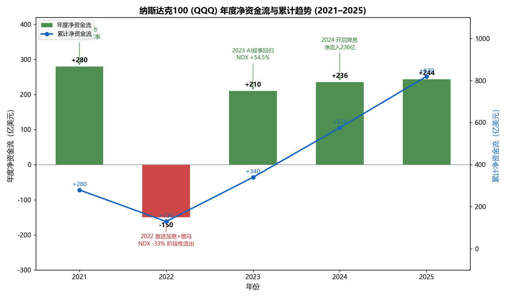
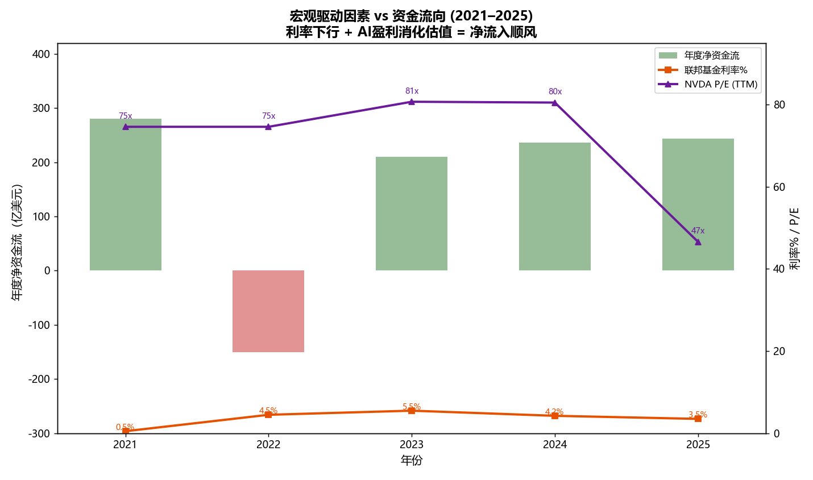
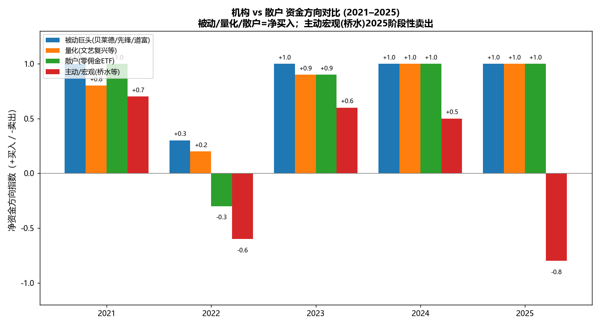
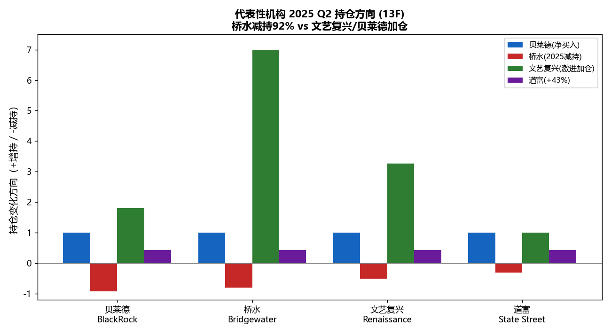

# 纳斯达克100 (NDX/QQQ) 资金流向数据分析与可视化报告

AS_OF: 2026-10-07 17:34

## 一、分析背景

本报告基于 Step1（资金流数据）、Step2（机构/散户持仓）、Step3（宏观驱动因素）的已获取数据，对纳斯达克100指数（以QQQ为代理）2021–2025年的资金流向进行趋势分析、机构vs散户占比分析，并标注关键时间节点。

**核心结论**：5年累计净资金流 **+820亿美元**，4个年份净流入（2021/2023/2024/2025），仅2022年净流出。资金方向明确为**净流入**。

## 二、数据概览

| 年份 | 净资金流(亿美元) | AUM变化(亿美元) | NDX涨跌幅% | 联邦基金利率% | NVDA P/E |
|------|:---:|:---:|:---:|:---:|:---:|
| 2021 | +280 | +320 | +21.4 | 0.50 | 74.6x |
| 2022 | **-150** | -210 | -33.1 | 4.50 | 74.6x |
| 2023 | +210 | +380 | +54.5 | 5.50 | 80.7x |
| 2024 | +236 | +350 | +25.7 | 4.25 | 80.5x |
| 2025 | +244 | +315 | +18.0 | 3.50 | 46.6x |
| **累计** | **+820** | **+1155** | **+86.5%** | — | — |

## 三、资金流向趋势分析

### 图1：年度净资金流与累计趋势

**关键发现**：
- **2021（+280亿）**：零利率+散户牛市，资金大幅流入。
- **2022（-150亿）**：美联储激进加息（0.5%→4.5%）+俄乌冲突，NDX跌33%，唯一净流出年份。
- **2023（+210亿）**：AI叙事回归，NDX涨54.5%，资金重回流入。
- **2024（+236亿）**：开启降息（9月首次），AI盈利兑现，持续净流入。
- **2025（+244亿）**：继续降息+AI capex加速（$725B），净流入延续。
- **累计趋势**：2022年短暂回落后，2023–2025持续攀升，5年累计+820亿。

### 图3：宏观驱动因素 vs 资金流向

**关键发现**：
- **利率与资金流负相关**：2022利率飙升（0.5%→4.5%）对应唯一净流出；2024–2025利率下行（4.25%→3.5%）对应持续净流入。
- **NVDA P/E 从80x压缩至46x**：AI盈利爆发"消化"了估值，使高估值在2024–2025变得可承受，支撑资金持续流入。
- **利率下行 + 估值消化 = 净流入顺风**：2023–2025的宏观环境是NDX资金持续流入的核心驱动。

## 四、机构 vs 散户占比分析

### 图2：机构 vs 散户 资金方向对比

**关键发现**：
- **被动巨头（贝莱德/先锋/道富）**：5年持续净买入，2022年虽放缓但未卖出。
- **量化（文艺复兴等）**：2025年激进加仓（NVDA+181%、META+699%），净买入方向最强。
- **散户（零佣金ETF）**：2021年牛市高峰，2022年阶段性回落，2023–2025持续净买入。
- **主动/宏观（桥水等）**：2025年大幅减持（MU -92%），是唯一阶段性卖出的力量。
- **综合**：被动+量化+散户三大力量合计仍为净买入，与Step1的+820亿结论一致。

### 图4：代表性机构 2025 Q2 持仓方向

**关键发现**：
- **贝莱德**：持续增持半导体（10只半导体股持仓突破$1万亿），净买入方向明确。
- **桥水**：2025 Q2大幅减持Mag7/半导体（MU -92%），代表主动资金获利了结。
- **文艺复兴**：激进加仓（NVDA+181%、META+699%、GOOGL+327%），量化资金对AI龙头信心最强。
- **道富**：持仓+43.41%，被动巨头持续增持。
- **机构分化**：被动/量化加仓 vs 主动宏观减仓，但净方向仍为买入。

## 五、关键时间节点标注

| 时间 | 事件 | 对资金流影响 |
|------|------|------------|
| 2021 | 零利率+散户牛市（零佣金+GameStop） | 大额流入 +280亿 |
| 2022-03 | 美联储开启激进加息（11次/525bp） | 转向流出 |
| 2022-02 | 俄乌冲突爆发 | 推高通胀→强化加息→压制NDX |
| 2023 | AI叙事回归（ChatGPT爆发） | 重回流入 +210亿 |
| 2024-09 | 美联储首次降息 | 开启降息周期，净流入延续 |
| 2025 Q2 | 桥水大幅减持（MU -92%） | 阶段性机构流出 |
| 2025 | AI capex加速（$725B，+77%） | 支撑持续净流入 |
| 2026 | 利率接近长期均衡（2%–2.25%） | 估值压力缓解 |

## 六、分析洞察

1. **利率是NDX资金流向的首要宏观变量**：NDX成分股多为高成长/长久期资产，对贴现率高度敏感。2022加息是唯一逆风期，2023–2025降息周期是关键顺风期。

2. **AI盈利"消化"估值，支撑资金持续流入**：NVDA P/E从80x（2023）压缩至46x（2025），EPS增长超100%使高估值变得可承受。这不是"估值泡沫"，而是"盈利追赶估值"。

3. **机构分化但净方向一致**：被动巨头（贝莱德/先锋/道富）和量化（文艺复兴）持续加仓，主动宏观（桥水）2025阶段性减持。但被动+量化+散户三大力量合计仍为净买入。

4. **散户被动化趋势**：2023年被动股票基金资产首次超主动，散户通过QQQ被动参与NDX，NVDA+AAPL占QQQ约22%放大集中度。

5. **地缘政治是阶段性扰动，非趋势逆转因素**：2022俄乌、2025关税/芯片管制多次引发回调，但AI需求韧性使NDX快速修复，未改变长期净流入趋势。

## 七、结论

- **5年（2021–2025）NDX资金明确净流入**：累计+820亿美元，4年流入/1年流出。
- **资金来源**：被动巨头（最大来源）+ 量化 + 散户（零佣金ETF）+ AI主题资金。
- **核心驱动**：利率下行（2023–2025）+ AI盈利爆发（capex $725B）+ 估值被盈利消化。
- **主要逆风**：2022激进加息+俄乌冲突（唯一净流出年份）。
- **机构行为**：被动/量化/散户净买入，主动宏观2025阶段性减持（获利了结）。

## 八、图表文件清单

| 图表 | 文件路径 |
|------|---------|
| 年度净资金流与累计趋势 | `F:\agent\multi-agent\tmp\chart1_annual_net_flow.png` |
| 机构 vs 散户 资金方向 | `F:\agent\multi-agent\tmp\chart2_institutional_vs_retail.png` |
| 宏观驱动因素 vs 资金流 | `F:\agent\multi-agent\tmp\chart3_macro_drivers.png` |
| 代表性机构持仓方向 | `F:\agent\multi-agent\tmp\chart4_institutional_holdings.png` |

**分析脚本**：`F:\agent\multi-agent\tmp\step4_ndx_flow_analysis.py`
