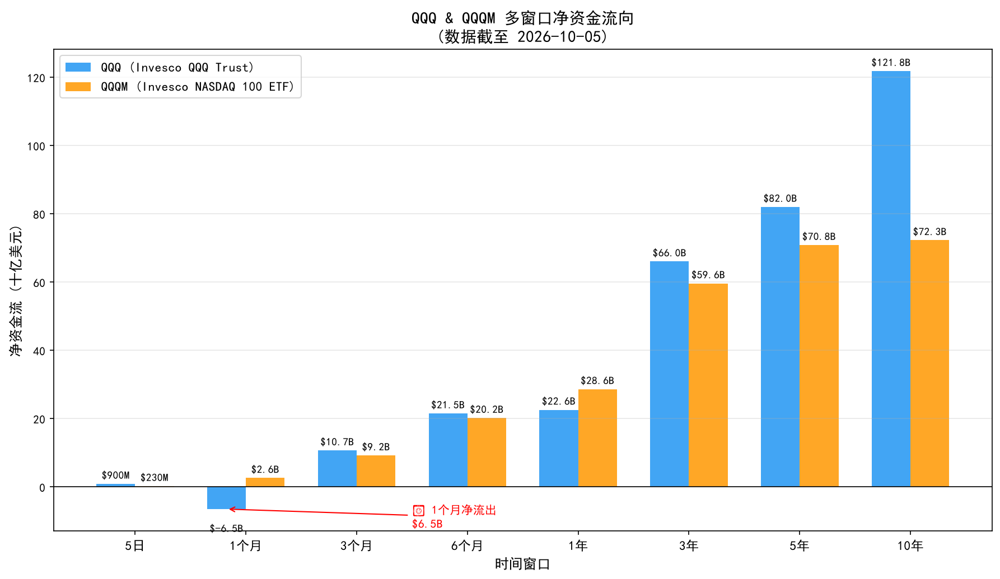
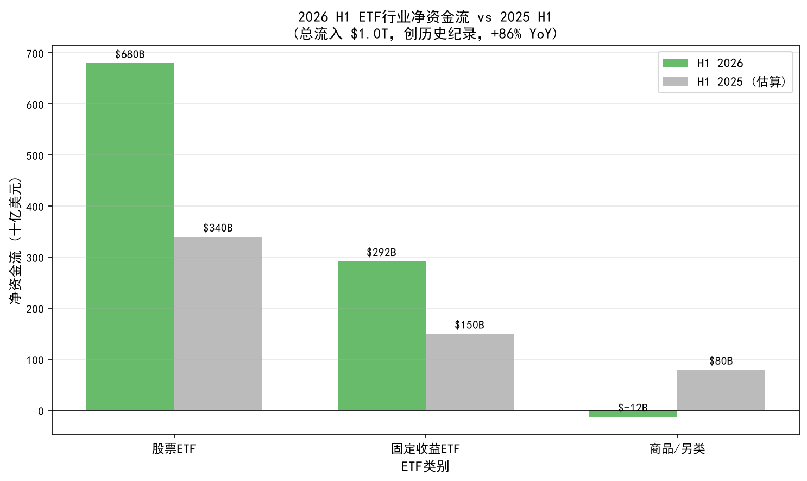
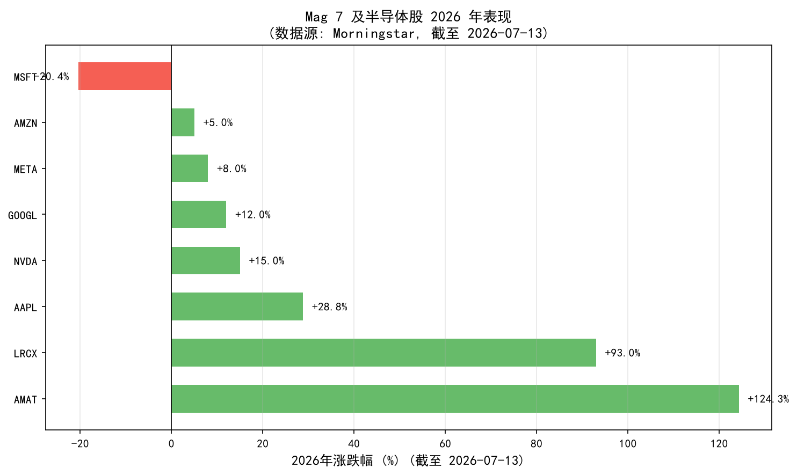
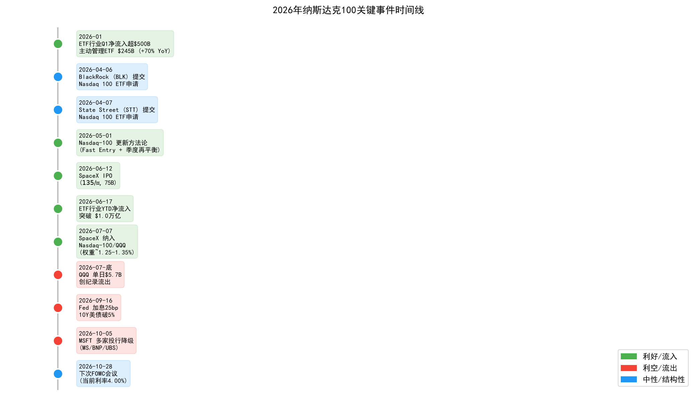
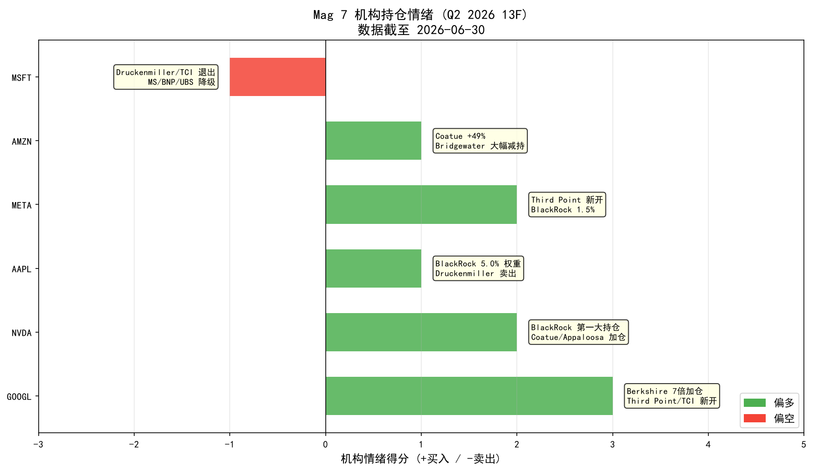
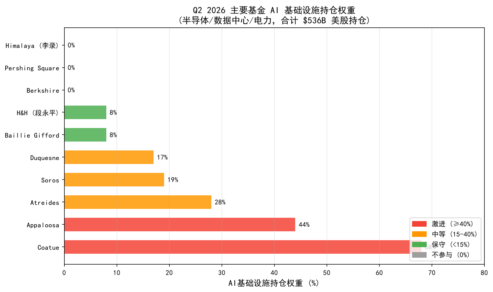

# 2026年纳斯达克100指数资金流向深度分析报告

**AS_OF: 2026-10-07 20:48**

---

## 一、分析背景

2026年，纳斯达克100指数（Nasdaq-100）及其核心ETF产品（QQQ/QQQM）在全球ETF市场中扮演着举足轻重的角色。作为美股科技股的核心载体，Nasdaq-100的资金流向不仅反映了投资者对AI/半导体等前沿科技主题的信心，更是宏观政策（美联储利率决议）、市场结构变化（指数成分股调整、新ETF竞争者入场）和机构行为（13F持仓变化）的综合体现。

本报告基于2026年10月7日前的最新数据，从**ETF资金流向、宏观政策影响、机构持仓变化、个股层面资金动向**四个维度，深入解读2026年纳斯达克100指数的资金流向特征、来源/去向及背后的投资逻辑。

**数据基准说明**：
- ETF流量数据截至 2026-10-05（QQQ最新价格 $749.58）
- 机构13F数据为 Q2 2026（季度截止 2026-06-30，披露截止 2026-08-14）
- 宏观政策数据截至 2026-09-16 Fed决议
- 分析师评级数据截至 2026-10-05

---

## 二、资金流向核心结论

### 2.1 总体判断：净流入为主，短期波动加剧

**2026年纳斯达克100指数（QQQ/QQQM）整体呈现净流入态势**，是美股ETF中资金流入最集中的品种之一。但9月美联储加息后，短期出现明显波动，1个月窗口净流出$6.5B，反映市场对利率/估值的敏感性。

| 时间窗口 | QQQ 净资金流 | QQQM 净资金流 | 趋势判断 |
|---------|-------------|-------------|---------|
| 5日 | +$900.5M | +$230.11M | 短期企稳 |
| **1个月** | **-$6.5B** | **+$2.61B** | **QQQ短期承压** |
| 3个月 | +$10.68B | +$9.21B | 中期稳健流入 |
| 6个月 | +$21.52B | +$20.19B | 半年度强劲流入 |
| 1年 | +$22.59B | +$28.64B | 年度净流入确认 |
| 3年 | +$66.04B | +$59.62B | 长期资金持续涌入 |
| 5年 | +$82.02B | +$70.85B | 长期趋势向上 |
| 10年 | +$121.82B | +$72.26B | 历史级资金积累 |

**关键发现**：
- QQQ 1个月净流出$6.5B是2026年唯一出现负值的时间窗口，直接对应2026-09-16美联储加息25bp及10年期美债收益率突破5%的宏观冲击
- QQQM（低费率版本）在所有时间窗口均保持净流入，且1年净流入（+$28.64B）超过QQQ（+$22.59B），反映费率敏感型投资者向低费率产品迁移
- 7月底曾出现单日$5.7B创纪录流出，是2026年最极端的单日资金外流事件

### 2.2 宏观背景：ETF行业创纪录流入

2026年上半年，全球ETF行业迎来历史性资金涌入，为纳斯达克100 ETF的净流入提供了宏观支撑：

| ETF类别 | H1 2026 净资金流 | H1 2025（估算） | 同比变化 |
|--------|-----------------|---------------|---------|
| 股票ETF | $680B | ~$340B | +100% |
| 固定收益ETF | ~$292B | ~$150B | +95% |
| 商品/另类 | -$12.4B | ~$79.5B | 转为流出 |
| **合计** | **$1.0T** | **~$570B** | **+86%** |

**里程碑事件**：
- 2026-06-17：ETF行业YTD净流入突破$1.0万亿（创历史纪录，约为前纪录的2倍）
- Q1 2026：ETF净流入超$500B，其中主动管理ETF单季$245B（同比+70%）
- 7月单月：ETF净流入$191B，2026 YTD接近$1.3万亿

**解读**：纳斯达克100 ETF的净流入是ETF行业整体创纪录流入的组成部分。股票ETF $680B的流入中，科技股ETF（尤其是Nasdaq-100相关）是最大受益者之一。

---

## 三、资金来源与去向深度分析

### 3.1 资金来源：四大驱动因素

#### （1）被动指数资金强制买入（结构性流入）

**SpaceX IPO与指数纳入**：
- 2026-06-12：SpaceX IPO（$135/股，约$75B规模）
- 2026-07-07：SpaceX纳入Nasdaq-100指数与QQQ，权重约1.25%-1.35%
- **影响**：所有跟踪Nasdaq-100的被动基金（QQQ、QQQM及其他ETF）必须强制买入SpaceX股票，带来结构性资金流入

**指数方法论更新**：
- 2026-05-01：Nasdaq-100更新方法论，新增Fast Entry规则、调整季度再平衡流程
- **影响**：提高成分股换手率，强化被动资金流入机制，使指数更能及时反映市场变化

#### （2）AI/半导体主题持续强劲（基本面驱动）

**半导体指数创纪录表现**：
- Philadelphia Semiconductor Index Q2 2026上涨87.8%（1994年指数创立以来最佳单季）
- Micron财年Q3营收+346%，TSMC位列4家主要基金前10持仓
- 半导体占S&P 500权重升至16%（2003年为0%）

**Mag 7中AI受益股表现**：
- Apple +28.8%（截至7/13，Mag 7最佳）：AI战略更新 + iPhone 17周期
- Applied Materials +124.3%、Lam Research +93.0%：半导体设备领涨
- NVIDIA：AI训练/推理芯片需求持续强劲

#### （3）ETF行业整体创纪录流入（市场结构驱动）

- H1 2026 ETF行业总净流入$1.0T（创纪录，+86% YoY）
- 股票ETF流入$680B（同比翻倍以上）
- 机构与散户共同加仓美股，纳斯达克100作为科技股核心载体受益

#### （4）新竞争者入场扩大资金池（竞争驱动）

- 2026-04-06：BlackRock (BLK) 提交Nasdaq 100指数ETF申请
- 2026-04-07：State Street (STT) 提交Nasdaq 100指数ETF申请
- **影响**：直接挑战Invesco QQQ的$379B规模主导地位（Invesco股价当日下跌5.2%），但费率竞争反而扩大Nasdaq 100 ETF整体资金池，吸引更多投资者进入该指数

### 3.2 资金去向：三大流出压力

#### （1）美联储加息与利率冲击（宏观逆风）

**2026-09-16 Fed决议**：
- 加息25bp（2023年以来首次加息），12-0一致通过
- 主席：Kevin Warsh
- 理由：通胀过高且持续过久（核心PCE约3.4%，整体PCE上修至3.7%），美伊冲突推高油价
- **市场反应**：
  - 道指跌631点（-1.2%）
  - 标普500跌0.4%
  - 纳指微跌<0.1%
  - **10年期美债收益率升至5.003%（19年来首次突破5%）**
  - 布伦特原油-2.7%至$105.83

**对纳斯达克100的影响**：
- 加息+10Y破5%对高估值科技股构成估值压力
- 直接导致7月底QQQ单日$5.7B创纪录流出及1个月净流出$6.5B
- 下次FOMC：2026-10-28（当前利率4.00%）

#### （2）Mag 7内部轮动与估值担忧（结构性调整）

**"Impressive 493"轮动主题**：
- 2026年出现从Mag 7向"Impressive 493"（标普其余493只）的明显轮动
- Edward Yardeni（"Impressive 493"提出者）12月结束对科技股的买入建议，认为市场过度集中于Mag 7
- 短期低配Mag 7，但长期仍看多纳指
- BofA预测：Mag 7盈利增长优势预计还能维持约18个月，之后更广泛市场将追赶

**Mag 7内部分化**：
- 最佳：Apple +28.8%（AI战略+iPhone 17）
- 最差：Microsoft -20.4%（软件见顶，AI Capex ROI担忧）
- 半导体领涨：AMAT +124.3%、LRCX +93.0%

#### （3）机构从大型科技轮动至其他资产（行为变化）

**宏观基金轮动**：
- Druckenmiller：卖出NVDA/AAPL/MSFT，转向高股息（Kinder Morgan +$134.2M）
- Bridgewater：减持AMZN（4.4M→2.0M股）、GOOGL（2.4M→1.4M股），轮动至芯片设备+黄金/通胀对冲
- **解读**：反映对估值和利率的担忧，从大型科技转向防御性/对冲性资产

---

## 四、机构持仓变化与买卖动机解读

### 4.1 BlackRock Q2 2026 前9大持仓

| 排名 | 股票 | 组合权重 | 类别 |
|-----|------|---------|------|
| 1 | NVIDIA | 5.8% | AI芯片 |
| 2 | Apple | 5.0% | 消费电子/AI |
| 3 | Alphabet | 4.4% | AI搜索/云 |
| 4 | Microsoft | 3.4% | 软件/云 |
| 5 | Amazon | 2.7% | 电商/云 |
| 6 | Broadcom | 2.3% | 半导体 |
| 7 | Micron | 1.8% | 存储芯片 |
| 8 | Meta | 1.5% | 社交/AI广告 |
| 9 | Tesla | 1.3% | 电动车/AI |

**解读**：全球最大资管机构BlackRock前9大持仓中8只为科技/AI股，AI/芯片/大型科技股仍主导其组合。

### 4.2 Mag 7机构持仓情绪（Q2 2026 13F）

| 股票 | 机构情绪得分 | 主要买方 | 主要卖方 | 2026表现（截至7/13） |
|-----|------------|---------|---------|-------------------|
| **GOOGL** | **+3（最偏多）** | Berkshire（7倍加仓，+48.1M股）、Third Point（新开）、TCI/段永平（新开2.46M股）、BlackRock（4.4%） | Bridgewater（988K股减持） | Mag 7中表现靠前 |
| **NVDA** | **+2（偏多）** | BlackRock（5.8%，第一大持仓）、Coatue、Appaloosa | Druckenmiller（Q2卖出） | AI芯片需求强劲 |
| **META** | **+2（偏多）** | Third Point（新开）、BlackRock（1.5%） | 无明显大额卖出 | AI广告+元宇宙 |
| **AAPL** | **+1（分歧）** | BlackRock（5.0%）、Coatue | Druckenmiller（Q2卖出） | +28.8%（Mag 7最佳） |
| **AMZN** | **+1（分歧）** | Coatue（+49%）、BlackRock（2.7%） | Bridgewater（2.4M股大幅减持） | 云+AI驱动 |
| **MSFT** | **-1（唯一偏空）** | Coatue（+18%）、BMO（首次覆盖Outperform）、Scotiabank（上调目标价$510→$615） | Druckenmiller（Q2卖出）、TCI/段永平（退出）、Morgan Stanley/BNP/UBS（10/5降级） | -20.4%（Mag 7最差） |

**核心发现**：
1. **GOOGL获集体加仓**：Berkshire 7倍加仓（+48.1M股）是Q2 2026最引人注目的机构动作，Third Point/TCI新开仓位，为GOOGL提供强背书
2. **MSFT遭集体减持**：Druckenmiller/TCI退出，Morgan Stanley/BNP/UBS三家投行10/5同日降级，是唯一机构偏空的Mag 7成分股
3. **NVDA/AAPL/META/AMZN**：机构态度分歧，但整体偏多

### 4.3 AI基础设施持仓权重（Q2 2026，10家基金，合计$536B美股持仓）

| 基金 | AI基础设施权重 | 分类 |
|-----|--------------|------|
| Coatue | 68% | 激进（≥40%） |
| Appaloosa | 44% | 激进（≥40%） |
| Atreides | 28% | 中等（15-40%） |
| Soros | 19% | 中等（15-40%） |
| Duquesne | 17% | 中等（15-40%） |
| Baillie Gifford | 8% | 保守（<15%） |
| H&H（段永平） | 8% | 保守（<15%） |
| Berkshire Hathaway | 0% | 不参与 |
| Pershing Square | 0% | 不参与 |
| Himalaya（李录） | 0% | 不参与 |

**解读**：
- AI基础设施（半导体/数据中心/电力）持仓权重差异极大，与AUM无相关性
- Coatue最激进（68%），Berkshire/Pershing/李录完全不参与
- 反映机构对AI主题的风险偏好分化：成长型基金（Coatue/Appaloosa）重仓AI基础设施，价值型基金（Berkshire/Pershing）回避

### 4.4 重点机构动作详解（Q2 2026）

#### （1）Berkshire Hathaway（Buffett）
- **动作**：Alphabet (GOOGL) Class C持仓增长超7倍（+48.1M股）；回购$45B自家股票
- **解读**：巴菲特大幅加仓Alphabet，是Q2 2026 13F季最引人注目的动作之一，为GOOGL提供强背书

#### （2）Stan Druckenmiller（Duquesne）
- **动作**：卖出NVDA、AAPL、MSFT；转向高股息股票（Kinder Morgan KMI +2.87M股，总值$134.2M）；新增Bitdeer、Hyperliquid持仓
- **解读**：顶级宏观基金减持三大科技巨头，转向受益于降息的高股息股，反映对估值和利率的担忧

#### （3）Bridgewater（Dalio）
- **动作**：大幅减持大型科技（AMZN 4.4M→2.0M股、GOOGL 2.4M→1.4M股）；同时加仓半导体设备股；新增Newmont（金矿）2.7M股、Barrick Mining作为通胀/地缘对冲
- **解读**：桥水从大型科技轮动至芯片设备+黄金/通胀对冲，反映对宏观不确定性的防御性配置

#### （4）Coatue
- **动作**：Micron (MU)从165,931股增至3.14M股（+1,800%）；新开Intel (INTC) $1.69B、Cerebras (CBRS) $1.55B、Forgent Power (FPS) $1.15B、Hut 8 (HUT) $1.12B；AMZN +49%、MSFT +18%、Equinix (EQIX) +17%
- **解读**：Coatue激进加仓AI基础设施（芯片、数据中心电力），AI基础设施权重达68%，是Q2 2026最激进的AI主题投资者

#### （5）Third Point（Ackman）
- **动作**：新开Alphabet和Meta持仓；新开20M WBD股
- **解读**：Ackman建仓Alphabet/Meta，看好AI广告和搜索业务

#### （6）TCI（Duan Yongping/段永平）
- **动作**：新开2.46M股Alphabet持仓；同时退出Microsoft持仓
- **解读**：段永平从MSFT转向GOOGL，反映对Alphabet AI战略的看好

---

## 五、投资逻辑深度解读

### 5.1 买方逻辑：为什么资金持续流入纳斯达克100？

#### （1）AI/半导体是2026年最强主线
- 半导体指数Q2 +87.8%（1994年以来最佳单季）
- Micron营收+346%，TSMC/Micron成为多家基金前3持仓
- AI训练/推理芯片需求持续强劲，NVIDIA/AMD/Broadcom等受益
- **投资逻辑**：AI基础设施建设（数据中心、芯片、电力）是未来3-5年的确定性趋势，资金提前布局

#### （2）被动指数资金强制买入
- SpaceX纳入指数带来被动资金强制买入
- 指数方法论更新提高换手率，强化被动资金流入机制
- **投资逻辑**：被动投资是长期趋势，指数成分股调整带来结构性资金流入

#### （3）ETF行业整体创纪录流入
- H1 2026 ETF行业总净流入$1.0T（创纪录，+86% YoY）
- 股票ETF流入$680B（同比翻倍以上）
- **投资逻辑**：投资者偏好ETF的透明度、低成本和便捷性，纳斯达克100作为科技股核心载体受益

#### （4）新竞争者入场扩大资金池
- BLK/STT提交Nasdaq 100 ETF申请，挑战Invesco QQQ的$379B规模
- **投资逻辑**：费率竞争降低投资者成本，吸引更多资金进入Nasdaq 100 ETF整体市场

### 5.2 卖方逻辑：为什么出现短期资金流出？

#### （1）美联储加息与利率冲击
- 2026-09-16加息25bp，10Y美债收益率突破5%
- **投资逻辑**：高利率环境压制高估值科技股的估值，投资者从成长股转向价值股/高股息股

#### （2）Mag 7内部轮动与估值担忧
- MSFT年内-20.4%，多家投行10/5降级
- Yardeni等分析师认为市场过度集中于Mag 7
- **投资逻辑**：Mag 7估值过高，资金向"Impressive 493"（标普其余493只）轮动，追求更广泛的收益来源

#### （3）机构从大型科技轮动至其他资产
- Druckenmiller/Bridgewater等宏观基金减持大型科技，转向高股息/芯片设备/黄金
- **投资逻辑**：对估值和利率的担忧，从进攻性资产转向防御性/对冲性资产

### 5.3 多空信号对比

| 维度 | 看多信号（Bull） | 看空信号（Bear） |
|-----|----------------|----------------|
| **宏观政策** | - | Fed加息25bp，10Y美债破5%，高估值科技股承压 |
| **AI/半导体** | 半导体指数Q2 +87.8%，Micron营收+346%，AI主题持续强劲 | - |
| **Mag 7表现** | Apple +28.8%（AI战略+iPhone 17） | Microsoft -20.4%（软件见顶），多家投行降级 |
| **机构行为** | Berkshire 7倍加仓Alphabet，Coatue AI基础设施权重68% | Druckenmiller/Bridgewater减持大型科技，转向高股息/黄金 |
| **ETF资金流** | QQQ 1年净流入+$22.59B，QQQM 1年+$28.64B，ETF行业H1 $1T创纪录 | QQQ 1个月净流出-$6.5B，7月底单日$5.7B创纪录流出 |
| **结构性变化** | SpaceX纳入指数带来被动资金强制买入，BLK/STT入场扩大资金池 | - |
| **分析师观点** | Yardeni长期仍看多纳指，BofA预测Mag 7盈利优势维持18个月 | Yardeni短期低配Mag 7，认为市场过度集中 |

**综合判断**：
- **短期（1-3个月）**：偏空。Fed加息+10Y破5%压制估值，MSFT降级引发Mag 7内部轮动，1个月净流出$6.5B反映短期压力
- **中期（3-12个月）**：中性偏多。AI/半导体主题持续强劲，被动指数资金强制买入，ETF行业创纪录流入提供支撑
- **长期（1-3年）**：偏多。AI基础设施建设是确定性趋势，纳斯达克100作为科技股核心载体长期受益

---

## 六、结论与展望

### 6.1 核心结论

1. **2026年纳斯达克100指数整体为净流入**：QQQ 1年净流入+$22.59B，QQQM 1年+$28.64B，是美股ETF中资金流入最集中的品种之一
2. **短期波动加剧**：9月Fed加息后，QQQ 1个月净流出$6.5B，7月底出现单日$5.7B创纪录流出，反映市场对利率/估值的敏感性
3. **机构对Mag 7内部分化明显**：GOOGL获Berkshire/Third Point/TCI集体加仓（最偏多），MSFT遭Druckenmiller/TCI减持+多家投行降级（唯一偏空）
4. **AI基础设施是机构最一致的买入主题**：Coatue权重68%，半导体指数Q2 +87.8%（1994年以来最佳单季）
5. **宏观逆风是短期主要压力**：Fed加息+10Y破5%压制高估值科技股，是7月底QQQ创纪录流出的核心宏观背景
6. **结构性利好支撑长期流入**：SpaceX纳入指数带来被动资金强制买入，BLK/STT入场扩大Nasdaq 100 ETF整体资金池，ETF行业H1 $1T创纪录流入

### 6.2 未来展望

**关键观察点**：
1. **2026-10-28 FOMC会议**：当前利率4.00%，市场关注Fed是否继续加息或暂停，将直接影响科技股估值
2. **Mag 7内部轮动是否持续**：MSFT能否企稳，"Impressive 493"轮动是否加速
3. **AI/半导体主题持续性**：半导体指数Q2 +87.8%后是否出现回调，AI资本开支ROI能否兑现
4. **新ETF竞争者进展**：BLK/STT的Nasdaq 100 ETF是否获批，费率竞争是否加剧
5. **SpaceX纳入后的表现**：权重1.25%-1.35%的SpaceX能否成为新的资金流入催化剂

**风险提示**：
- Fed继续加息或10Y美债收益率进一步上升，可能引发更大规模资金流出
- Mag 7估值过高，若AI资本开支ROI不及预期，可能引发估值回调
- 地缘政治风险（美伊冲突等）推高油价，加剧通胀压力

---

## 附录：数据来源

### ETF流量数据
- https://etfdb.com/etf/QQQ
- https://etfdb.com/etf/QQQM
- https://convextrade.com/metrics/qqq
- https://www.ishares.com/us/insights/inside-the-market/2026-etf-market-trends-and-flows-h1
- https://etfdb.com/equity-etf-content-hub/1-trillion-milestone-before-summer-2026-etf-flows
- https://www.etftrends.com/thematic-investing-content-hub/etf-flows-top-500-billion-first-quarter-2026

### 宏观政策与新闻
- https://www.wsj.com/livecoverage/fed-meeting-warsh-interest-rate-09-16-2026
- https://polymarket.com/event/fed-decision-in-september-762
- https://www.investing.com/economic-calendar/interest-rate-decision-168
- https://www.morningstar.com/markets/4-charts-not-so-magnificent-seven
- https://vestedfinance.com/blog/us-stocks/is-the-magnificent-7-growth-story-over
- https://finance.yahoo.com/news/excluding-magnificent-seven-stocks-heres-222300285.html
- https://www.marketbeat.com/compare-stocks/magnificent-seven-stocks

### 机构13F数据
- https://www.instagram.com/p/Db3pgl5jUU5 (BlackRock Q2 2026 13F)
- https://hedgetrace.com (Most Widely Held Stocks Q2 2026)
- https://finance.yahoo.com/news/billionaire-stan-druckenmiller-selling-nvidia-092000474.html
- https://hedgefollow.com/stocks/MSFT
- https://reboundcapital.substack.com/p/the-13f-report-what-top-funds-are
- https://www.bbae.com/blog/13f-highlights-where-top-investors-moved-in-q2-2026
- https://news.ainvest.com/deep-topic/topic/dt_01M06RRBK3JK6882WSB6GBPCB8
- https://hedgefundalpha.com/news/q2-2026-13f-roundup
- https://www.bit.com/research/13f-filings-q2-2026-overlapping-stocks-opposite-bets

### 结构性变化
- https://finance.yahoo.com/markets/stocks/articles/blk-stt-enter-nasdaq-100-153500389.html
- https://www.invesco.com/qqq-etf/en/etf-insights/qqq-monthly-review.html
- https://www.etfaction.com/record-5-7-billion-outflow-from-qqq-dominates-trading-activity
- https://finance.yahoo.com/markets/options/articles/daily-etf-flows-qqq-notches-210004406.html
- https://finance.yahoo.com/news/qqq-tops-daily-etf-inflows-210004613.html

---

**报告生成时间**：2026-10-07 20:48  
**数据基准**：ETF流量截至2026-10-05，机构13F为Q2 2026（截至2026-06-30），宏观政策截至2026-09-16 Fed决议，分析师评级截至2026-10-05  
**免责声明**：本报告仅供参考，不构成投资建议。投资有风险，决策需谨慎。
