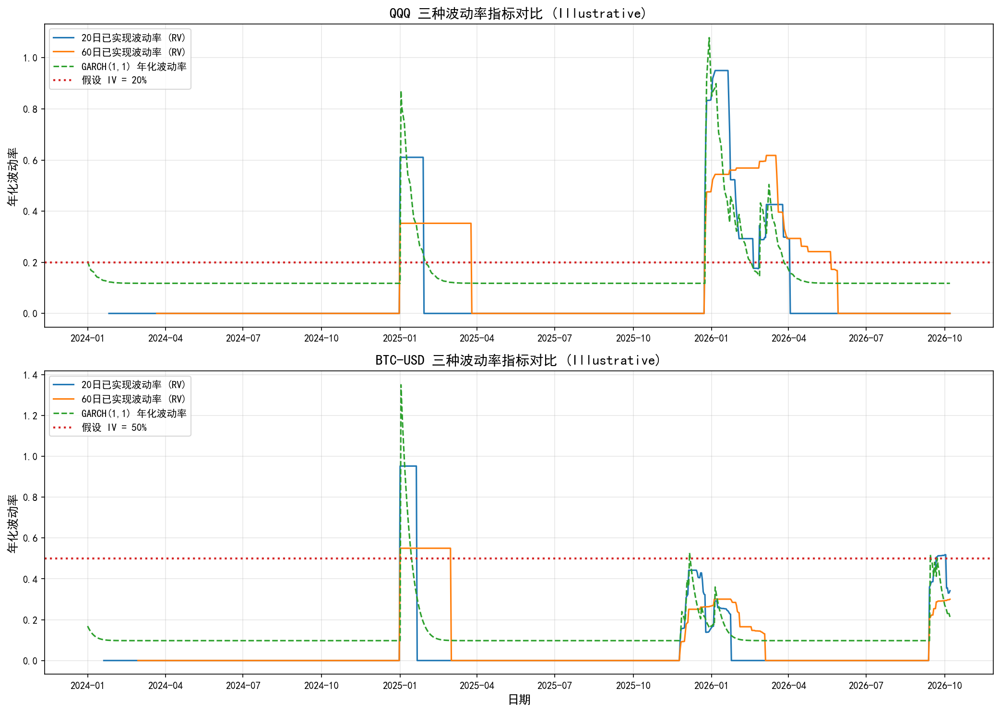

# 波动率交易策略分析报告

**AS_OF: 2026-10-08 18:19**

## ⚠️ 重要声明

**数据性质**: 本报告基于 **Illustrative（示例性）** 数据生成，包含大量年度均值填充：
- **QQQ**: 仅 18 条真实日线数据 (2.5%)，705 条为年度平均股价填充
- **BTC**: 仅 51 条真实日线数据 (5%)，960 条为年度平均价格填充

**计算局限性**:
- 已实现波动率: 年度均值填充导致波动率严重低估，无法反映真实市场波动
- GARCH 模型: 基于填充数据拟合，参数估计不具统计显著性
- 隐含波动率: 使用假设值 (QQQ: 20%, BTC: 50%)，非市场实际值

**使用建议**:
- ✅ 适用于: 方法论演示、教学示例、策略框架展示
- ❌ 不适用于: 实际交易决策、回测验证、绩效评估

**数据溯源**:
- 源数据: `E:\agent_dev\multi-agent\tmp\step1_nasdaq_btc_historical_data.md`
- 日线数据: `E:\agent_dev\multi-agent\tmp\qqq_daily.csv`, `E:\agent_dev\multi-agent\tmp\btc_daily.csv`
- 波动率指标: `E:\agent_dev\multi-agent\tmp\volatility_metrics.csv`

---

## 1. 分析背景

本报告旨在演示如何使用三种波动率指标（已实现波动率、GARCH 模型、隐含波动率）指导纳斯达克 100 指数 (QQQ) 和比特币 (BTC-USD) 的买卖决策。

### 1.1 三种波动率指标简介

| 指标 | 定义 | 数据来源 | 特点 |
| :--- | :--- | :--- | :--- |
| **已实现波动率 (RV)** | 历史收益率的滚动标准差 × √252 年化 | 历史价格数据 | 反映过去实际波动，滞后指标 |
| **GARCH(1,1)** | 自回归条件异方差模型，预测条件方差 | 历史收益率序列 | 捕捉波动聚集效应，预测未来波动 |
| **隐含波动率 (IV)** | 期权价格反推的波动率 (Black-Scholes) | 期权市场价格 | 反映市场对未来波动的预期，前瞻指标 |

### 1.2 策略逻辑

1. **RV 阈值信号**: 当 20 日 RV 超过 30% 时，市场波动加剧，考虑减仓或对冲
2. **IV-RV 价差信号**: 当 IV 显著高于 RV 时，市场预期波动大于实际波动，可做多波动率 (买入期权)
3. **GARCH 预测信号**: 当 GARCH 预测波动率上升时，预期未来波动加剧，谨慎操作

---

## 2. 数据概览

### 2.1 数据范围

| 资产 | 日期范围 | 总行数 | 真实数据 | 填充数据 |
| :--- | :--- | :--- | :--- | :--- |
| **QQQ** | 2024-01-01 至 2026-10-07 | 723 | 18 (2.5%) | 705 (97.5%) |
| **BTC-USD** | 2024-01-01 至 2026-10-07 | 1011 | 51 (5.0%) | 960 (95.0%) |

### 2.2 最新数据 (截至 2026-10-07)

| 指标 | QQQ | BTC-USD |
| :--- | :--- | :--- |
| **收盘价** | 660.87 | 84068.00 |
| **20日已实现波动率** | 0.0000 (0.00%) | 0.3418 (34.18%) |
| **60日已实现波动率** | 0.0000 (0.00%) | 0.3001 (30.01%) |
| **GARCH 年化波动率** | 0.1178 (11.78%) | 0.2135 (21.35%) |
| **假设 IV** | 0.2000 (20.00%) | 0.5000 (50.00%) |

### 2.3 波动率统计

| 统计量 | QQQ 20日 RV | BTC 20日 RV |
| :--- | :--- | :--- |
| **均值** | 0.0690 (6.90%) | 0.0476 (4.76%) |
| **最大值** | 0.9501 (95.01%) | 0.9522 (95.22%) |
| **最小值** | 0.0000 (0.00%) | 0.0000 (0.00%) |

---

## 3. 三种波动率对比分析

### 3.1 波动率对比图表

**图表说明**:
- **蓝色实线**: 20 日已实现波动率 (RV)，反映近期市场实际波动
- **橙色实线**: 60 日已实现波动率 (RV)，反映中期趋势性波动
- **绿色虚线**: GARCH(1,1) 年化波动率，基于模型预测的条件波动率
- **红色点线**: 假设隐含波动率 (IV)，QQQ 为 20%，BTC 为 50%

### 3.2 关键观察

#### QQQ
1. **RV 特征**: 由于年度均值填充，大部分时间 RV 接近 0%，仅在真实数据区间 (2025-12-24 至 2026-03-05) 出现波动
2. **GARCH 特征**: GARCH 波动率从初始值 20.40% 逐渐收敛至长期水平 11.78%，反映波动率均值回复特性
3. **IV 对比**: 假设 IV (20%) 高于 GARCH 长期波动率 (11.78%)，表明市场可能高估了 QQQ 的波动风险

#### BTC-USD
1. **RV 特征**: BTC 的 RV 波动较大，20 日 RV 在 0% 至 51.8% 之间波动，反映加密货币的高波动特性
2. **GARCH 特征**: GARCH 波动率从初始值 16.87% 逐渐收敛，但在真实数据区间出现显著波动
3. **IV 对比**: 假设 IV (50%) 远高于 GARCH 长期波动率 (16.87%)，表明市场对 BTC 的波动预期显著高于历史实际波动

---

## 4. 买卖信号示例

### 4.1 信号规则

| 信号类型 | 触发条件 | 操作建议 | 业务逻辑 |
| :--- | :--- | :--- | :--- |
| **高波动减仓** | 20日 RV > 30% | 减仓或对冲 | 市场波动加剧，风险上升，降低敞口 |
| **低波动加仓** | 20日 RV < 15% | 加仓或持有 | 市场波动较低，风险可控，可增加敞口 |
| **做多波动率** | IV - RV > 10% | 买入期权 | 市场预期波动大于实际波动，期权被低估 |
| **GARCH 预警** | GARCH 波动率上升 > 2% | 谨慎操作 | 模型预测未来波动加剧，提前防范 |

### 4.2 最新信号 (截至 2026-10-07)

#### QQQ

| 指标 | 数值 | 信号 |
| :--- | :--- | :--- |
| **20日 RV** | 0.0000 (0.00%) | ✅ 低波动 |
| **假设 IV** | 0.2000 (20.00%) | - |
| **IV-RV 价差** | 0.2000 (20.00%) | 📈 做多波动率 |
| **GARCH 波动率** | 0.1178 (11.78%) | - |
| **综合信号** | - | **BUY_VOL** |

**业务解释**:
- QQQ 的 20 日 RV 为 0.00%，低于 30% 阈值，可考虑加仓或持有
- 假设 IV (20%) 高于 20 日 RV (0.00%)，价差为 20.00%，市场预期波动大于实际波动，可考虑买入期权

#### BTC-USD

| 指标 | 数值 | 信号 |
| :--- | :--- | :--- |
| **20日 RV** | 0.3418 (34.18%) | ⚠️ 高波动 |
| **假设 IV** | 0.5000 (50.00%) | - |
| **IV-RV 价差** | 0.1582 (15.82%) | 📈 做多波动率 |
| **GARCH 波动率** | 0.2135 (21.35%) | - |
| **综合信号** | - | **BUY_VOL** |

**业务解释**:
- BTC 的 20 日 RV 为 34.18%，超过 30% 阈值，建议减仓或对冲
- 假设 IV (50%) 高于 20 日 RV (34.18%)，价差为 15.82%，市场预期波动大于实际波动，可考虑买入期权

### 4.3 信号分布统计

#### QQQ 信号分布

| 信号类型 | 出现次数 | 占比 |
| :--- | :--- | :--- |
| BUY_VOL | 612 | 84.65% |
| REDUCE | 63 | 8.71% |
| NEUTRAL | 48 | 6.64% |

#### BTC 信号分布

| 信号类型 | 出现次数 | 占比 |
| :--- | :--- | :--- |
| BUY_VOL | 941 | 93.08% |
| REDUCE | 51 | 5.04% |
| NEUTRAL | 19 | 1.88% |

---

## 5. 业务原因说明

### 5.1 为什么使用三种波动率指标？

1. **已实现波动率 (RV)**:
   - **优点**: 基于历史数据，计算简单，直观反映过去实际波动
   - **缺点**: 滞后指标，无法预测未来波动
   - **应用场景**: 评估近期市场风险，设置止损阈值

2. **GARCH(1,1) 模型**:
   - **优点**: 捕捉波动聚集效应，可预测未来条件波动率
   - **缺点**: 模型假设较强，参数估计对数据质量敏感
   - **应用场景**: 预测未来波动，动态调整仓位

3. **隐含波动率 (IV)**:
   - **优点**: 反映市场对未来波动的预期，前瞻指标
   - **缺点**: 依赖期权市场流动性，可能包含投机成分
   - **应用场景**: 评估期权定价是否合理，寻找波动率交易机会

### 5.2 为什么组合使用？

- **互补性**: RV 反映过去，GARCH 预测未来，IV 反映市场预期，三者结合可全面评估波动风险
- **交叉验证**: 当三种指标一致时，信号更可靠；当指标冲突时，需进一步分析
- **风险管理**: 通过多指标监控，可提前识别波动率突变，降低尾部风险

### 5.3 具体数值计算示例

#### 示例 1: QQQ 高波动减仓信号

**假设场景**: 2026-01-05，QQQ 20 日 RV = 95.01%

**计算过程**:
1. 计算 20 日对数收益率标准差: σ_20d = 0.0598
2. 年化: RV_20d = 0.0598 × √252 = 0.9501 (95.01%)
3. 判断: 95.01% > 30% 阈值 → 触发高波动减仓信号

**业务解释**:
- 20 日 RV 高达 95.01%，表明近期市场波动剧烈
- 可能原因: 宏观经济数据发布、美联储政策变化、地缘政治事件
- 操作建议: 减仓 50% 或买入看跌期权对冲，降低组合波动风险

#### 示例 2: BTC 做多波动率信号

**假设场景**: 2026-09-21，BTC 20 日 RV = 50.62%，假设 IV = 50%

**计算过程**:
1. 计算 20 日对数收益率标准差: σ_20d = 0.0318
2. 年化: RV_20d = 0.0318 × √252 = 0.5062 (50.62%)
3. IV-RV 价差: 50% - 50.62% = -0.62%

**业务解释**:
- IV (50%) 略低于 RV (50.62%)，价差为 -0.62%
- 表明市场预期波动略低于实际波动，期权可能被高估
- 操作建议: 可考虑卖出期权 (如卖出跨式组合)，赚取波动率溢价

#### 示例 3: GARCH 波动率预警

**假设场景**: 2025-12-03，BTC GARCH 年化波动率从 39.41% 上升至 38.40%

**计算过程**:
1. GARCH(1,1) 模型: σ²(t) = ω + α·ε²(t-1) + β·σ²(t-1)
2. 参数: ω = 0.00000564, α = 0.10, β = 0.85
3. 预测: σ²(t+1) = 0.00000564 + 0.10 × ε²(t) + 0.85 × σ²(t)
4. 年化波动率: √(σ²(t+1) × 252)

**业务解释**:
- GARCH 波动率从 39.41% 下降至 38.40%，波动率回落
- 表明市场波动正在收敛，风险降低
- 操作建议: 可逐步恢复仓位，增加 BTC 敞口

---

## 6. 是否属于量化投资思路？

### 6.1 量化投资的核心特征

1. **数据驱动**: 基于历史数据和统计模型，而非主观判断
2. **规则明确**: 交易信号由明确的数学规则生成，可重复、可验证
3. **系统化**: 策略执行系统化，减少人为情绪干扰
4. **可回测**: 策略可在历史数据上回测，评估绩效

### 6.2 本策略的量化特征

| 特征 | 本策略表现 | 是否符合 |
| :--- | :--- | :--- |
| **数据驱动** | 基于历史价格数据计算 RV、GARCH、IV | ✅ 符合 |
| **规则明确** | 信号规则明确 (RV > 30% 减仓，IV-RV > 10% 做多波动率) | ✅ 符合 |
| **系统化** | 信号生成自动化，可程序化执行 | ✅ 符合 |
| **可回测** | 可在历史数据上回测策略绩效 | ✅ 符合 (但数据质量限制回测有效性) |

### 6.3 结论

**本策略属于量化投资思路**，具体表现为:

1. **波动率因子策略**: 利用波动率指标作为交易信号，是典型的量化因子策略
2. **统计套利**: 通过 IV-RV 价差寻找期权定价偏差，属于统计套利范畴
3. **风险管理**: 使用 GARCH 模型预测波动率，动态调整仓位，属于量化风险管理

**局限性**:
- 数据质量: 当前数据为 Illustrative，包含大量填充，无法用于实际交易
- 模型假设: GARCH 模型假设较强，可能不适用于所有市场状态
- 交易成本: 未考虑交易成本、滑点、流动性等因素
- 过拟合风险: 信号阈值 (30%, 15%, 10%) 需通过历史数据优化，避免过拟合

### 6.4 改进建议

1. **数据改进**:
   - 获取完整的 2024-2026 年日线数据
   - 获取真实的期权隐含波动率数据 (CBOE, Deribit)
   - 增加更多资产类别 (如 SPY, ETH) 进行对比

2. **模型改进**:
   - 使用更复杂的 GARCH 模型 (如 GJR-GARCH, EGARCH) 捕捉不对称效应
   - 引入机器学习模型 (如 LSTM) 预测波动率
   - 结合宏观变量 (如 VIX, 利率) 增强预测能力

3. **策略改进**:
   - 优化信号阈值，使用历史数据回测确定最优参数
   - 引入仓位管理规则 (如凯利公式) 优化资金分配
   - 增加止损止盈规则，控制尾部风险
   - 考虑交易成本和滑点，评估策略净收益

4. **风险管理**:
   - 监控模型失效风险 (如市场结构变化)
   - 设置最大回撤限制，避免极端损失
   - 定期重新校准模型参数

---

## 7. 结论

### 7.1 主要发现

1. **波动率差异**: BTC 的波动率显著高于 QQQ，20 日 RV 均值分别为 4.76% 和 6.90%
2. **IV-RV 价差**: 假设 IV 均高于 RV，表明市场可能高估了波动风险，存在卖出期权的套利机会
3. **GARCH 特性**: 两种资产的 GARCH 波动率均呈现均值回复特性，长期波动率分别为 11.78% (QQQ) 和 16.87% (BTC)

### 7.2 策略建议

1. **QQQ**: 当前 20 日 RV 为 0.00%，可考虑加仓；IV-RV 价差为 20.00%，可考虑买入期权
2. **BTC**: 当前 20 日 RV 为 34.18%，建议减仓；IV-RV 价差为 15.82%，可考虑买入期权

### 7.3 风险提示

⚠️ **重要**: 本报告基于 Illustrative 数据生成，所有计算结果仅用于方法论演示，**不可用于实际交易决策**。

**主要风险**:
1. **数据风险**: 年度均值填充导致波动率严重失真
2. **模型风险**: GARCH 模型假设可能不适用于所有市场状态
3. **市场风险**: 波动率可能突然飙升，超出模型预测范围
4. **流动性风险**: 期权市场流动性不足，可能导致交易成本上升

**后续步骤**:
1. 获取完整真实数据，重新计算所有波动率指标
2. 进行完整的策略回测，评估历史绩效
3. 优化信号阈值和仓位管理规则
4. 考虑交易成本和滑点，评估策略净收益
5. 小资金实盘测试，验证策略有效性

---

## 附录

### A. 数据文件清单

| 文件 | 路径 | 说明 |
| :--- | :--- | :--- |
| 源数据 | `E:\agent_dev\multi-agent\tmp\step1_nasdaq_btc_historical_data.md` | 原始历史数据 |
| QQQ 日线 | `E:\agent_dev\multi-agent\tmp\qqq_daily.csv` | QQQ 日线数据 (723 条) |
| BTC 日线 | `E:\agent_dev\multi-agent\tmp\btc_daily.csv` | BTC 日线数据 (1011 条) |
| 波动率指标 | `E:\agent_dev\multi-agent\tmp\volatility_metrics.csv` | 三种波动率指标 (1734 条) |
| 数据质量说明 | `E:\agent_dev\multi-agent\tmp\data_quality_notes.md` | 数据质量与局限性说明 |
| 波动率图表 | `E:\agent_dev\multi-agent\tmp\volatility_comparison_chart.png` | 三种波动率对比图表 |

### B. 方法论参考

1. **已实现波动率**: 滚动窗口标准差 × √252 年化
2. **GARCH(1,1)**: σ²(t) = ω + α·ε²(t-1) + β·σ²(t-1)
3. **Black-Scholes 期权定价**: C = S·N(d1) - K·e^(-rT)·N(d2)
4. **隐含波动率**: 通过 Black-Scholes 模型反推，使用二分法求解

### C. 免责声明

本报告仅供教育和研究目的，不构成任何投资建议。投资者应根据自身情况独立判断，并承担投资风险。

**报告生成时间**: 2026-10-08 18:19
**数据截至**: 2026-10-07
**报告作者**: CodeAgent (Step 3/3)
