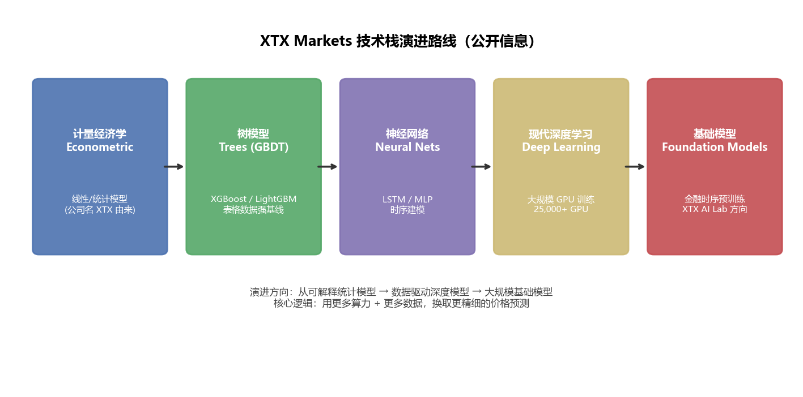
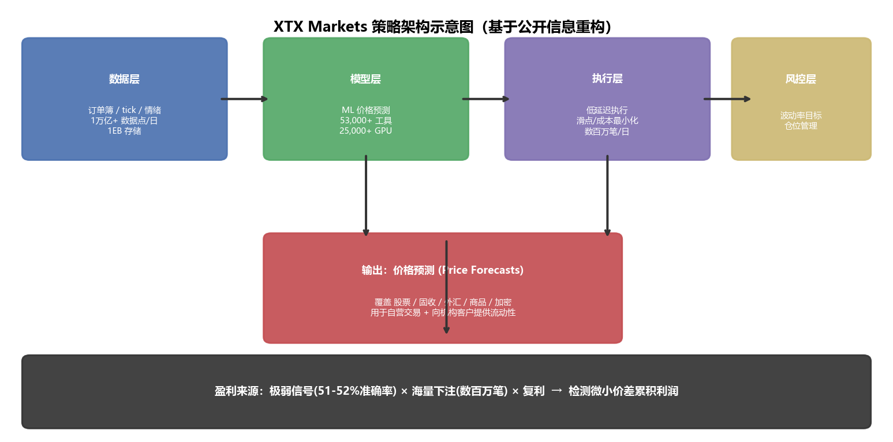
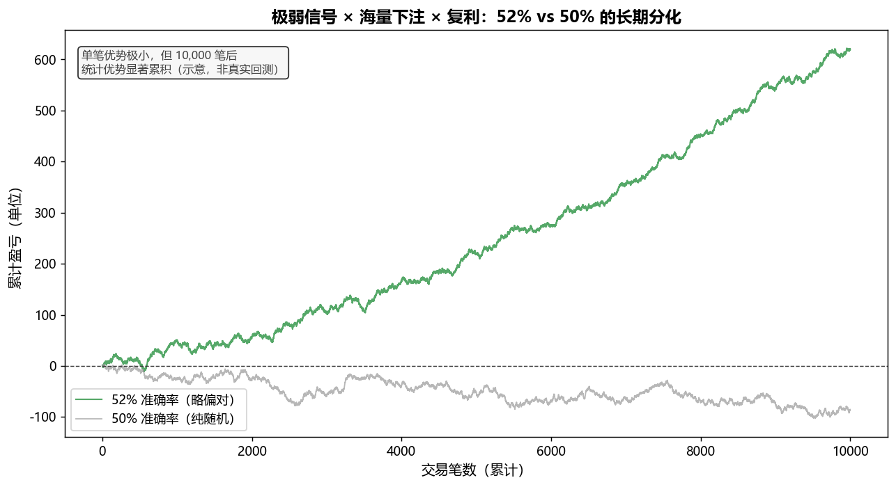
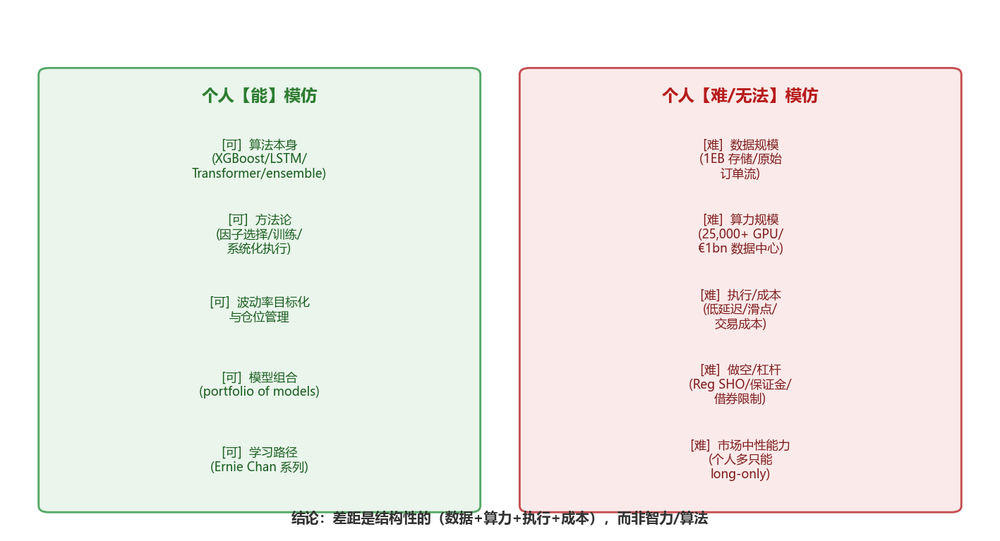

# XTX Markets 创始人 Alex Gerko 的机器学习量化策略：深度解析与个人模仿可行性评估

**AS_OF: 2026-10-09 09:11**（本报告综合步骤1/步骤2的公开检索结果撰写；所有数据均为公开报道/官网/招聘/学术资料，非实时行情。XTX 具体网络架构、回测指标、预测精度数字属商业机密，公开渠道不可得。）

> **报告定位**：本报告是三步研究计划的最终综合。它把 XTX 的**具体案例**（25,000 GPU、1EB 存储、53,000 工具）与**行业通用理论**（51–52% 准确率阈值、执行成本重要性、统计优势逻辑）结合起来，回答三个核心问题：
> 1. XTX 的 ML 策略**具体怎么做**（算法、预测目标、数据源）？
> 2. **为什么**在算法公开的前提下 XTX 仍能持续盈利？
> 3. **个人投资者/机构**能否模仿？边界在哪里？

---

## 目录
1. [执行摘要](#一执行摘要)
2. [XTX Markets 的 ML 策略具体做法](#二xtx-markets-的-ml-策略具体做法)
3. [盈利核心原因分析：为什么公开算法下仍能赚钱](#三盈利核心原因分析为什么公开算法下仍能赚钱)
4. [个人投资者模仿的可行性评估](#四个人投资者模仿的可行性评估)
5. [给不同投资者的实操建议](#五给不同投资者的实操建议)
6. [结论](#六结论)
7. [来源清单](#七来源清单)
8. [信息缺口与免责](#八信息缺口与免责)

---

## 一、执行摘要

**一句话结论**：XTX Markets 的盈利**不来自某个独家算法**，而来自"**极弱信号 × 海量下注 × 复利**"的统计钱，其前提是**算力 + 数据 + 执行 + 风控**的系统性规模优势。算法本身（XGBoost、LSTM、Transformer、ensemble）全部公开开源，但把公开算法在 53,000 个工具上、用 25,000 张 GPU、以极低延迟和成本落地并持续迭代，是个人几乎无法复制的。

**三个关键洞察**：

| 维度 | 核心结论 |
|------|---------|
| **策略本质** | 不是"预测得准"，而是"每笔略偏对（51–52%）× 数百万笔 × 复利"。金融信噪比极低，52% 的次日方向准确率就算卓越。 |
| **盈利护城河** | 算法公开，但**数据（1EB 存储/1万亿数据点/日）+ 算力（25,000 GPU/€1bn 数据中心）+ 执行（低延迟/滑点最小化）+ 人才**构成系统性壁垒。 |
| **个人可行性** | **能模仿**算法与方法论；**无法模仿**数据规模、算力、执行成本、做空/杠杆、市场中性能力。个人只能在"小规模、低频率、长持有、严格风控"区间追求统计优势。 |

---

## 二、XTX Markets 的 ML 策略具体做法

### 2.1 公司与创始人背景（事实基础）

- **XTX Markets**：英国伦敦算法交易公司，2015 年 1 月由 Alexander (Alex) Gerko 创立，是 GSA Capital 的衍生（spin-off）。Gerko 持股约 75%，现任 co-CEO（与 Hans Buehler 共同）。
- **规模**：约 300 名员工（伦敦、新加坡、纽约、巴黎、布里斯托尔、孟买、埃里温、芬兰 Kajaani）；日交易量约 $250bn–$300bn，覆盖 35 个国家。
- **盈利记录**：2022 年利润 £1.1bn（同比 +64%）；2023 年营收约 £2.0bn、净利约 £835m；2024 年 Gerko 从 XTX 获得 £683m；2025 年报道利润约 £895m。
- **Gerko 背景**：俄罗斯出生、英国籍，数学博士（莫斯科国立大学），曾在 Deutsche Bank 做 FX 交易、GSA Capital 任 FX 交易主管。2026 年身家约 $17.1bn（Bloomberg/Forbes）。

### 2.2 预测目标：预测什么？

- **核心是"价格预测"（price forecasts）**：官网明确表述——"用 state-of-the-art machine learning 技术，为 **53,000+ 金融工具** 生成价格预测，覆盖 **股票、固定收益、外汇、大宗商品、加密货币**"。
- 这些预测被用于：(a) 在交易所/替代交易场所直接交易；(b) 向客户提供流动性（做市/流动性提供）。
- 学术演讲（Atlas Wang, Research Director, XTX AI Lab, Stony Brook 2026-03-09）进一步说明：系统每天为"数万金融工具"生成预测，执行 $300bn+ 全球交易量，**全自动、无人为裁量**；领域特点是"海量数据 + 高噪声 + 对抗性动态 + 频繁 regime shift（市场状态切换）"。

### 2.3 数据源：喂给模型什么？

- 模型每天处理 **超过 1 万亿个数据点**，包括：
  - **订单簿（order book）**：盘口深度、买卖挂单
  - **tick 数据**：逐笔成交
  - **情绪（sentiment）信号**：新闻、社交媒体等非结构化数据
- **1 Exabyte+ 可用存储**（另有报道提到 650PB 高速存储）支撑这些原始数据的采集、清洗、存储。

### 2.4 算法演进路线（关键：从简单到深度）

XTX 官方招聘描述（Quantitative Researcher - Deep Learning, Built In）给出了最权威的技术演进：
> "过去十年，我们的模型从赋予公司名字（XTX = eXtreme Trading eXchange / econometric）的**计量经济学方法（econometric methods）**，演进到**树模型（trees，如 XGBoost/LightGBM 类）**和**神经网络（neural networks）**，再到**现代深度学习（modern deep learning）**。我们期望这一演进继续。"

- 即技术栈演进：**计量经济学 → 树模型（GBDT 类）→ 神经网络 → 现代深度学习 / 大规模 foundation models（基础模型）**。
- 最新方向（Atlas Wang 演讲标题）："Algorithmic Trading with **Large-Scale Deep Learning**"，AI Lab 专注开发**面向金融时间序列和市场数据的"大规模基础模型（foundation models）"**。
- **注意**：XTX 并未公开点名具体网络结构（如是否用 Transformer/LSTM），公开层面只到"deep learning / foundation models"这一层级。

### 2.5 基础设施（"押注 ML"的物质基础）

| 资源 | 规模 | 意义 |
|------|------|------|
| **GPU 集群** | 25,000+ 张（约 10,000 A100 + 10,000 V100） | 大规模并行训练/推理 |
| **存储** | 1 Exabyte+（另有 650PB 高速存储） | 支撑 1 万亿数据点/日 |
| **数据中心** | 芬兰 Kajaani €1bn 建 5 个数据中心 | 凉爽气候 + 地热/低成本电力 |
| **早期超算** | 冰岛地热能源驱动超算 | 低成本算力先行 |
| **研究组织** | XTX Labs / AI Lab（纽约）+ AI Residency Program（月薪 $40k–$50k） | 专门做"金融 × ML"研究 |

### 2.6 策略架构总览

**数据流**：原始数据（订单簿/tick/情绪）→ 特征工程 → ML 模型（53,000+ 工具价格预测）→ 低延迟执行（数百万笔/日）→ 波动率目标化风控 → 累积微小价差利润。

---

## 三、盈利核心原因分析：为什么公开算法下仍能赚钱

### 3.1 核心机制：极弱信号 × 海量下注 × 复利

**这是理解 XTX 盈利逻辑最关键的一条。**

- **金融信噪比极低**：图像分类模型可达 95%+ 准确率，但**次日股票收益预测，51–52% 的准确率就算"卓越"**。成功的 ML 交易模型在单笔预测上"几乎一半时间是错的"。
- **优势来自统计，而非单点**：一个能 52% 正确预测次日方向、覆盖数百只股票、配合合理仓位管理的模型，就能产生 **Sharpe > 1.0**。"略好于随机"在量化金融里就是有价值的。
- **盈利机制**：在成千上万笔交易中，每笔都"略偏对"，靠**大量下注 + 复利**累积。单笔利润极小，靠规模和数量取胜。

> **上图说明**：52% 准确率（绿线）与 50% 纯随机（灰线）在单笔上几乎无差别，但 10,000 笔后统计优势显著分化。XTX 的 53,000 工具 × 数百万笔交易正是这一机制的极致体现。（示意，非真实回测）

### 3.2 护城河拆解：算法公开，但"用得起、用得上"的人极少

| 壁垒 | XTX 的具体表现 | 为什么个人无法复制 |
|------|--------------|------------------|
| **算力** | 25,000+ GPU、€1bn 芬兰数据中心 | 个人/小机构无法承担七位数以上的算力成本 |
| **数据** | 1 万亿数据点/日、1EB 存储、原始订单流/tick/情绪 | 原始高频数据的采集、清洗、存储本身就是巨大壁垒 |
| **执行** | 低延迟执行、滑点最小化、proprietary 执行算法 | ML 预测的边际优势很小，能否落地为利润取决于执行速度和成本 |
| **人才** | 300 人中聚集纯数学、物理、CS、ML 背景研究者；AI Lab + 高薪酬 Residency | 人才密度和持续迭代能力难以复制 |
| **规模** | 53,000 工具 × 数百万笔自动交易 | 微小价差需要海量交易才能累积，个人资金量和工具覆盖差几个数量级 |
| **收入多元化** | 自营 + 向机构客户提供流动性（做市） | 做市角色需要规模和技术支撑 |

**Gerko 原话（Bloomberg 访谈）**：
> "By building things ourselves, we can build ahead of our needs... we have been confident that we can apply more compute power to ultimately generate better returns."
> （自建基础设施，用更多算力换更高回报。）

### 3.3 行业共识的补充维度

1. **数据壁垒**：行业共识——"相当一部分优势来自竞争对手拿不到的数据源和处理管道"（Quantt）。
2. **特征工程**：现代 ML 用**自动特征发现**（自编码器、嵌入学习、表示学习）；**Foundation models 可把非结构化数据（新闻、情绪）转成特征**（Nurp）。同样的 XGBoost，喂不同的特征，结果天差地别。
3. **模型集成/混合架构**：行业现状是"**窄边界 ML 组件嵌入更宽的规则框架**"的混合架构主导生产环境（Nurp）。ML 没有取代规则逻辑，而是作为其中一环。
4. **执行优势**：最优执行（Almgren-Chriss 框架）、做市、滑点最小化。**ML 预测的边际优势很小，能否落地为利润取决于执行速度和交易成本**（ml-quant、IJFMR）。
5. **风险管理**：专业量化**不追最大收益，而追最可靠的收益**：每个策略都**波动率目标化**（volatility-targeted），仓位缩放使组合风险大致恒定（Lauren Lee Substack）。
6. **现实约束**：ML 模型"预测准"≠"赚钱"，必须过**交易成本、模型衰减、过拟合、微观结构**四道关（IJFMR 2026-01）。

### 3.4 关键结论

**XTX 的盈利不来自"某个独家算法"，而来自"算力 + 数据 + 执行 + 人才 + 工程"的系统性规模优势。** 算法本身公开，但把公开算法在 53,000 个工具上、用 25,000 GPU、以极低延迟和成本落地并持续迭代，是个人几乎无法复制的。

---

## 四、个人投资者模仿的可行性评估

### 4.1 行业共识：差距不在"智力/想法"，而在三样东西

Quant-Builder 明确指出：**机构与个人量化之间的差距，从来不是智力或想法，而是三样具体的东西**（数据、基础设施/算力、执行/成本）。"智力核心——因子选择、模型训练、系统化执行——不是专有魔法，是任何规模都能复制的流程。"

### 4.2 可行性矩阵

### 4.3 个人**能**模仿的部分（公开、可复制）

| 维度 | 具体内容 | 来源 |
|------|---------|------|
| **算法本身** | XGBoost/LightGBM、LSTM、Transformer、ensemble、特征工程方法——全部公开开源 | 公开文献 |
| **方法论** | 因子选择、模型训练、系统化执行、波动率目标化、模型组合 | Quant-Builder、QuantStart |
| **学习路径** | Ernie Chan 的《Quantitative Trading》《Algorithmic Trading》《Machine Trading》是面向"成熟个人投资者"的经典 | QuantStart、Investing.com |
| **平台降门槛** | Quant-Builder 等平台已把机构量化的核心组件开放给个人，无需研究团队或七位数数据预算 | Quant-Builder |

### 4.4 个人**难以/无法**模仿的部分（结构性壁垒）

| 壁垒 | 具体表现 | 为什么是硬约束 |
|------|---------|--------------|
| **数据** | 拿不到 XTX 级别的原始订单流/tick/情绪数据，也建不起 1EB 存储 | 数据是"对手拿不到"的，不是"买得到"的 |
| **算力** | 25,000+ GPU、€1bn 数据中心 | 成本差几个数量级 |
| **执行/成本** | 个人受严格保证金要求、有限做空（尤其难借券）、几乎无法用合成空头 | Reg SHO 和保守的券商风控模型在杠杆变得有用之前就封顶了 |
| **监管/工具** | 机构用基于净风险的组合保证金、机构借券、期货/swap 低成本精确对冲——个人没有 | 监管和工具层面的结构性差异 |
| **市场中性** | 机构能建市场中性、因子中性策略；个人大多**只能做多（long-only）** | 被迫吸收因子周期和回撤，而专业机构系统性对冲掉了这些 |
| **规模效应** | XTX 靠 53,000 工具 × 数百万笔交易累积微小价差；个人资金量和工具覆盖都差几个数量级 | "微小价差"对个人而言可能**被交易成本吃掉** |

### 4.5 可行性结论

- **能模仿"方法论和算法"，不能模仿"规模、数据、执行、成本结构"**。
- 个人可行的定位：**在较小规模、较低频率、较长持有期上，用公开 ML 方法 + 严格风控 + 波动率目标化，追求"略好于随机"的统计优势**，而非复制 XTX 的高频微小价差套利。
- 个人最大的现实障碍不是"算法不会"，而是：**交易成本、做空/杠杆限制、数据质量、以及"微小优势被交易成本吃掉"**。
- 关键提醒：ML 模型"预测准"≠"赚钱"，必须过交易成本、模型衰减、过拟合三道关（IJFMR）。

---

## 五、给不同投资者的实操建议

### 5.1 个人投资者（Retail）

**可行路径**：
1. **定位**：小规模、低频率、长持有期（周/月级别），不追求高频微小价差。
2. **算法**：从 XGBoost/LightGBM 起步（表格数据强基线），再尝试 LSTM/Transformer。
3. **方法论**：
   - 因子选择：动量、价值、质量、波动率等经典因子 + 简单技术指标。
   - 模型组合：牛市模型、保守模型、行业模型，市场安静时行业模型仍能找机会。
   - 波动率目标化：仓位缩放使组合风险大致恒定（如年化 10%）。
4. **风控**：严格止损、仓位上限、避免过度杠杆。
5. **学习**：Ernie Chan 系列书籍 + QuantStart 社区。
6. **平台**：Quant-Builder 等降低门槛的平台。

**必须警惕**：
- **交易成本**：微小优势可能被佣金/滑点/点差吃掉。先算清楚成本再谈收益。
- **过拟合**：回测好看 ≠ 实盘赚钱。用样本外数据、walk-forward 验证。
- **模型衰减**：市场状态切换后模型失效，需要持续监控和再训练。
- **long-only 限制**：无法做市场中性，被迫吸收因子周期和回撤。

### 5.2 小型机构（Hedge Fund / Family Office）

**可行路径**：
1. **定位**：中等规模、中低频率，追求统计优势 + 一定市场中性。
2. **数据**：购买商业数据源（Bloomberg、Refinitiv、Quandl 等），但拿不到 XTX 级别的原始订单流。
3. **算力**：云 GPU（AWS/GCP/Azure）+ 本地混合，成本可控但远不及 XTX。
4. **执行**：使用 prime broker 的低延迟通道，但滑点控制能力有限。
5. **风控**：波动率目标化 + 因子中性 + 组合保证金。
6. **差异化**：在 XTX 覆盖不到的"长尾"工具或"低频"区间寻找 alpha。

**必须警惕**：
- **与 XTX 正面竞争**：在高频微小价差区间，XTX 有绝对优势，不要硬碰。
- **数据质量**：商业数据源的清洗和标准化需要投入。
- **人才**：量化研究员的薪酬和留存是持续挑战。

### 5.3 大型机构（Asset Manager / Prop Desk）

**可行路径**：
1. **定位**：大规模、多频率、多策略，追求系统性 alpha。
2. **数据**：自建数据管道 + 商业数据源 + 另类数据（卫星、信用卡、社交媒体）。
3. **算力**：自建数据中心或大规模云合同，接近 XTX 级别。
4. **执行**：proprietary 执行算法 + 低延迟基础设施 + 做市角色。
5. **风控**：全面波动率目标化 + 因子中性 + 组合保证金 + 压力测试。
6. **研究**：AI Lab + 高薪酬研究员 + 持续迭代。

**必须警惕**：
- **模型衰减**：大规模模型更容易过拟合，需要严格的样本外验证。
- **监管**：做市、高频交易、杠杆等面临更严格的监管审查。
- **竞争**：XTX 等头部机构在高频区间有绝对优势，需要在低频/另类数据区间差异化。

---

## 六、结论

### 6.1 对 XTX 策略的最终判断

XTX Markets 的 ML 策略**不是"某个独家算法"的魔法**，而是**"极弱信号 × 海量下注 × 复利"的统计钱**，其前提是**算力 + 数据 + 执行 + 风控**的系统性规模优势。算法本身（XGBoost、LSTM、Transformer、ensemble）全部公开开源，但把公开算法在 53,000 个工具上、用 25,000 张 GPU、以极低延迟和成本落地并持续迭代，是个人几乎无法复制的。

### 6.2 对个人投资者的最终建议

**能模仿"方法论和算法"，不能模仿"规模、数据、执行、成本结构"**。个人可行的定位是：**在较小规模、较低频率、较长持有期上，用公开 ML 方法 + 严格风控 + 波动率目标化，追求"略好于随机"的统计优势**，而非复制 XTX 的高频微小价差套利。

**最大的现实障碍**不是"算法不会"，而是：**交易成本、做空/杠杆限制、数据质量、以及"微小优势被交易成本吃掉"**。

### 6.3 一句话总结

> **XTX 赚的是"统计的钱"，不是"算法的钱"。算法公开，但规模不公开。个人能学方法，但学不了规模。**

---

## 七、来源清单

### 步骤1：XTX Markets 及 Alex Gerko 背景
1. https://en.wikipedia.org/wiki/XTX_Markets
2. https://en.wikipedia.org/wiki/Alex_Gerko
3. https://www.xtxmarkets.com （官网：53,000+ 工具、25,000+ GPU、1EB 存储、$250bn 日交易量）
4. https://builtin.com/job/quantitative-researcher-deep-learning/9716220 （技术演进：econometric→trees→NN→deep learning）
5. https://finance.yahoo.com/news/billionaire-alex-gerko-xtx-build-050000389.html （Bloomberg：€1bn 芬兰数据中心、25,000 GPU、Gerko 访谈原话）
6. https://www.wsj.com/finance/alex-gerko-xtx-markets-ai-d155626a （WSJ：Nvidia 芯片 + deep learning 预测价格、冰岛地热超算）
7. https://ai.stonybrook.edu/news/seminars/algorithmic-trading-large-scale-deep-learning （Atlas Wang 演讲：foundation models、$300bn 全自动交易）
8. https://lex.substack.com/p/ai-the-secret-ai-supercomputers-powering （25,000 GPU 构成、1 万亿数据点/日、订单簿/tick/情绪信号）
9. https://www.forbes.com/profile/alexander-gerko （身家、背景、分红）
10. https://jawlah.co/en/63361 （2025 利润 £895m、微小价差 + 数百万笔自动交易）
11. https://paperswithbacktest.com/course/alex-gerko （数据驱动策略、执行优化、最小化滑点）
12. https://community.portfolio123.com/t/xtx-markets-unveils-machine-learning-lab-blending-finance-with-technology/66200 （XTX Labs / AI Residency Program）

### 步骤2：ML 量化盈利逻辑与个人可行性
13. https://www.quantt.co.uk/resources/machine-learning-finance-guide （51-52% 准确率即卓越、Sharpe>1、数据壁垒、领域专家）
14. https://nurp.com/algorithmic-trading-blog/machine-learning-quantitative-trading-applications （混合架构、自动特征工程、foundation models 转非结构化数据）
15. https://www.ml-quant.com/topics/trading-microstructure-execution （微观结构、最优执行、做市、arXiv 2026-09 论文）
16. https://www.ijraset.com/research-paper/prediction-and-portfolio-optimization-in-quantitative-trading （ML 多策略、特征选择）
17. https://www.ijfmr.com/research-paper.php?id=65636 （现实约束：交易成本、模型衰减、过拟合、微观结构）
18. https://www.quant-builder.ai/articles/institutional-quant-strategies-retail-investors （差距在数据/基础设施/执行；模型组合可复制；平台降门槛）
19. https://www.quantstart.com/articles/Self-Study-Plan-for-Becoming-a-Quantitative-Trader-Part-I （Ernie Chan 学习路径、个人量化）
20. https://www.acadian-asset.com/investment-insights/systematic-methods/machine-learning-in-quant-investing-revolution-or-evolution （ML 是进化非革命、领域知识仍必需）
21. https://www.investing.com/analysis/chan,-machine-trading-200181357 （Machine Trading 书评、个人可提取价值）
22. https://laurenleek.substack.com/p/how-hard-can-quant-trading-really （个人 vs 机构：监管、做空/杠杆、波动率目标、市场中性）

---

## 八、信息缺口与免责

### 8.1 信息缺口

- XTX **未公开**具体网络架构（是否 Transformer/LSTM/特定 foundation model 结构）、具体特征工程、回测细节、夏普/容量数据——这些是商业机密。
- "预测精度"的具体数字（如方向预测准确率、IC 值）公开渠道不可得。
- 本报告基于"公开算法 + 公开基础设施差距"来论证，而非虚构 XTX 内部细节。

### 8.2 免责

- 本报告为研究分析，**不构成投资建议**。
- 所有数据均来自公开来源，已标注出处。XTX 的具体模型细节属商业机密，公开渠道只能看到"技术路线 + 基础设施 + 招聘描述"层面的信息。
- 图表中的"52% vs 50%"为**示意**，非真实回测数据。
- 个人投资者在实施任何量化策略前，应充分评估自身风险承受能力，并咨询专业顾问。

---

**报告完成时间**：2026-10-09 09:11
**报告路径**：`E:\agent_dev\multi-agent\tmp\xtx_gerko_ml_research_final_report.md`
**图表路径**：`E:\agent_dev\multi-agent\tmp\charts\`（chart1_algo_evolution.png, chart2_architecture.png, chart3_weak_signal.png, chart4_feasibility.png）
