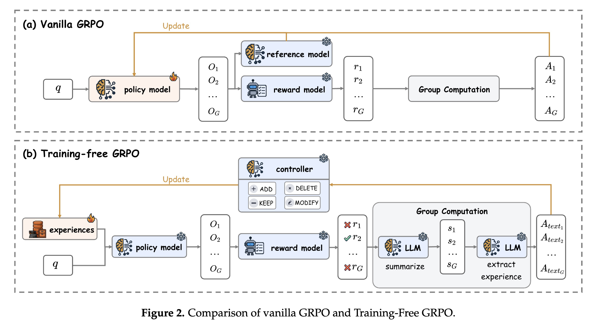
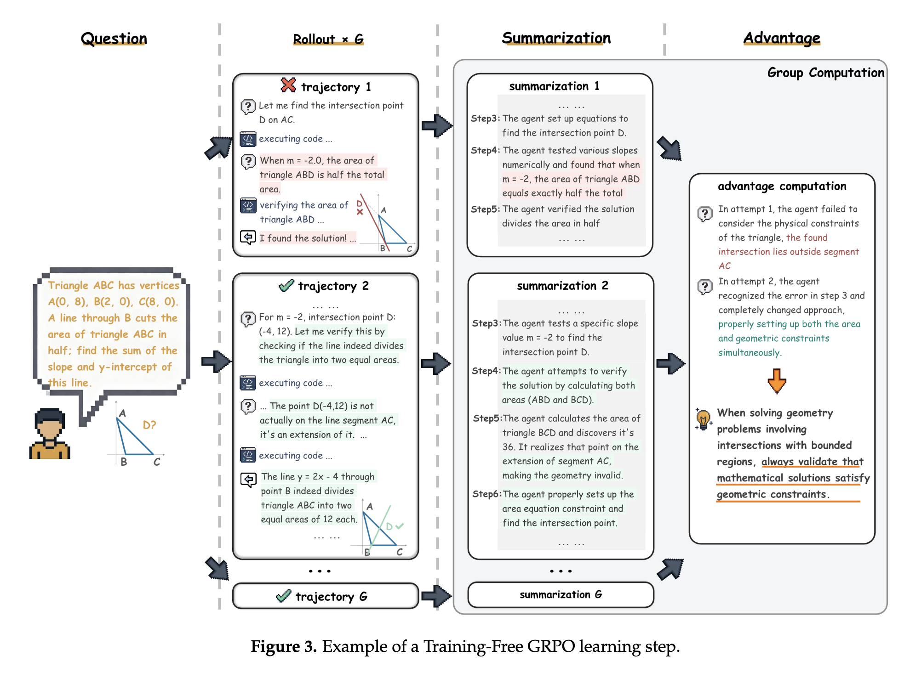

一、为了让LLM适配垂直领域的特定任务，使用通用的LLM时有两种方案：

| 方案     | 原理                                                                     | 优点                                                                                                                                 | 缺点                                                                                                                                                                    |
| -------- | ------------------------------------------------------------------------ | ------------------------------------------------------------------------------------------------------------------------------------ | ----------------------------------------------------------------------------------------------------------------------------------------------------------------------- |
| finetune | 1、sft、RL...... 2、把垂直领域的知识写入weight、parameter中固化下来 | 1、增加了训练数据，可能产生一些泛化能力 2、减少inference时的context 长度                                                        | 1、需要消耗大量算力，成本较高 2、LLM的weight大幅改变后，可能灾难性遗忘 3、LLM仍然是黑箱，interpretability较差 4、出现新数据后，还要继续微调才能让LLM记住 |
| RAG      | 垂直领域知识作为一个外挂库                                               | 1、无需额外训练，算力要求低 2、答案来自知识库，interpretability is very good 3、出现新数据后加入知识库即可，简单粗暴成本低 | 1、模型未能消化吸收新知识、新数据，可能无法泛化 2、interface的时候可能出现超长context                                                                              |

二、trainning-free GRPO： https://arxiv.org/abs/2510.08191  借鉴GRPO的思路，但并不改变LLM的weight，如下图所示：

* 用户的query，加上知识库沉淀积累的experience，一起送入LLM，产生多个output
* reward model选择正确、好的output，去掉差的
* LLM做总结，找出正确output的原因、思路等，整理成最终的text，放入知识库，并对存量的知识做增删改；
* 整个流程全是“拟人化”的：
  * “学生”LLM自己做题回答，输出多个不同的答案
  * “老师”LLM检查，找出正确的、高质量的答案
  * “学生”LLM自己用正确的答案做总结，找出解题的思路、方法，放入知识库，并删除老旧的知识

整个流程举例如下：

